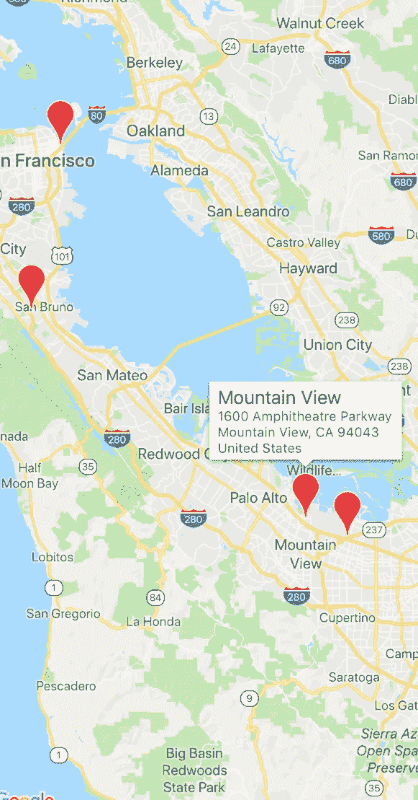

# 在 Flutter 中自定义谷歌地图标记图标

> 原文：<https://medium.com/geekculture/change-google-map-marker-icon-in-flutter-c68b2e4da31e?source=collection_archive---------0----------------------->


我将展示如何通过在 Flutter 中放置你自己选择的图像来定制谷歌地图标记图标。下面是谷歌地图中自定义图标的演示。自定义图标是不是很酷？


让我们开始吧:

# 先决条件:

*   谷歌地图必须集成在你的颤振项目。
*   无论你在哪里使用标记，比如:

```
Marker demo= new Marker(
markerId: MarkerId(“marker_id”),
infoWindow: InfoWindow(title:_currentAddress),
);
```

谷歌地图上出现了一个红色的默认红色标记



因此，要更改此标记图标，您必须遵循以下步骤:

> **一、导入内置包:**

```
import ‘package:flutter/services.dart’ show rootBundle;
import ‘dart:ui’ as ui;
import 'dart:typed_data';
```

> **二世。创建将自定义图像(您希望用作标记图标)更改为字节数组的函数。**

```
Future<Uint8List> getBytesFromAsset({String path,int width})async {
ByteData data = await rootBundle.load(path);
ui.Codec codec = await ui.instantiateImageCodec(
   data.buffer.asUint8List(), 
   targetWidth: width
 );
ui.FrameInfo fi = await codec.getNextFrame();
return (await fi.image.toByteData(
   format: ui.ImageByteFormat.png))
 .buffer.asUint8List();
}
```

> **三。对自定义标记图标使用上述函数。**

```
final Uint8List customMarker= await getBytesFromAsset(
 path:<image_url>, //paste the custom image path 
 width: 50 // size of custom image as marker
);
```

> **四。在标记配置选项中使用上述标记。**

```
Marker demo= new Marker(
markerId: MarkerId(“marker_id”),
infoWindow: InfoWindow(title:_currentAddress),
icon: BitmapDescriptor.fromBytes(customMarker)
);
```

完成所有这些操作后，默认标记图标将变为您在项目中选择的图像的自定标记图标。

# 额外提示:

在上面的步骤中，我们在谷歌地图中使用了自定义标记图标的资产图像。网络形象呢？🤔🤔🤔
这也是解决方案:))请遵循以下步骤:

> **一、使用 pubspec.yaml 中的 network_image_to_byte 包:**

```
network_image_to_byte: 
```

> **二。导入上面的包:**

```
import ‘package:network_image_to_byte/network_image_to_byte.dart’;
```

> **三。使用 imageurl(您选择的)更改默认标记图标**

```
final Uint8List customMarker= await networkImageToByte(<image_url>);
```

> **四。在标记配置中使用上述标记:**

```
Marker demo= new Marker(
markerId: MarkerId(“marker_id”),
infoWindow: InfoWindow(title:_currentAddress),
icon: BitmapDescriptor.fromBytes(customMarker)
);
```

就像这样，你可以从你的资产文件夹或者从互联网上改变你选择的谷歌地图的默认标记图标。希望这能帮助你。

谢了。

欲了解更多信息，请购买《让自己成为软件开发者:让我们深入了解 Flutter & MNCs》一书。

跟我上媒[这里](https://www.facebook.com/Flutter-Motivation-with-Lakshydeep-104972618552227/)也是。
不停学习
不停编码
不停赚
:):)