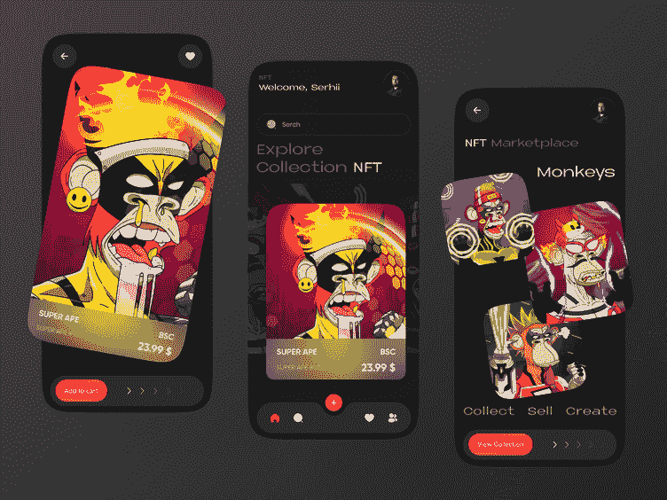
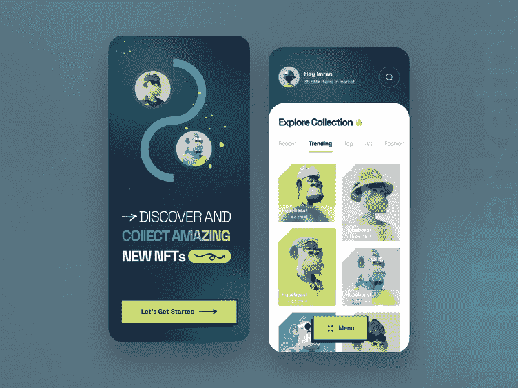

# 改变传统，给你心爱的人一份 NFT 节日礼物吧！

> 原文：<https://medium.com/geekculture/change-the-tradition-with-an-nft-holiday-gift-to-your-beloved-ones-7ca7c9cf9455?source=collection_archive---------15----------------------->

## 尽管 NFT 自 2010 年代中期就已经存在，但它们是在 2021 年加密热潮期间成为人们关注的焦点。NFT 节日礼物呢？他们怎么了？

节日越来越近了，因为全世界都在为圣诞节和新年以及这几天的假期做准备。几乎每个人都会开始考虑给他们亲近的人送些新礼物，一份能让接受者开心并给你带来微笑的新礼物。如果你是一个科技极客，并且知道过去两年的趋势，你可能已经有了答案。NFT 节日礼物可能是某人让他们欣赏技术或让他们理解你的感情的完美选择。随着我们的进步，让我们看到理解这一点所需的一切。

# 《NFT 节日礼物》中的“NFT”是什么

扩大“NFT”给了我们不可替代的令牌。那是什么意思？不可替换令牌表示不能相互交换的数字令牌。例如，虽然我们可以把一张 5 美元的钞票换成另一张同面值的钞票，或者换成多种排列的钞票，但我们不能把毕加索的一幅作品换成他的另一幅。后一个原则适用于不可替代的令牌，并且有一些令牌的工作方式类似于前一个原则——加密货币。尽管 NFT 自 2010 年代中期就已经存在，但它们是在 2021 年加密热潮期间成为人们关注的焦点。NFT 节日礼物呢？他们怎么了？

# NFT 能被赠送给别人吗？

简而言之，是的，赠送 NFT 是允许的，而且过程比人们想象的要简单得多。NFT 新年礼物在 2022 年就已经是一件事了，就在那时，关于 NFTs 的词传播到了全球大众。但是，如果你想知道给收件人 NFT 奖是什么，这里有一些见解。 [**购买 NFT**](https://bit.ly/3EDpNrj) 礼物可以向接受者提供产品的权利和拥有有区块链记录支持的认证物品的炫耀权利。

其他权利，如二次销售版税和知识产权，可由 NFT 的原创者酌情提供。如果你是一个创造者，你将有更多的自由来决定你的 NFT 新年礼物将如何造福你所爱的人。

# 但是，它们不是很贵吗？

是也不是！如果你看看高端蓝筹 PFP NFT 系列，如 Bored Ape Yacht Club 或 CryptoPunks，你可能会觉得要破产才能得到一个 JPEG。但是，也有不错的 NFT 收藏品和个别 NFT 物品，它们的价格只是那些备受追捧的收藏品的一小部分，但内在价值几乎相同。得到 NFT 新年礼物总是取决于接受者的兴趣和观点。当您处理这些非功能性交易时，会增加更多的成本，因为交易(汽油)费用会随着区块链和一周的时间而变化。

# 购买 NFT 礼物:两种方式

*   通过搜索各种 [**市场平台**](https://bit.ly/3F012Xm) 为接收者购买 NFT 礼物，并将其交易到他们的加密钱包中。
*   向他们的钱包发送一些加密货币，以便他们可以为自己购买 NFT 节日礼物，在这个过程中满足双方。

# 为什么我应该买 NFT 礼物？

购买 NFT 新年礼物远不是炫耀自己是一个很酷的技术人员，因为 NFT 已经离开了精英财产的状态，开始融入更多的日常生活用例。尽管全球密码市场崩溃，趋势低迷，但 NFTs 的进步也导致了**元宇宙技术**的巨大增长。基于此类 [**元宇宙平台**](https://bit.ly/3OCmjcX) (如虚拟土地、虚拟角色或装备)的 NFT 节日礼物，如果它们的价值随着时间的推移而增值的话，可以成为巨大的财富。

NFT 的节日礼物也可以让那些已经喜欢上 NFT 的人受益，比如千禧一代。狂热的 P2E 游戏玩家希望在新的一年里拥有一件他们买不起的昂贵的 NFT 物品，作为他们爱人送给他们的礼物，以赚取被动的财富。或者一个名人 NFT 收藏品给一个亲密的热心粉丝可以让他们的一天变得更好。

# 赠送最后的想法

因此，我们可以说，购买 NFT 礼物可以是一个伟大的选择，任何人都可以访问互联网和一个支持非功能性交易的加密钱包。即使是 NFT 支持的硬件钱包也可以成为尚未涉足该领域的人的选择。假期即将来临，如果你等到最后一刻才收到 NFT 的礼物，你可能会陷入网络堵塞。马上着手购买有价值的 NFT 新年礼物，让他们的一年过得更好。