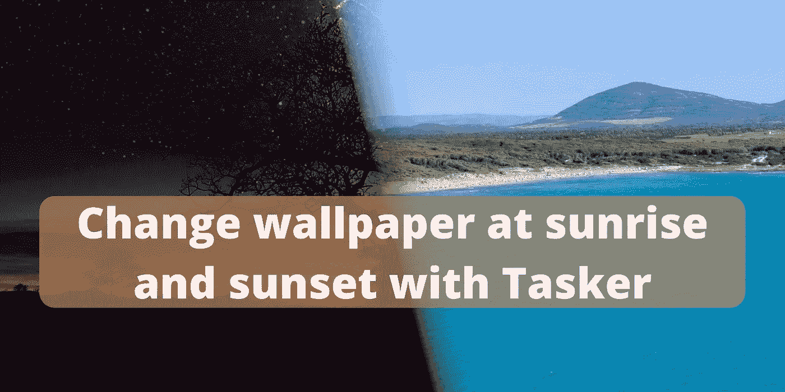
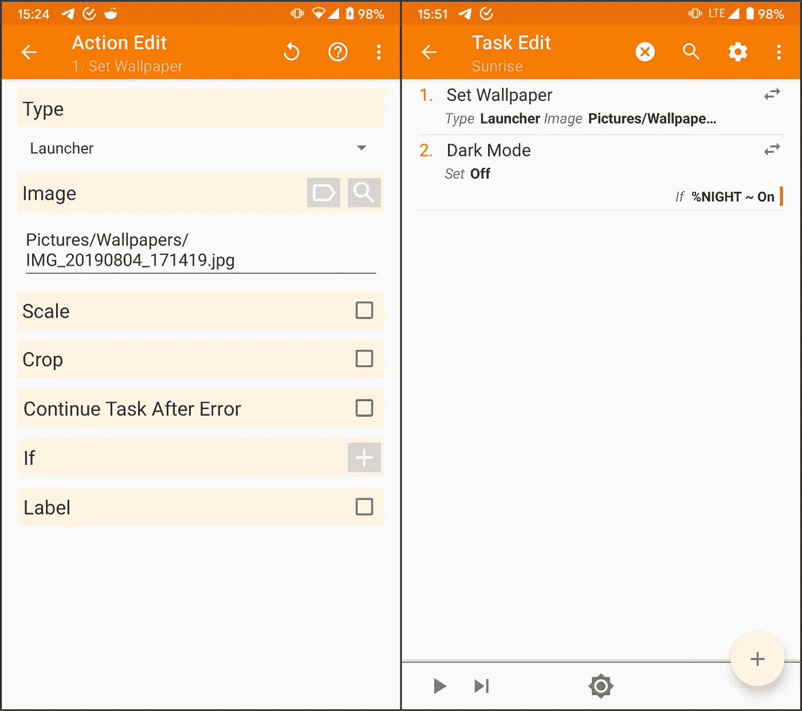
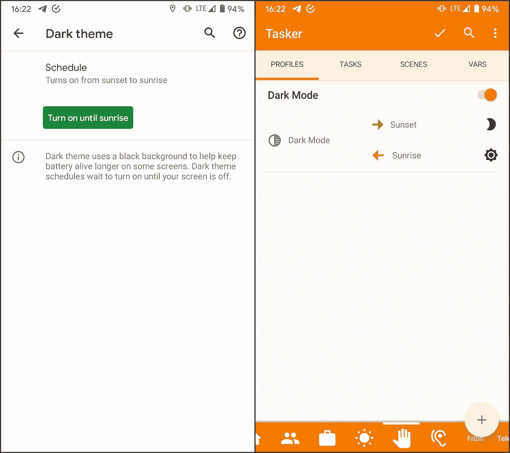
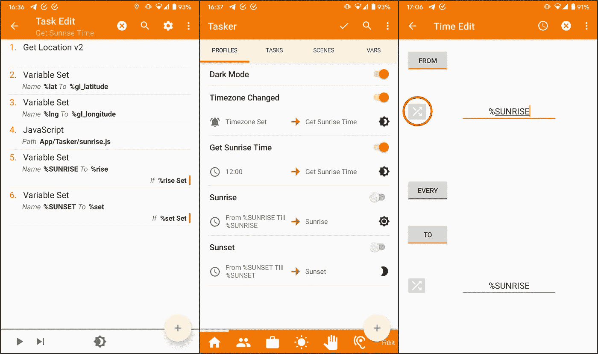

# 用 Tasker 在日出日落时更换壁纸

> 原文：<https://medium.com/geekculture/change-wallpaper-at-sunrise-and-sunset-with-tasker-ec771a63acdd?source=collection_archive---------8----------------------->

Photo on the left by [Red Zeppelin](https://unsplash.com/@redzeppelin?utm_source=unsplash&utm_medium=referral&utm_content=creditCopyText) on [Unsplash](https://unsplash.com/s/photos/night-wallpaper?utm_source=unsplash&utm_medium=referral&utm_content=creditCopyText)

今天我来解释一下如何配置 Tasker 在日出日落时更换壁纸。例如，设置较暗的壁纸可以在夜间放松眼睛，这很有用。

# 第一步。准备任务

第一步是创建两个任务，一个在日出时运行，另一个在日落时运行。

使用**设置壁纸**动作，可以指定要使用的图片和其他参数。

您也可以使用适当的操作来决定启用/禁用黑暗模式。我增加了一个条件，只有当它打开而不是在*自动*模式时才这样做。

On the left, the **Set Wallpaper** action; on the right, the **Sunrise** task.

# 第二步。配置配置文件

根据您的设置和需求，有两种可能的选项。

## 备选方案 1。当黑暗模式开启时

如果您的手机在日落时自动启用黑暗模式，并在日出时禁用它，您可以使用此选项。

在 Tasker 中配置一个 profile，触发状态*黑暗模式*，设置**日落**任务为*进入任务*，设置**日出**为*退出任务*。

On the left, the Dark Mode setting on my phone; on the right the profile.

## 选项 2。计算日出和日落时间

如果你的手机没有之前的设置，或者你不想使用它，你可以根据你的位置计算日出和日落时间。

该选项使用 javascript 文件，您可以从以下页面[日出/日落— Tasker Wiki](http://tasker.wikidot.com/sunrisesunset) 下载该文件。

你需要一个新任务，姑且称之为**获取日出时间**，两个配置文件触发它，两个配置文件启动**日出**和**日落**任务。

The first screenshot shows the **Get Sunrise Time** task, the second the profiles discussed earlier, and the third the button to define a variable as time for the **Sunrise** and **Sunset** profiles.

**获取日出时间**任务执行以下动作:

*   **获取位置 V2** :确定你的位置。
*   **变量集**:这两个动作为 javascript 文件准备变量。
*   **Javascript** :执行之前下载的文件。它需要文件的路径。
*   **变量集**:这两个动作存储 javascript 文件产生的变量。

两个配置文件触发任务执行:

*   在**时区设置**事件条件。
*   在**时间**条件下。

有了这两个，它每天更新日落和日出时间，并在您更改时区时立即更新。

然后，两个配置文件在由**获取日出时间**任务计算的时刻触发**日出**和**日落**任务。