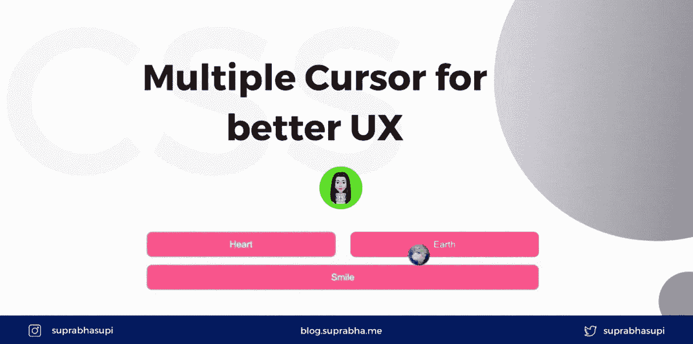
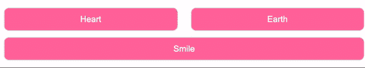
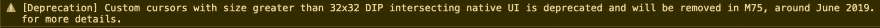

# 用 CSS 改变光标以获得更好的 UX

> 原文：<https://medium.com/geekculture/changing-cursor-with-css-for-better-ux-407110d1ad76?source=collection_archive---------37----------------------->



multiple cursors for better UX

cursor CSS 属性设置鼠标指针的类型，如果有的话，当鼠标指针在一个元素上时显示。

在某些情况下，用户代理样式表中的默认光标行为并不合适。在这种情况下，我们应该将光标改变为能够反映该元素上预期的用户交互的东西。

检查[码笔](https://codepen.io/suprabhasupi/pen/PopGBRO) 🧡上的所有光标

# 使用自定义光标↓

cursor 属性被指定为零个或多个用逗号分隔的`<url>`值。cursor 属性完全接受 SVG 文件，但不接受 gif 文件。

是的，你可以创建自己的自定义光标使用任何图像，如 png，jpg 等。

```
<div class="cursors">
  <button class="heart">Heart</button>
  <button class="earth">Earth</button>
  <button class="smile">Smile</button>
</div>.cursors {
  display: flex;
  flex-wrap: wrap;
}
.heart {
  cursor: url("https://i.imgur.com/K10EMnr.png"), auto;
}
.earth {
  cursor: url("https://i.imgur.com/scE50J2.png"), pointer;
}
.smile {
  cursor: url("https://i.imgur.com/aPPijZC.png"), pointer;
}
```

## 输出:



📝注意:**图像的尺寸不能大于 32*32 倾角**，否则你会得到以下警告，你的图像将无法工作。



我已经用这个网站调整了我的图片大小。

# 参考🧐

*   [MDN 单据光标](https://developer.mozilla.org/en-US/docs/Web/API/Console)

🌟[推特](https://twitter.com/suprabhasupi) |👩🏻‍💻 [suprabha.me](https://www.suprabha.me/) |🌟 [Instagram](https://www.instagram.com/suprabhasupi/)