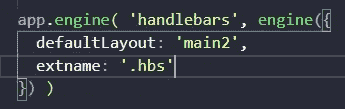
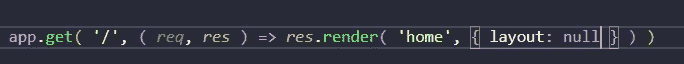
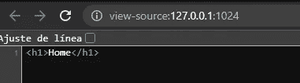
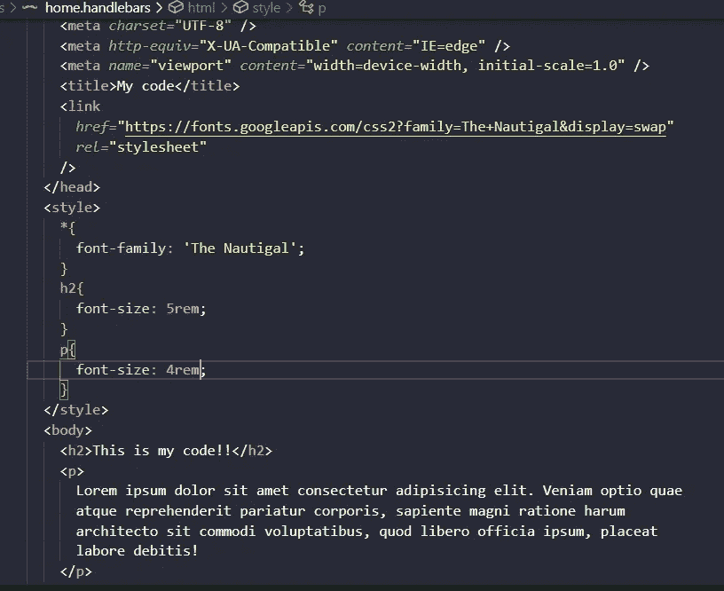
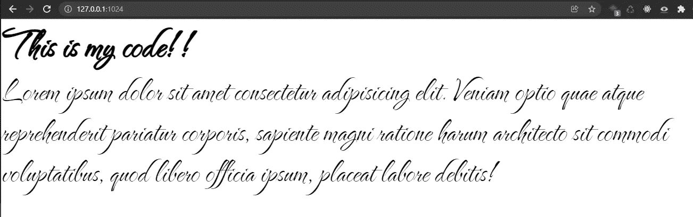
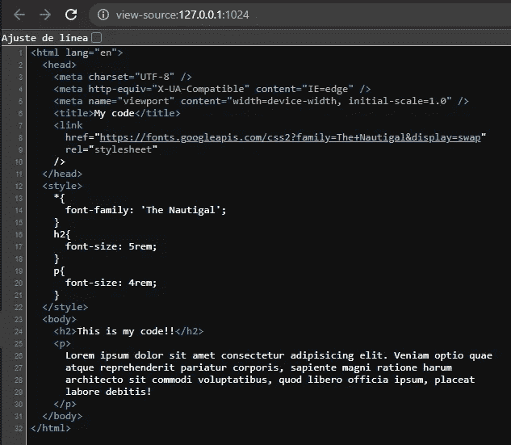

# 更改车把扩展并向 view Express.js 车把添加完整代码

> 原文：<https://medium.com/geekculture/changing-the-handlebars-extension-and-adding-complete-code-to-a-view-express-js-handlebars-5219917d72fe?source=collection_archive---------14----------------------->

嗨，我正在用 Hanldebars 的 Express.js 模板学习很多新东西，我想分享这些新东西

首先，我们可以改变扩展名。车把到。在这种情况下，我们需要设置 extname:'。引擎对象中的“hbs”

Example adding extname to .hbs

它将搜索。hbs 布局扩展

完整的代码到一个视图，例如，如果我们想添加一个完整的自定义 HTML 模板我们需要指定布局为空

Example setting the layout to null for the response

Example just <h1> tag and no default layout

让我们添加自己的完整代码

Example added a complete HTML template into a view

Outcome of the HTML custom template into a view

Example source code Chrome browser

# 结论

这些是帮助您使用 Express.js 和 handlebars 的快捷方式，除此之外，您还可以使用它们来改进您的视图或布局。

# 来源

 [## 使用 Node 和 Express 进行 Web 开发:利用 JavaScript 堆栈

### 使用 Node 和 Express 进行 Web 开发:利用 Amazon.com 的 JavaScript 堆栈。*免费*送货到…

www.amazon.com](https://www.amazon.com/Web-Development-Node-Express-Leveraging/dp/1492053511)