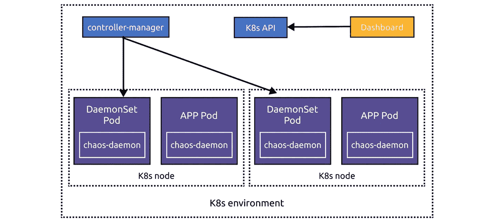
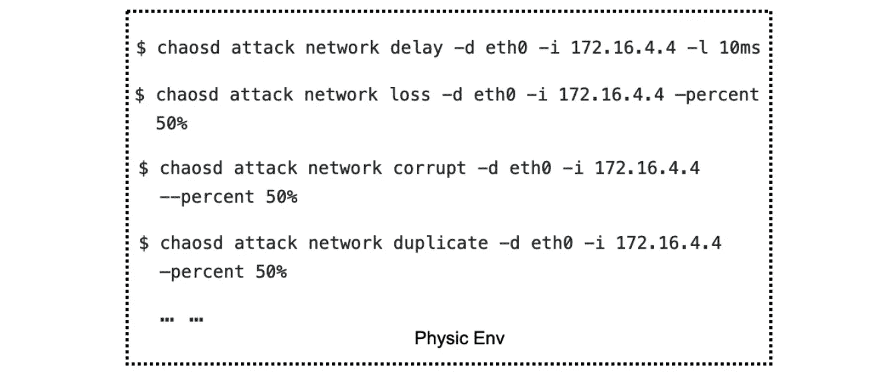
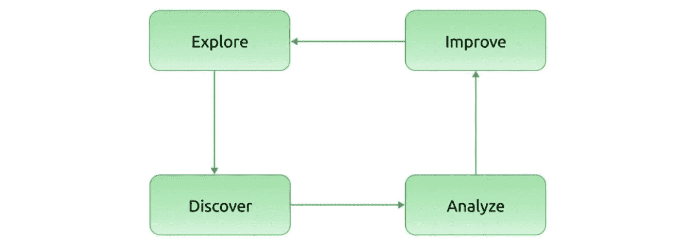

# 混沌网格翻拍:向混沌即服务更近一步

> 原文：<https://medium.com/geekculture/chaos-mesh-remake-one-step-closer-toward-chaos-as-a-service-791069f3f838?source=collection_archive---------46----------------------->

**作者:**

*   常宇(奇虎 360 工程师)
*   [王祥](https://github.com/WangXiangUSTC)(混沌网委员，平盖工程师)

**Transcreator:** [黄然](https://github.com/ran-huang)；编辑:汤姆·万德

[Chaos Mesh](https://chaos-mesh.org/) 是一个云原生的混沌工程平台，在 Kubernetes 环境中编排混沌。使用 Chaos Mesh，您可以在 Kubernetes 上通过将所有类型的故障注入到 Pods、网络、文件系统甚至内核来测试您的系统的弹性和健壮性。

由于它是开源的，并被云本地计算基金会(CNCF)作为沙盒项目接受，Chaos Mesh 吸引了世界各地的贡献者，并帮助用户测试他们的系统。然而，它仍有很大的改进空间:

*   它需要提高可用性。有些功能使用起来很复杂。例如，当您应用一个混沌实验时，您经常需要手动检查实验是否已经开始。
*   它主要用于 Kubernetes 环境。因为 Chaos Mesh 不能管理多个 Kubernetes 集群，所以需要为每个 Kubernetes 集群部署 Chaos Mesh。虽然 [chaosd](https://github.com/chaos-mesh/chaosd) 支持在物理机器上运行 chaos 实验，但是其功能非常有限，而且命令行的使用也不方便。
*   它不允许插件。要应用定制的混沌实验，你必须修改源代码。而且混沌网格只支持 Golang。

诚然，Chaos Mesh 是一流的混沌工程平台，但距离提供混沌即服务(CaaS)还有很长的路要走。因此，在 [TiDB Hackathon 2020](https://pingcap.com/community/events/hackathon2020/) ，**上，我们对 Chaos Mesh 的架构进行了修改，使其向 CaaS** 更近了一步。

在这篇文章中，我将谈论 CaaS 是什么，我们如何用混沌网格实现它，以及我们的计划和经验教训。我希望我们的经验对你建立自己的混沌工程系统有所帮助。

# 什么是混沌即服务？

正如 Gremlin 的联合创始人 Matt Fornaciari 所说的那样，CaaS“意味着你将在几分钟内获得直观的用户界面、客户支持、开箱即用的集成和你需要的一切。”

从我们的角度来看，CaaS 应该提供:

*   用于管理的统一控制台，您可以在其中编辑配置和创建混沌实验。
*   可视化指标，让您看到实验状态。
*   暂停或存档实验的操作。
*   简单的互动。您可以轻松地拖放对象来协调您的实验。

一些公司已经采用混沌网格来满足自己的需求，如[网易伏羲人工智能实验室](https://pingcap.com/blog/how-a-top-game-company-uses-chaos-engineering-to-improve-testing)和 FreeWheel，使其成为 CaaS 的模型。

# 向 CaaS 发展混沌网格

基于我们对 CaaS 的理解，我们在 Hackathon 期间改进了 Chaos Mesh 的架构，包括改进了对不同系统的支持和更好的可观察性。你可以在 [wuntun/chaos-mesh](https://github.com/wuntun/chaos-mesh/tree/caas) 和 [wuntun/chaosd](https://github.com/wuntun/chaosd/tree/caas) 中查看我们的代码。

## 重构混沌仪表板

当前的混沌网状结构适合于单个的 Kubernetes 集群。Chaos Dashboard，web UI，被绑定到一个特定的 Kubernetes 环境:

The current Chaos Mesh architecture

在这个重构过程中，为了允许 Chaos Dashboard 管理多个 Kubernetes 集群，我们将 Chaos Dashboard 从主架构中分离出来。现在，如果您在 Kubernetes 集群之外部署 Chaos Dashboard，您可以通过 web UI 将集群添加到 Chaos Dashboard。如果在集群内部部署 Chaos Dashboard，它会通过环境变量自动获取集群信息。

你可以在 Chaos Dashboard 中注册 Chaos Mesh(技术上来说是 Kubernetes 配置)或者让`chaos-controller-manager`通过配置向 Chaos Dashboard 报告。Chaos Dashboard 和`chaos-controller-manager`通过 CustomResourceDefinitions (CRDs)进行交互。当`chaos-controller-manager`发现一个混沌网状 CRD 事件时，它调用`chaos-daemon`进行相关的混沌实验。因此，Chaos Dashboard 可以通过在 CRD 上操作来管理实验。

## 重构混沌 d

chaosd 是一个在物理机器上运行混沌实验的工具包。以前，它只是一个命令行工具，功能有限。

Previously, chaosd was a command line tool

在重构过程中，**我们让 chaosd 支持 RESTful API 并增强了它的服务，这样它就可以通过解析 CRD 格式的 JSON 或 YAML 文件来配置混沌实验。**

现在，chaosd 可以通过配置将自己注册到 Chaos Dashboard，并向 Chaos Dashboard 发送定期心跳。通过心跳信号，Chaos Dashboard 可以管理 chaosd 节点状态。您还可以通过 web UI 向 Chaos Dashboard 添加 chaosd 节点。

此外， **chaosd 现在可以在指定时间安排混沌实验并管理实验生命周期，这统一了 Kubernetes 和物理机上的用户体验。**

借助新的 Chaos Dashboard 和 chaosd，Chaos Mesh 的优化架构如下:

Chaos Mesh’s optimized architecture

## 提高可观察性

另一个改进是可观察性，即如何判断实验是否成功进行。

在改进之前，您必须手动检查实验指标。如果您将 [StressChaos](https://chaos-mesh.org/docs/simulate-heavy-stress-on-kubernetes/) 注入到 Pod 中，您必须进入 Pod 来查看是否有`stress-ng`进程，然后使用`top`命令来检查 CPU 和内存利用率。这些指标告诉你你的 StressChaos 实验是否成功创建。

为了简化流程，我们现在将`node_exporter`集成到`chaos-daemon`和 chaosd 中来收集节点指标。我们还在 Kubernetes 集群中部署了`kube-state-metrics`,结合 cadvisor 来收集 Kubernetes 指标。收集的指标由 Prometheus 和 Grafana 保存和可视化，这为您检查实验状态提供了一种简单的方法。

**需要进一步改进**

总体而言，指标旨在帮助您:

*   确认混沌注入。
*   观察混沌对服务的影响，并进行定期分析。
*   应对异常混乱事件。

为了实现这些目标，系统需要监控实验数据指标、普通指标和实验事件。混沌网格仍需改进:

*   实验数据指标，例如注入网络延迟的确切延迟持续时间和模拟工作负载的特定负载。
*   实验事件；即创建、删除和运行实验的 Kubernetes 事件。

这是一个来自[石蕊](https://github.com/litmuschaos/chaos-exporter#example-metrics)的度量标准的好例子。

# 混沌网格的其他提议

由于黑客马拉松的时间有限，我们没有完成所有的计划。以下是我们的一些建议，供混沌网格社区在未来考虑。

## 管弦乐编曲

一个混沌工程的闭环包括四个步骤:探索混沌，发现系统中的不足，分析根本原因，发送反馈以进行改进。

A closed loop of Chaos Engineering

然而**目前大多数开源混沌工程工具只注重探索，不提供务实的反馈**。基于改进的可观测性组件，我们可以实时监控混沌实验，并对实验结果进行比较和分析。

有了这些结果，我们将能够通过添加另一个重要的组件:编排来实现一个闭环。Chaos Mesh 社区已经提出了一个[工作流](https://github.com/chaos-mesh/rfcs/pull/10/files)特性，它使你能够轻松地编排和调用 Chaos 实验，或者方便地将 Chaos Mesh 与其他系统集成。你可以在 CI/CD 阶段或者 canary 发布之后运行混沌实验。

**将可观察性和编排结合起来，为混沌工程创造了一个闭环反馈回路**。如果您要在 Pod 上启动 100 毫秒的网络延迟测试，您可以使用 observability 组件来观察延迟变化，并使用 PromQL 或其他基于编排的 DSL 来检查 Pod 服务是否仍然可用。如果服务不可用，当延迟时间为> = 100 毫秒时，您可以得出服务不可用的结论。

但是 100 ms 不是你服务的门槛；您需要知道您的服务可以处理的最大延迟是多少。通过编排混沌实验的值，您将知道要满足服务级别目标，您必须确保的阈值是多少。此外，您将了解不同网络条件下的服务性能，以及它们是否符合您的预期。

## 数据格式

混沌网格使用 CRDs 来定义它的混沌对象。如果能把 CRDs 转换成 JSON 文件，就能实现组件之间的通信。

在数据格式方面，chaosd 只是以 JSON 格式消费和注册 CRD 数据。如果一个混沌工具可以消耗 CRD 数据并注册自己，它就可以在不同的场景下运行混沌实验。

## 插件

混沌网格对插件的支持有限。你只能通过在 Kubernetes API 中注册一个 CRD[来添加一个新的混乱](https://chaos-mesh.org/docs/add-new-chaos-experiment-type/)。这带来了两个问题:

*   你必须使用 Golang 开发插件，这是编写混沌网格的同一种语言。
*   您必须将扩展代码合并到混沌网格项目中。因为 Chaos Mesh 没有像 BPF(Berkeley Packet Filter)那样的安全机制，合并插件代码可能会带来额外的风险。

为了实现完整的插件支持，我们需要探索一种新的方法来添加插件。由于混沌网格本质上是基于 CRD 进行混沌实验的，所以混沌实验只需要生成、监听和删除 CRD。在这方面，我们有几个想法值得尝试:

*   开发一个控制器或操作员来管理 CRDs。
*   统一处理 CRD 事件，并通过 HTTP 回调对 CRD 进行操作。这个方法只使用 HTTP APIs，对 Golang 没有要求。例如，参见[白盒控制器](https://github.com/summerwind/whitebox-controller)。
*   使用 WebAssembly (Wasm)。当需要调用混沌实验逻辑时，只需调用 Wasm 程序即可。参见矢量的 [WASM 变换](https://vector.dev/docs/reference/transforms/wasm/)。
*   使用 SQL 查询混沌实验状态。因为 Chaos Mesh 是基于 CRDs 的，所以可以用 SQL 在 Kubernetes 上操作。例子包括 [Presto 连接器](https://github.com/xuxinkun/kubesql)和 [osquery 扩展](https://github.com/aquasecurity/kube-query)。
*   使用基于 SDK 的扩展，比如 [Chaos Toolkit](https://docs.chaostoolkit.org/reference/api/experiment/) 。

## 与其他混沌工具的集成

对于现实世界的系统，单一的混沌工程工具很难穷尽所有可能的用例。这就是为什么与其他混沌工具集成可以使混沌工程生态系统更加强大。

市场上有许多混沌工程工具。Litmus 的 [Kubernetes 实现](https://github.com/litmuschaos/litmus-go/tree/master/chaoslib/powerfulseal)基于 [PowerfulSeal](https://github.com/powerfulseal/powerfulseal) ，而其[容器实现](https://github.com/litmuschaos/litmus-go/tree/master/chaoslib/pumba)基于 [Pumba](https://github.com/alexei-led/pumba) 。[北海巨妖](https://github.com/cloud-bulldozer/kraken)专注 Kubernetes， [AWSSSMChaosRunner](https://github.com/amzn/awsssmchaosrunner) 专注 AWS， [Toxiproxy](https://github.com/shopify/toxiproxy) 针对 TCP。也有基于[特使](https://docs.google.com/presentation/d/1gMlmXqH6ufnb8eNO10WqVjqrPRGAO5-1S1zjcGo1Zr4/edit#slide=id.g58453c664c_2_75)和 Istio 的合并项目。

为了管理各种各样的混乱工具，我们可能需要一个统一的模式，比如[混乱中心](https://hub.litmuschaos.io/)。

# 来自社区的声音

在这里，我们想分享中国一家领先的网络安全公司以及混沌网格用户如何调整混沌网格以满足他们的需求。它们的适应有三个方面:物理节点、容器和应用程序。

## 物理节点

*   支持在物理服务器上执行脚本。您可以在 CRDs 中配置脚本目录，并使用`chaos-daemon`运行您的脚本。
*   使用自定义脚本模拟重启、关机和内核崩溃。
*   使用自定义脚本关闭节点的网卡。
*   使用 sysbench 创建频繁的上下文切换，以模拟“噪音邻居”效应。
*   使用 BPF 的`seccomp`拦截容器的系统调用。这是通过传递和过滤 PID 实现的。

## 容器

*   随机更改部署副本的数量，以测试应用程序的流量是否异常。
*   基于 CRD 对象的嵌入:在混沌 CRDs 中填充入口对象以模拟接口的速度限制。
*   基于 CRD 对象的嵌入:在混沌 CRD 中填充纤毛网络策略对象以模拟波动的网络条件。

## 应用

*   支持运行自定义作业。目前，混沌网格使用`chaos-daemon`注入混沌，不能保证调度的公平性和亲和性。为了解决这个问题，我们可以使用`chaos-controller-manager`直接为不同的 CRD 创建工作。
*   支持在自定义作业中运行[纽曼](https://github.com/postmanlabs/newman)随机更改 HTTP 参数。这是为了在 HTTP 接口上实现混沌实验，当用户执行异常行为时会发生这种情况。

# 摘要

传统的故障测试针对系统中预期易受攻击的特定点。往往是一个断言:特定的条件产生特定的结果。

混沌工程更强大，因为它帮助你发现“未知的未知”通过在更广阔的领域探索，混沌工程加深了你对被测系统的了解，并挖掘出新的信息。

综上，以上是我们个人对混沌工程和混沌网格的一些思考和实践。我们的 Hackathon 项目还没有为生产做好准备，但我们希望对 CaaS 有所启发，并为 Chaos Mesh 起草一份有前途的路线图。如果你对构建混沌服务感兴趣，加入我们的 Slack (#project-chaos-mesh)！

*原载于 2021 年 6 月 24 日*[*www.pingcap.com*](https://pingcap.com/blog/chaos-mesh-remake-one-step-closer-toward-chaos-as-a-service)