# C++中的混沌动力学系统建模。

> 原文：<https://medium.com/geekculture/chaotic-dynamics-system-modeling-in-c-74749fa6677?source=collection_archive---------1----------------------->


Google.com

在下面的文章中，我将描述动力系统的基本概况，并给你模型表示的一般直觉。在第二部分，我将展示关于动力系统的混沌理论(混沌动力学)的介绍。我将描绘有趣的系统，这些系统将使用 C++进行模拟(代码在我的 [GitHub](https://github.com/markusbuchholz/Chaotic_Dynamics_System_Modeling_in_Cpp) 上)。

[头文件](https://github.com/lava/matplotlib-cpp)(用于绘图库)必须和你的 cpp(一个你可以从我的库克隆的文件)在同一个文件夹里。
你的程序可以编译如下:

```
//compile
g++ my_prog.cpp -o my_prog -I/usr/include/python3.8 -lpython3.8// //run
./my_prog//folder tree
├── my_prog
├── my_prog.cpp
├── matplotlibcpp.h
```

# 动力系统。

随时间变化的系统称为动态系统，由一个或多个方程表征。例如，动态方程可以用来解释人口变化、天气或机器人运动。动力系统将由微分方程来描述，微分方程涉及函数的导数(瞬时变化)。

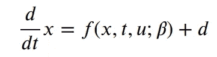

因为我们需要捕捉直觉，我将解释动力方程(微分方程)的所有组成部分。

向量 X 代表我们系统的状态，它有**个最小数量的**组值，我们需要用它们来描述我们的系统(行为)。如果我分析[摆](https://en.wikipedia.org/wiki/Pendulum)，这个系统被它的角度θ和绕枢轴的角速度唯一定义。

**F** 就是我们所说的动态，它是一组描述状态 1、状态 2、状态 3 和状态 n 的动态的函数 f1、f2、f3、… fn。函数 **F** 是一个矢量场，提供关于系统将如何根据当前状态 **X** 随时间变化的信息。我们称 **F** 为向量场，因为它给我们每个状态空间 **X** 关于向量如何求导的方向的信息。

**t，正如所料，**是时间，它是描述系统如何随时间变化的动态系统的基本“组件”。

**向量 u** 与动态系统的主动控制有关。当我们开车时，我们可以通过踩加速踏板来加快速度。这是我们对影响响应的系统的外部输入(控制信号)。

**𝛽** 是一个组件，它包括系统的其他参数，我们无法明确控制这些参数，但是这些值的变化会改变系统的动态行为(响应)。如果我们再次考虑汽车。当轿厢由一个人驾驶而没有乘客时，以及当轿厢满载时(乘客和行李的最大数量)，轿厢动态(响应)会有所不同。

我们也不能忘记其他干扰 **d** 像系统中的通知，不精确，或者我们试图控制的机械系统的质量下降。

我似乎很有必要提一下我们在构建系统的动态模型时所面临的挑战，以及对其行为的影响。

1.  一般来说，动态系统可以用牛顿定律、拉格朗日方程或哈密顿方程来描述，然而，这些方程只是近似真实的，因为系统通常是复杂的，由许多参数、变量和关系来描述。有时我们无法获得这些参数，因为它们不可测量或难以提取，或者我们不知道它们的存在或关系。通常我们使用近似“真实世界或真实行为”的模型。
2.  与用于描述动态的方程相关的第二个重要挑战是非线性(意味着不满足叠加——可加性和均匀性)。这些系统很难综合和分析。
3.  在一个动态系统中——向量 X 有很多维。天气或人脑可以用许多变量来描述，这些变量通常是未知或不可预测的。这里的挑战是选择最受系统动态影响的那些。
4.  系统的动态也可能是混沌的(我们将在下一篇文章的下一节中更进一步)。通常，这意味着系统动力学对(参数𝛽)、初始条件或隐藏状态的微小变化非常敏感。正如我之前在关于[洛伦兹吸引子](/geekculture/lorenz-attractor-weather-forecast-explained-93703ad0ec6)的文章中所讨论的，初始状态的小变化会影响一定时间后的极端变化。意思是—对微小的变化、初始条件或其他模型参数敏感。
5.  描述系统的所有参数都可以与不确定性相关联，因为我们使用的动态模型的所有组件都是不确定的(随机的)——我们可以定义我们如何影响系统的概率，我们测量什么，我们如何测量，我们甚至不确定时间(系统可能有一些延迟)等。

如您所见，随着时间的推移，动态系统很难建模、操作和影响。如果您需要更多信息，我鼓励您学习控制系统领域和/或观看史蒂夫·布伦顿教授的 YouTube 频道 **或 Brian Douglas 的 TechTalk，点击此处**[](https://www.youtube.com/user/ControlLectures)****和** [**。**](https://www.youtube.com/user/ControlLectures)**

# **混乱。**

**[混沌理论](https://en.wikipedia.org/wiki/Chaos_theory)与行为在理论上可预测的确定性系统相关。混沌系统最初看起来是可预测的，但结果却是随机的，这种系统的行为是无法确定的。
注意。这里描述的所有 C++仿真都可以在我的 [Github](https://github.com/markusbuchholz/Chaotic_Dynamics_System_Modeling_in_Cpp) 上获得。**

**我们可以定义系统行为混乱的时间。然而，它取决于三个参数:**

1.  **在预测中不确定性的数量是可以容忍的，**
2.  **可以多精确地测量其当前状态，**
3.  **和取决于系统动态的时间尺度。**

**混沌没有普遍接受的定义，但是以下
特征总是被混沌系统的解所描述:**

1.  **长期非周期性系统行为，**
2.  **对初始条件的敏感性(请看看我之前讨论过[洛伦兹吸引子](/geekculture/lorenz-attractor-weather-forecast-explained-93703ad0ec6)的文章)，**
3.  **[分形结构](https://en.wikipedia.org/wiki/Fractal)**

****

**Wikipedia**

**一个奇怪的吸引子，(混沌吸引子，分形吸引子)是一个
吸引子，表现出对初始条件的敏感性。在下面的例子中，我们可以绘制由 Guanrong Chen 和 Tetsushi Ueta → ( [Multiscroll 吸引子)](https://en.wikipedia.org/wiki/Multiscroll_attractor)发现(修改)的洛伦兹模型上的微分方程的解。**

**混沌系统的动力学描述如下，**

**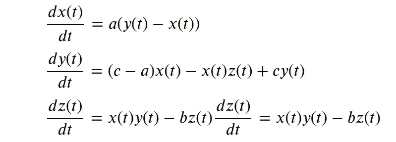**

**数值解可以描述如下，**

****

**A strange attractor when a= 35, b = 3, and c= 28.**

**下一个可以观察到混沌现象的例子是[蔡氏电路。该电路显示了许多有趣的现象，包括通向混沌的倍周期级联、通向混沌的间歇路径和通向混沌的准周期路径。](https://en.wikipedia.org/wiki/Chua%27s_circuit)**

**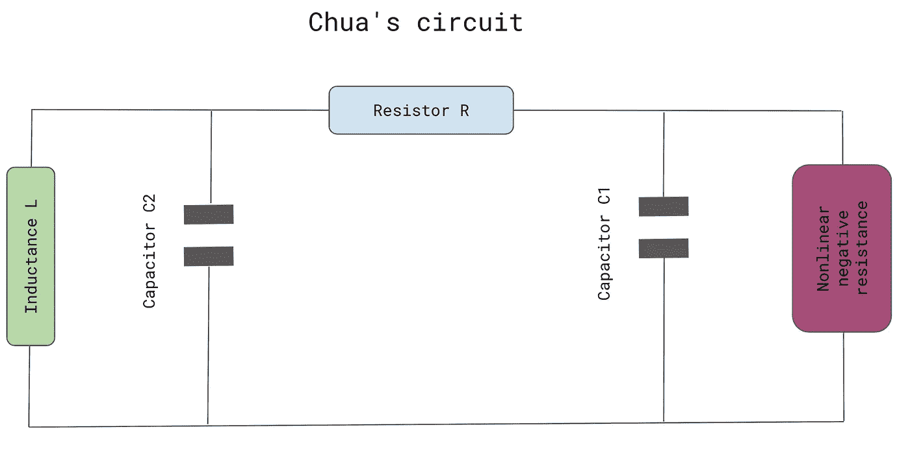**

**Chua’s circuit (by author)**

**混沌系统的动力学描述如下，**

**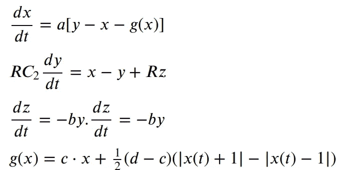**

****g(x)** 描述了非线性电阻
的电气响应，其形状取决于其元件的特定配置。**

**参数 **a、b、c 和 d** 由电路元件的特定值决定。**

**数值解可以描述如下，**

**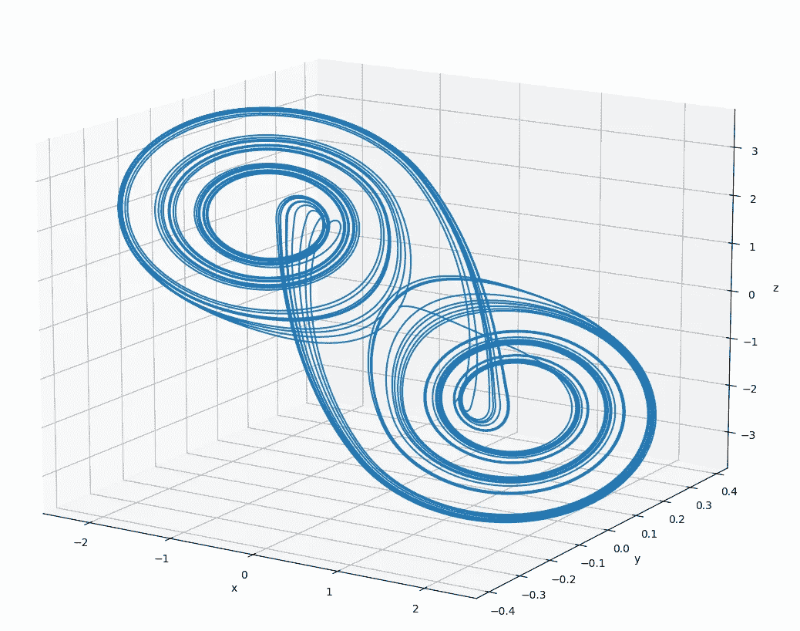**

**Chua’s double-scroll attractor**

**[奥托·e·罗斯勒](https://en.wikipedia.org/wiki/R%C3%B6ssler_attractor)构建了以下三维
微分方程系统:**

**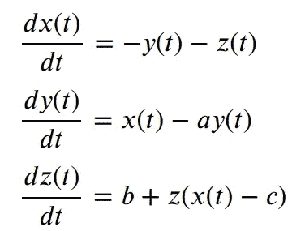**

**其中 a、b 和 c 都是常数。**

**数值解可以描述如下，**

**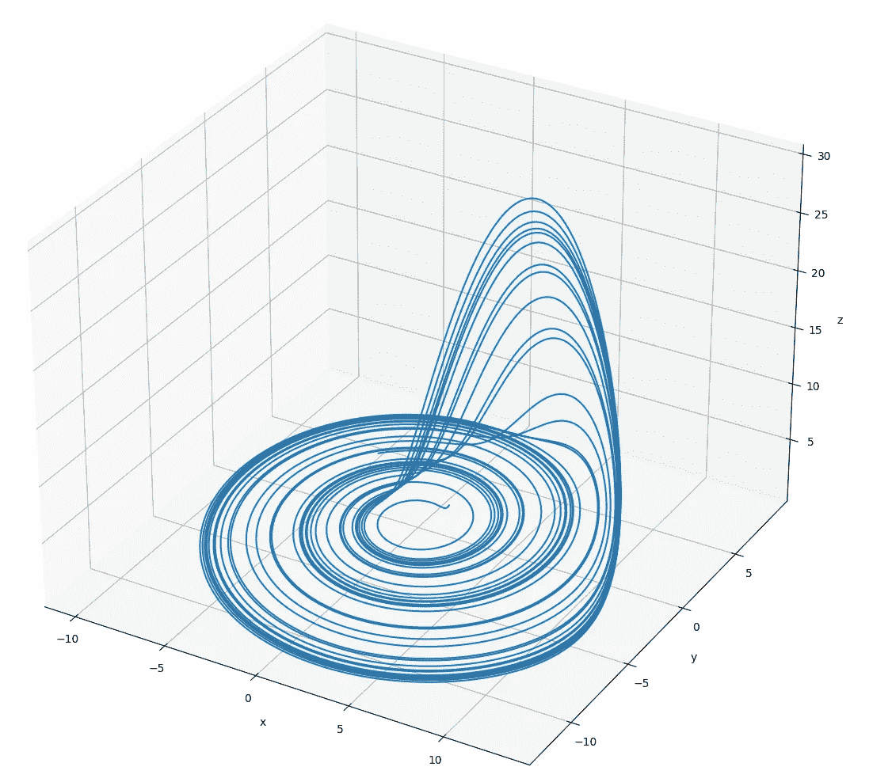**

**The chaotic attractor for the system when c = 6\. 3**

**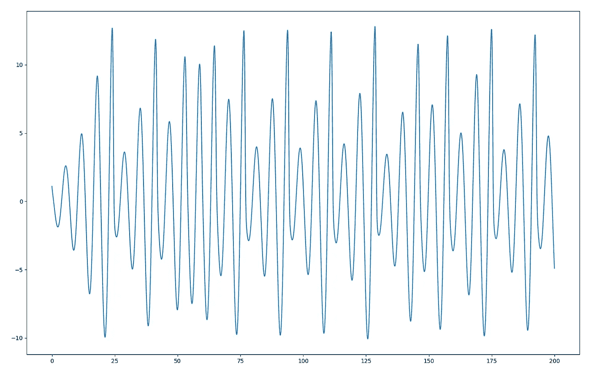**

**The chaotic attractor for the system when c = 6\. 3\. x(t) curve**

**你可以看到，如果只是 x 的初始条件稍微改变，会发生什么。**

**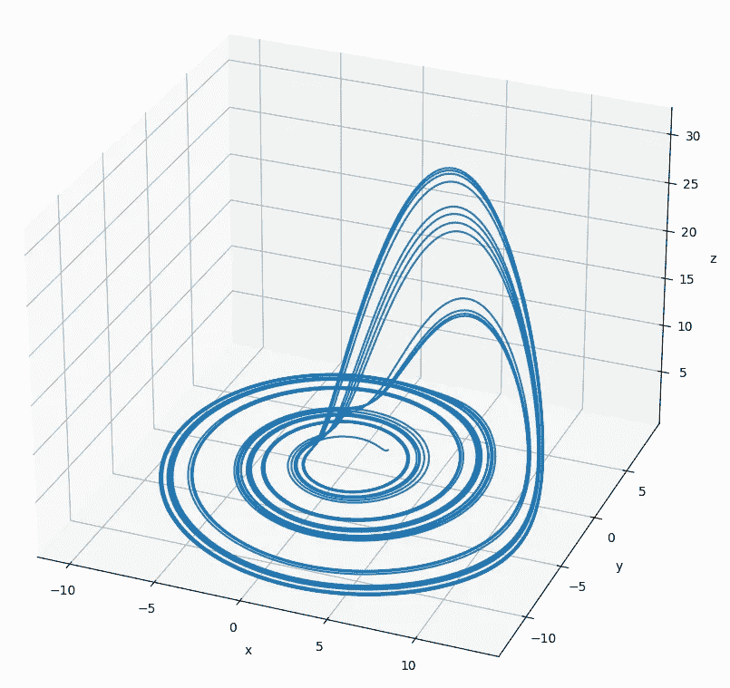**

**The chaotic attractor for the system when c = 6\. 3\. x(t) curve for change initial conditions.**

**我们也可以导出如下的动态系统，**

**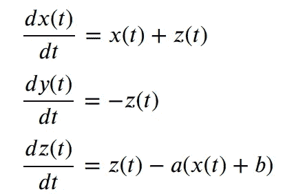**

**a = 17, b =16**

**并进行数值求解，**

**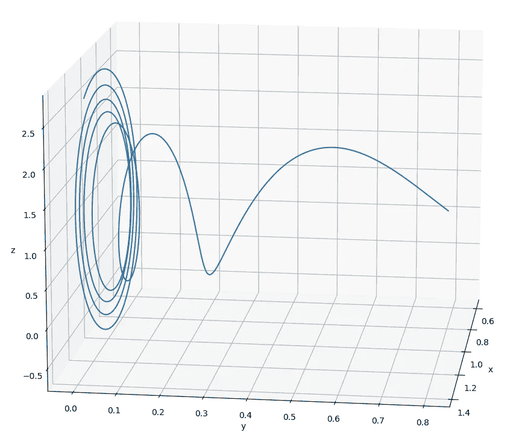**

**The solution curve for the above system**

**接下来，我们可以模拟具有两个自由度
的[哈密顿系统](https://en.wikipedia.org/wiki/Hamiltonian_system)。**

**动态系统可以描述如下，**

**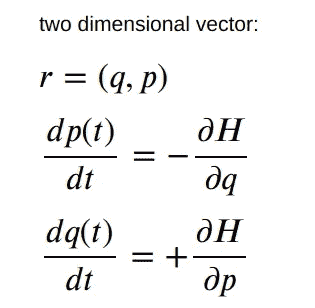**

**一般来说，只有两个自由度的哈密顿系统集合中非常小但重要的子集是完全可积的。这些系统的路径是四维的，但是通过绘制庞加莱图，可以确定大致的结构。不可积系统可以表现出包括混沌行为在内的各种现象，与之相反，完全可积系统在相空间的所有区域都表现出异常平滑的规则行为。在简要说明可积性之后，我们将定义具有两个自由度的哈密顿系统。**

**数值解如下:**

**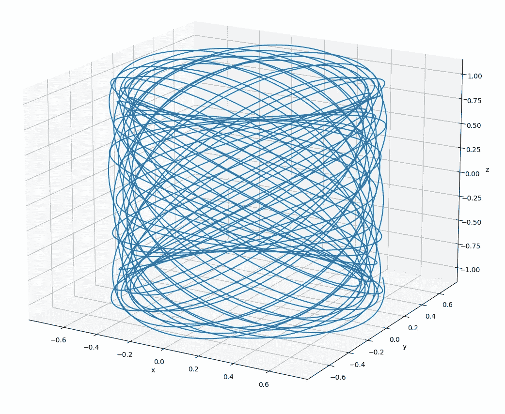**

**Projections of the Poincaré surface-of-section for the system**

**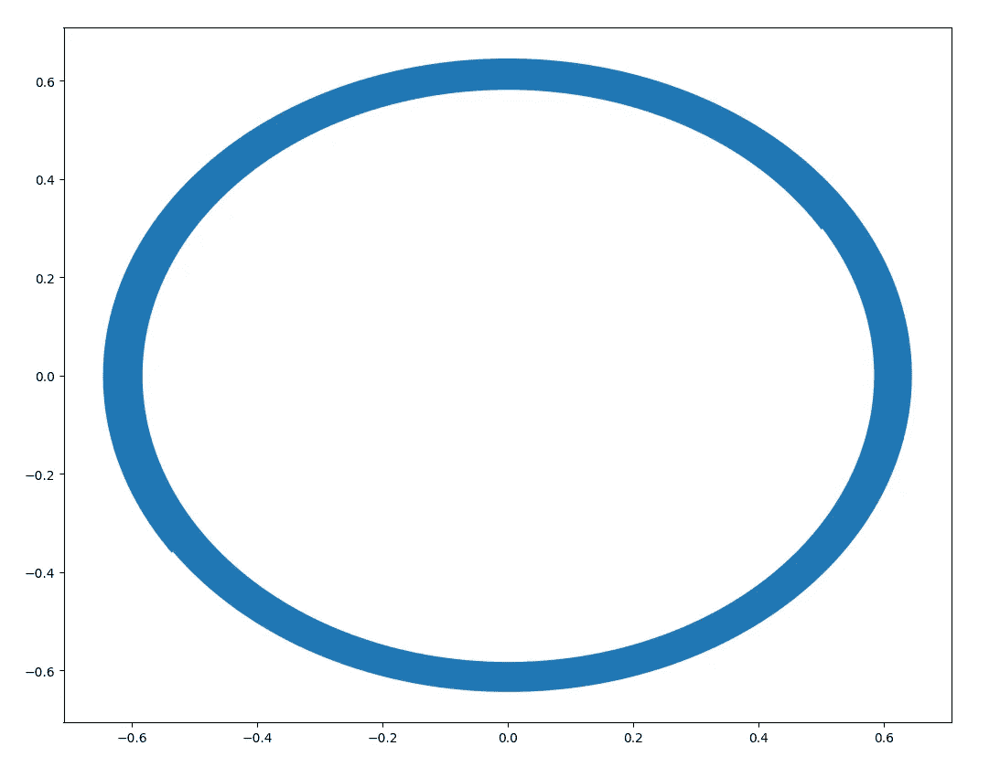**

**Projections of the Poincaré surface-of-section for the system p1(q1)**

**在最后一个例子中，我们将考虑一个周期性驱动的摆，如下所示:**

**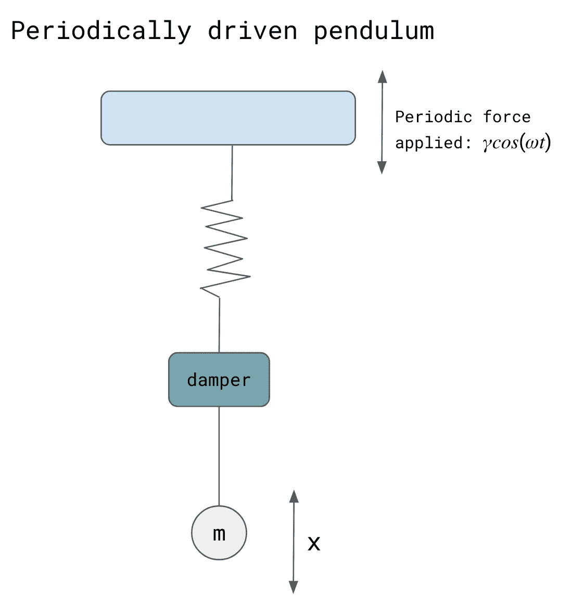**

**periodically driven pendulum )by author)**

**二阶动态系统可以用[杜芬方程](https://en.wikipedia.org/wiki/Duffing_equation)描述**

**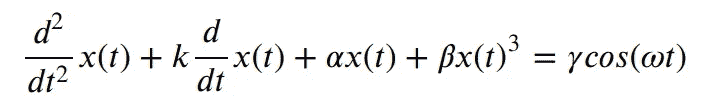**

**其中，在物理模型中，k ≥ 0 为阻尼系数，β为刚度，α为非线性刚度参数，x 为质量的位置，𝛾为强迫振动的振幅，ω为驱动力的频率。**

**数值解可以表示如下，**

**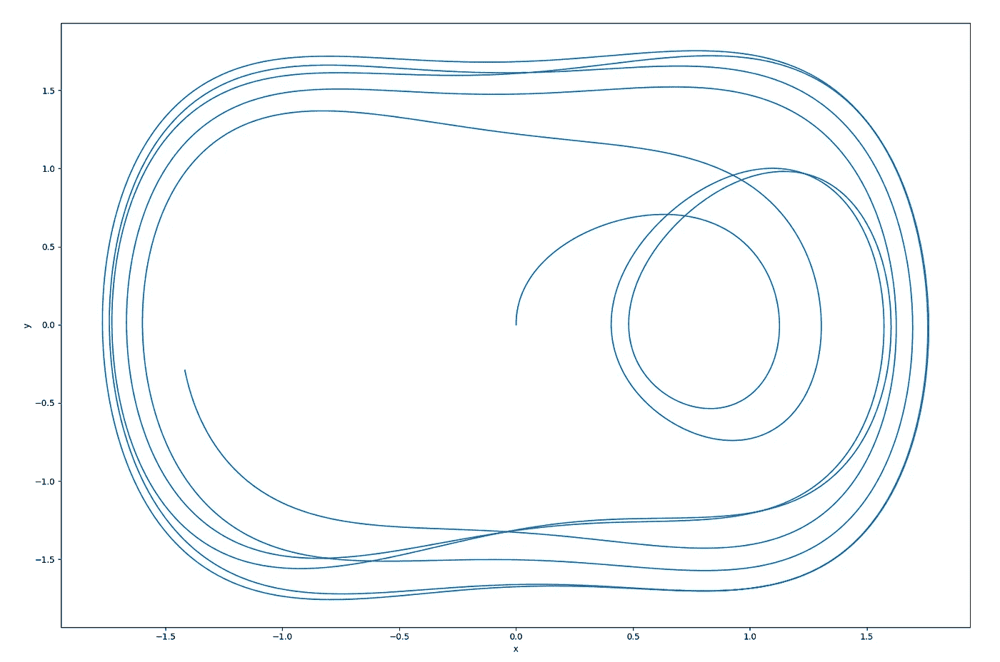**

**Poincaré map for discussed system**

**感谢您的阅读。**