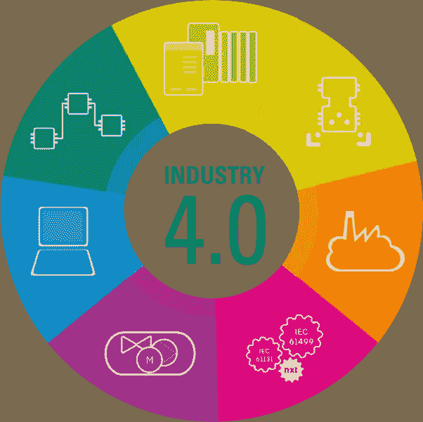

# 工业 4.0 的特征和影响

> 原文：<https://medium.com/geekculture/characteristics-and-impacts-of-industry-4-0-b1fdd19dcd35?source=collection_archive---------7----------------------->

# 介绍

全球和各国经济、特定行业、就业和资本市场中的[工业 4.0](https://www.technologiesinindustry4.com/) 模式浪潮正引起越来越多经济学家的关注。近年来，由于技术进步和发明，全球工业环境发生了巨大变化。工业 4.0 可以与前几个世纪发生的三次工业革命相提并论，它标志着制造业最重要的颠覆性转变以及随之而来的技术进步

从传统制造业向[工业 4.0](https://www.technologiesinindustry4.com/) 的本质进步，确立了四个重要特征和特性。

(1)智能生产的垂直网络化

(2)新一代全球价值链网络的横向整合

(3)整个价值链的生命周期工程

(4)指数技术的影响。

智能生产的垂直网络

# 描述

工业 4.0 的第一个关键特征是智能制造系统的垂直联网。[工业 4.0](https://www.technologiesinindustry4.com/) 中的垂直整合启动了工业几个层面之间的连接，从生产车间到生产监控、控制、监督、质量管理、运营、产品管理、加工等等。这种贯穿所有公司层面的互联性提供了一个流畅、透明的数据流，允许数据驱动的战略和战术选择。因此，垂直网络背后的关键目标是使用信息物理生产系统(CPPSs ),使行业能够快速应对需求波动、设备故障或库存短缺导致的意外订单变化。垂直网络扩展了一个组织的能力，使其有必要熟悉市场需求的变化，并从新的可能性中获得优势。

## 2.新一代全球价值链网络的横向整合

在工业 4.0 理念中，横向整合是指构成产品全球价值链的各种流程、公司和服务的网络。这可以在生产层面上观察到，是所有相关制造过程的总合并。相反，垂直整合是指生产层和最高管理层之间的高层次协调，例如质量管理、产品管理和生产控制。

工业 4.0 企业中的横向集成发生在不同的层面:生产车间、许多生产设施和整个价值链。每个连接的机器或生产单元在生产网络中开发一个具有明确定义的属性的节点。这些节点始终传达它们的状态，以经济高效地单独响应动态生产需求，并通过预测性维护减少系统停机时间。如果一个企业拥有几个生产场所，横向整合能够共享库存水平和意外延迟，并可能在拥有的设施之间重新分配工作，以快速应对市场需求波动或提高生产过程的效率和速度。尽管如此，最关键的全球横向整合仍然是整个价值链的整合。

[Industry 4.0](https://www.technologiesinindustry4.com/) 使用 CPPSs 处理整个价值链中的高度自动化和透明的协作，从入站组装、包装、存储、生产、质量控制、营销和销售，到出站配送、物流和零售服务。通过所有这些活动的横向整合，形成了一个实时高效的透明价值链。因此，这一特性提供了高度的灵活性，可以更快地响应不断变化的市场需求、缺点和问题，简化生产流程的优化，提高效率，并减少产生的浪费。此外，任何零件或产品的历史都被记录下来，并可随时访问，这一细节确保了持续的可追溯性也被视为“产品记忆”。

## 3.整个价值链的生命周期工程

在第四次工业革命的特征中，还有第四次工业革命的十个组成部分的影响，组织良好的创新管理，以及最后，有效的生命周期管理。

# 工业 4.0 的十大组成部分

除了贯穿产品和客户生命周期之外，工业 4.0 将允许整个价值链中的集成和跨学科工程。工业 4.0 应用程序旨在确保产品创新的传统领域。创新不是狭隘的，创新传统上大多与产品供应相关，但它同样在公司结构、流程、网络和盈利模式以及面向客户的功能等领域具有重要潜力。

组织良好的创新管理

向[工业 4.0](https://www.technologiesinindustry4.com/) 的数字化转型将使进一步提高工业 4.0 所有组成部分的创新管理效率成为可能。协作和设计的计划使个性化学习成为可能，从而加速战略实施和组织发展。项目组合管理中的工业 4.0 解决方案不仅可以更轻松地跟踪创新的投资回报(ROI)，还可以通过利用全球比较项目数据来识别风险，从而进行监控和补救。

有效的生命周期管理

数字化转型[工业 4.0](https://www.technologiesinindustry4.com/) 将使生命周期管理的重要数据能够随时随地交付。这些数据不仅包括信息和报告，还包括大数据处理的结果，这些结果将用于使用人工智能(al)生成合适的早期指标。Al 将为全球交叉检查提供服务，以控制为数据驱动的决策制定开发适当基础的可信度。它将使企业能够更好地认识和解决客户的需求，以及定制产品周期。

# 4.指数技术的浪潮

企业风险投资公司有一个强大的赌博，通过在开始时利用新趋势，从破坏性创新和指数技术中获利。企业风险资本投资于初创企业允许企业参与新产品和服务的开发，同时也确认了它们的长期有效性。这种类型的投资允许早期和适当地获得新技术。公司必须被认为更灵活，能够看到下一个拐角。只有到那时，一个新的业务区域才会成形，最终成为公司的新心脏。如果放弃这种潜力，公司的生存就会受到威胁。如果公司要完全利用指数技术的潜力来实现向工业 4.0 的数字化转型，他们必须转型为学习型组织。指数级的技术接受和集成必须缓慢但不间断。[学习](https://www.technologiesinindustry4.com/)对于长期的组织发展至关重要。是时候做一个不那么适得其反的转变了。当新概念、流程和业务部门开始作为学习的利基，并最终迁移到组织的中心，将它们建立为新的重要片段时，它们是最富有成效的。

欲了解更多详情，请访问:[https://www . technologiesinindustry 4 . com/2022/09/characters-and-impacters-of-industry-4-0 . html](https://www.technologiesinindustry4.com/2022/09/characteristics-and-impacts-of-industry-4-0.html)