# 图表度量

> 原文：<https://medium.com/geekculture/chartmetrics-5f1d0b89ece8?source=collection_archive---------36----------------------->

作者:达拉·谭(项目负责人)、杨柘、吉塞尔·库尔尼亚万、奥斯丁·范、纳塔内尔·维贾亚

使用 Spotify API 分析不同的音乐图表

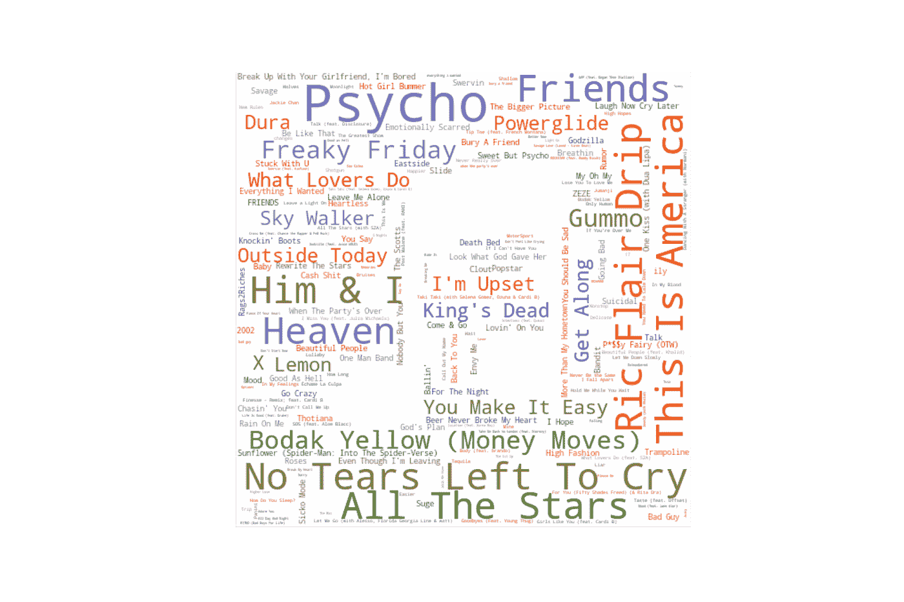

Mask Image by [Darius Dan](https://icon-icons.com/icon/music-note-circle-shape-brand/59119)

# 介绍

在过去的半个世纪里，随着音乐和音乐产业的发展，衡量一首歌曲成功与否的标准也在发展。例如，自 1940 年 7 月以来一直存在的 Billboard 排行榜，曾经根据唱片和专辑销量、唱片骑师和点唱机表演对歌曲进行排名，[，但后来已经更新为根据销量、电台播放、数字下载和流媒体活动进行排名，而不是根据](https://en.wikipedia.org/wiki/Billboard_charts#:~:text=History%2C%20methods%20and%20description,-This%20section%20needs&text=On%20January%204%2C%201936%2C%20Billboard,Hot%20100%20by%20mid%2D1958.)。

作为一个团队，我们对基于不同指标的图表有何不同感到好奇。为此，我们选择将分析重点放在三个来源上:来自 Mediabase 的美国和加拿大电台 airplay 信息、Billboard 年终热门 100 强排行榜和 Spotify 上的年度“热门歌曲”排行榜。我们还使用 Spotify API 提取了这些图表中歌曲的音频特征。

# 音频功能

Spotify 的 API 提供了一系列音频功能，如声音、能量和语速，这些功能可以洞察歌曲的特征。在深入分析之前，让我们先来看看相关矩阵，以便更好地理解音频特性:

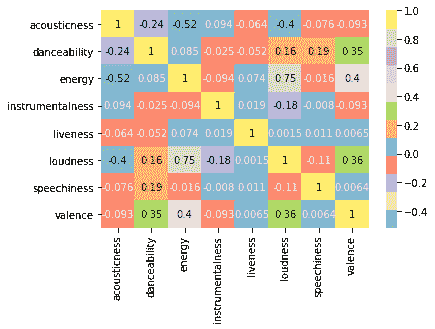

从相关矩阵中，我们观察到:

*   在能量和响度之间观察到最强的正相关，相关值为 0.75，能量是“强度和活动的感知度量”，响度是“以分贝为单位的音轨的整体响度”。
*   在声音和能量之间观察到最强的负相关，相关值为-0.52，声音是“从 0.0 到 1.0 的轨道是否是声音的置信度”。
*   价，描述了“一首曲目所传达的音乐积极性”，与可跳舞性正相关，可跳舞性描述了“一首曲目有多适合跳舞”和能量。

# Mediabase:广播 Airplay

为了开始我们的分析，让我们看看我们能够从 Mediabase 获得的广播 airplay 数据。总共有 128，000 首歌曲被列为曾经在电台上旋转过，但我们选择只关注旋转次数超过 100 次的记录，结果得到了 17，000 首歌曲的数据集。

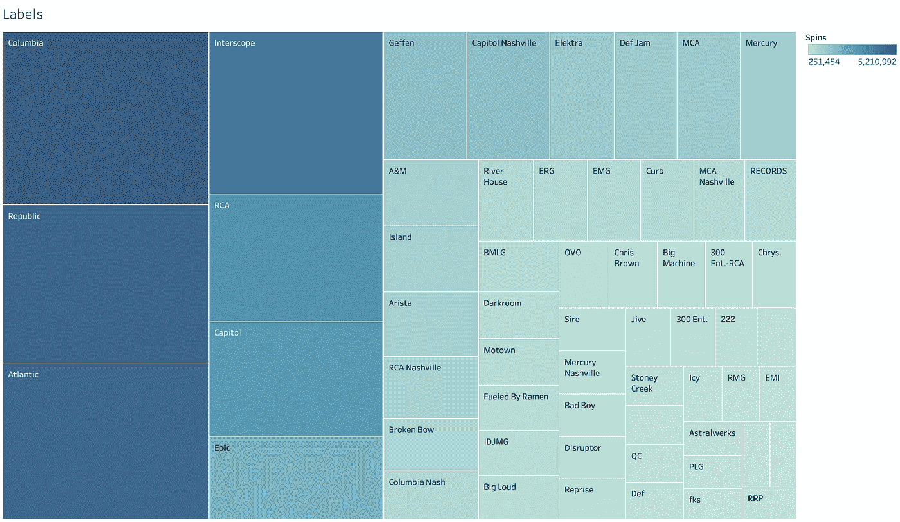

有了这个数据集，我们首先看看自旋是如何在各种标签中分布的。上图显示了已经累积了至少 250，000 次旋转的标签，较大且较暗的矩形对应于具有更多旋转的标签。这张图表大体上反映了音乐界的情况。从图表中我们可以看出，三大音乐巨头加起来占据了一半以上的市场份额，它们是:

*   环球，其中包括组成共和国，Interscope，国会大厦，格芬，国防果酱，MCA，水星，A&M 和岛；
*   索尼，包括哥伦比亚、RCA、Epic 和 Artista 和
*   华纳，包括大西洋和伊莱克特。

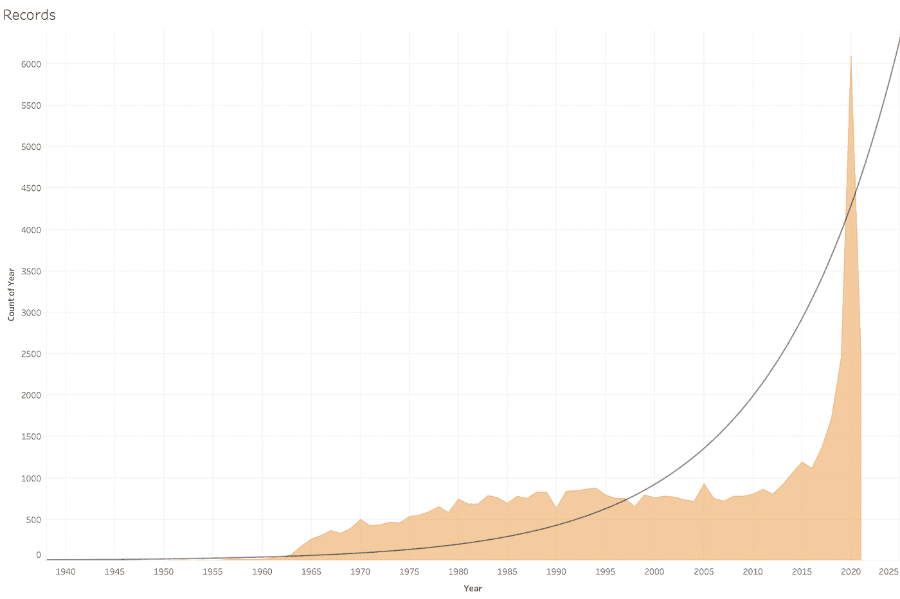

接下来，我们观察了旋转的次数是如何随时间变化的。从上图中我们可以看出，旋转次数呈指数级增长，最大增幅出现在 2015 年之后。鉴于我们只考虑了超过 100 次旋转的记录，这可能是广播电台和覆盖范围增加的结果，或者是近年来热门播放记录的合并。

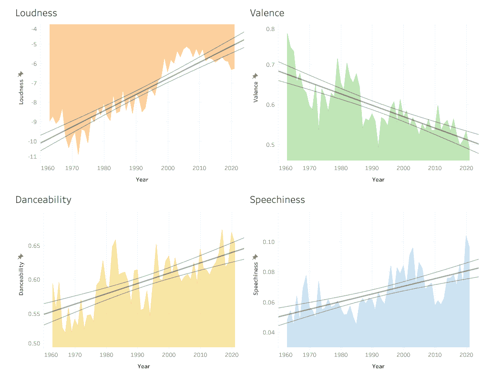

最后，我们研究了这些年来收音机播放的歌曲的音频特征是如何变化的。在这方面，我们观察到响度、效价、可舞性和语速的最显著趋势。如上图所示，随着时间的推移，收音机里播放的歌曲变得越来越大声，越来越消极，越来越适合跳舞，也越来越多话。

# 广告牌/Spotify 对比

看了我们的电台 airplay 数据集的趋势后，让我们继续看我们的 Billboard 和 Spotify 数据集。对于这两个图表，我们选择了从 2011 年到 2020 年的排名。下面是我们通过比较这两张图表得到的一些有趣的发现。

## 特征

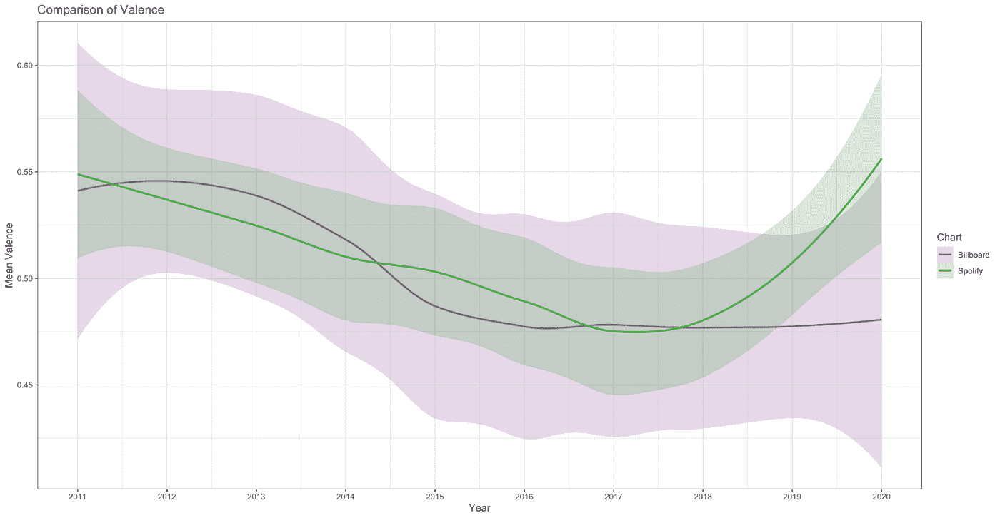

当比较两个排行榜上的歌曲时，一个引起我们注意的音频特征是 valence。从上图中可以看出，Billboard 和 Spotify 的平均价格最初都有所下降，但在过去三年中，Spotify 的平均价格有所上升，而 Billboard 的平均价格基本保持不变。由于歌曲的效价表明它有多积极，这表明近年来，Spotify 的听众开始喜欢更积极乐观的歌曲，相对于电台播放和销售，Billboard 排行榜也考虑了这一点。此外，我们观察到 Billboard 始终比 Spotify 具有更大的方差，这表明 Billboard 点击中表达的情感往往比 Spotify 点击中表达的情感更加多样化。

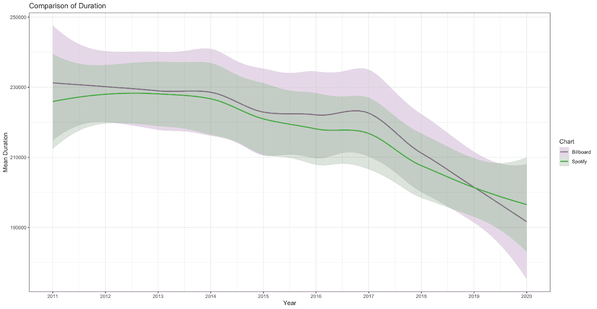

我们想强调的另一个音频特性是持续时间。一些音乐分析师，例如音乐播客“Switched on Pop”中的查理·哈丁(Charlie Harding)和内特·斯隆(Nate Sloan)，评论说，流媒体作为“分发音乐的主导力量”的兴起，由于支付结构的变化，导致了较短歌曲的趋势[，在流媒体平台上，艺术家现在可以按每条至少持续 30 秒的流支付固定费用，而不是按歌曲支付。我们上面的图表似乎既(a)证实了这个想法，又(b)表明这种影响在 2017 年左右变得最为突出。此外，有趣的是，Billboard 和 Spotify 在这张图表中显示了类似的趋势，这表明流媒体平台付费结构对歌曲长度的影响也渗透到了不纯粹基于流媒体的图表，如 Billboard。](http://theverge.com/2019/5/28/18642978/music-streaming-spotify-song-length-distribution-production-switched-on-pop-vergecast-interview)

## 艺术家

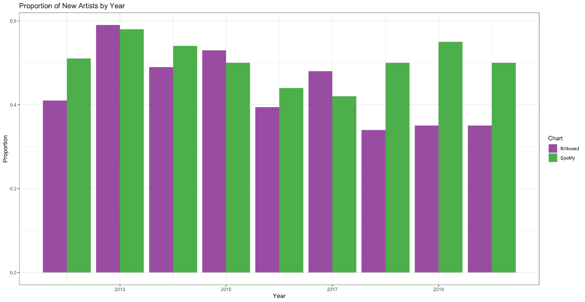

除了音频功能，我们也有兴趣比较谁的歌曲进入了两个排行榜。为此，我们首先比较了每年每张图中“新”艺术家的比例。在这个分析中，我们认为一个艺术家在特定年份的排行榜上是“新”的，如果他们在我们的数据集的前几年还没有一首歌出现在那个排行榜上。

从上面的图表中，我们看到，直到 2017 年，两个图表中每年新艺术家的比例似乎相对可比，但此后 Billboard 图表中每年新艺术家的比例似乎停滞不前，而 Spotify 图表中的比例则有所增加，并在剩余三年中明显高于 Billboard 图表。这可能表明，近年来，在流媒体平台上获得巨大的“突破”比通过电台播放和销售等其他方式更容易，Billboard 也考虑到了这一点。

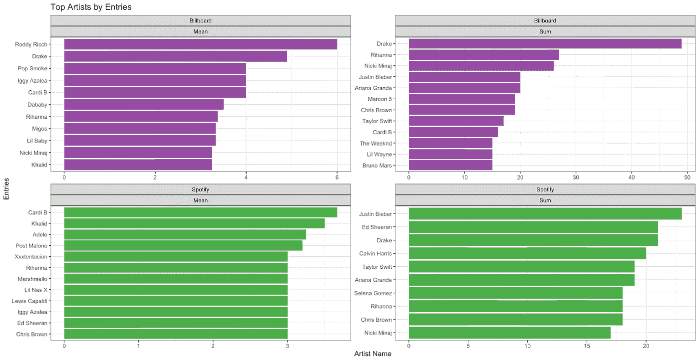

接下来，我们通过两个图表上的条目来查看顶级艺术家。在上面的图表中,“平均值”记录了一个艺术家每年参与的歌曲的平均数量，而“总和”记录了一个艺术家在 10 年期间参与的歌曲的总数。

我们观察到，总的来说，Spotify 图表似乎分布更均匀，最大的“均值”值约为 4，最大的“和”值约为 25，而 Billboard 图表约为 6 和 50。这似乎建立在我们从之前的图表中观察到的情况之上，即纯粹基于流媒体活动的图表可能更容易被打破，因为这表明即使在顶级艺术家中，与 Billboard 相比，Spotify 上单个艺术家的垄断也更少。

此外，我们观察到两个图表的“均值”图都是由说唱歌手主导的。这是有道理的，因为说唱歌手在制作自己的热门歌曲之外，往往会出现在其他艺术家的热门歌曲中，因此每年更有可能产生更多的热门歌曲。然而，我们确实注意到，Spotify 排行榜似乎没有 Billboard 排行榜那样由说唱歌手主导。

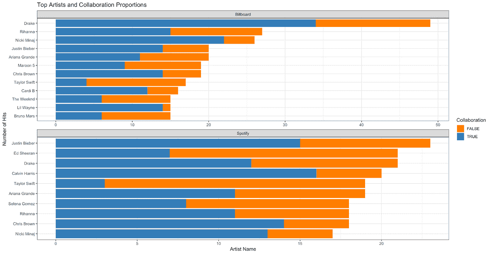

最后，我们观察了顶尖艺术家之间的合作比例。为了进行这种分析，我们首先根据每个艺术家参与的点击总数，在每个图表中锁定前 10 位艺术家。然后，如果一个以上的艺术家出现在点击中，我们将每个点击标记为合作(“真”)，否则标记为非合作(“假”)。

从上面的图表中，我们看到顶级艺术家有相当大的重叠，有七位艺术家——即德雷克、蕾哈娜、妮琪·米娜、贾斯汀比伯、爱莉安娜·格兰德、克瑞丝·布朗和泰勒·斯威夫特——在这两张图表中都名列前十。

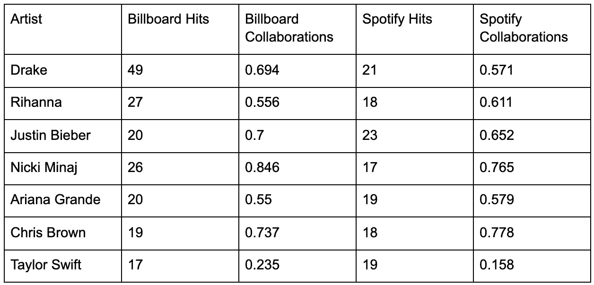

我们还观察到，泰勒·斯威夫特是这七位歌手中唯一一位没有合作过大部分作品的歌手。如上表所示，她的 Billboard 点击率和 Spotify 点击率分别只有 23%和 16%是合作的，相比之下，爱莉安娜·格兰德的 Billboard 点击率和 Spotify 点击率分别为 55%和 58%，他的合作比例排在第二位。

# 歌曲推荐

为了总结我们的分析，我们探索了使用音频特征来推荐歌曲。为此，我们创建了一个简单的函数，它接收 Spotify 上歌曲 URL 的输入，提取歌曲的音频特征，然后根据这些特征从我们从多位艺术家收集的歌曲数据集中找到其最近的邻居，并推荐与输入的歌曲相似的热门歌曲。下面是我们函数输出的两个例子。

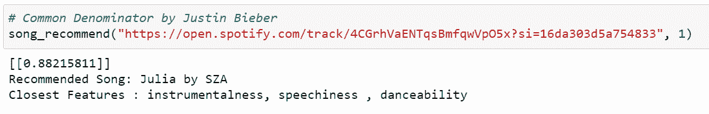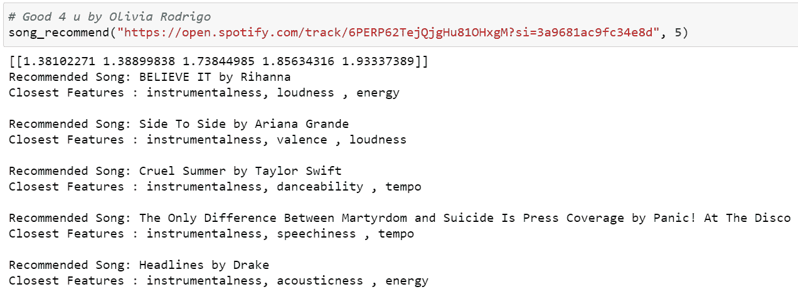

要用其他输入歌曲测试我们的功能，请访问我们的 GitHub 知识库[这里](https://github.com/datares/chartmetric)。

# 结论

总的来说，我们的分析得出了一些有趣的结果。我们与 Mediabase 的合作突显了电台播放的一些关键趋势，而我们对过去十年 Billboard 和 Spotify 排行榜的比较，无论是在热门歌曲的音频特征方面，还是在歌曲登上这些排行榜的艺术家方面，都揭示了流媒体和更传统形式的音乐的一些关键差异。我们还能够利用 k-最近邻算法来识别彼此具有相似特征的歌曲。总而言之，我们的分析提供了对一些有趣趋势的洞察，这些趋势出现在当今各种音乐排行榜和指标中。