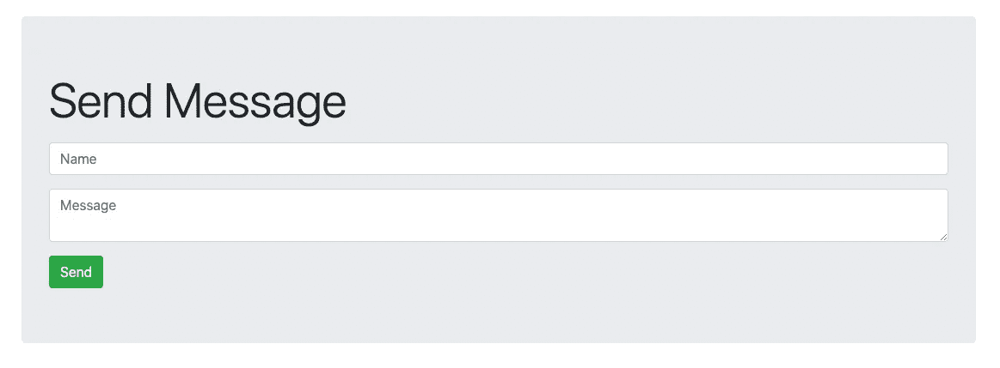
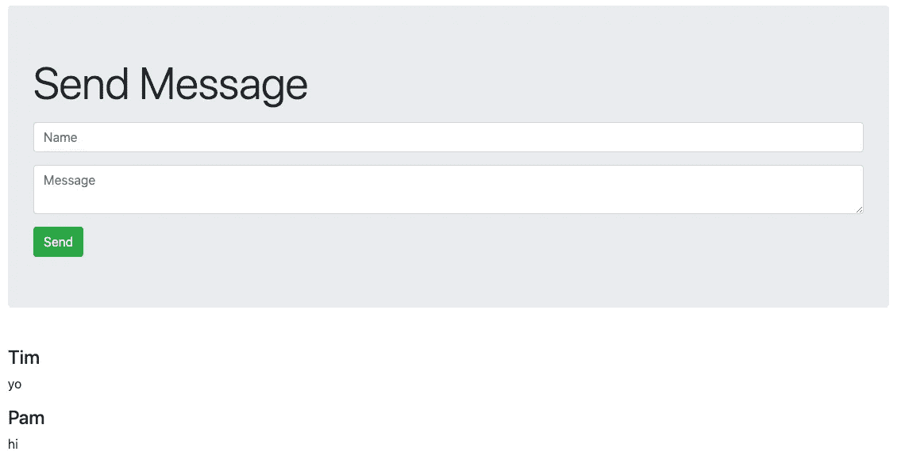
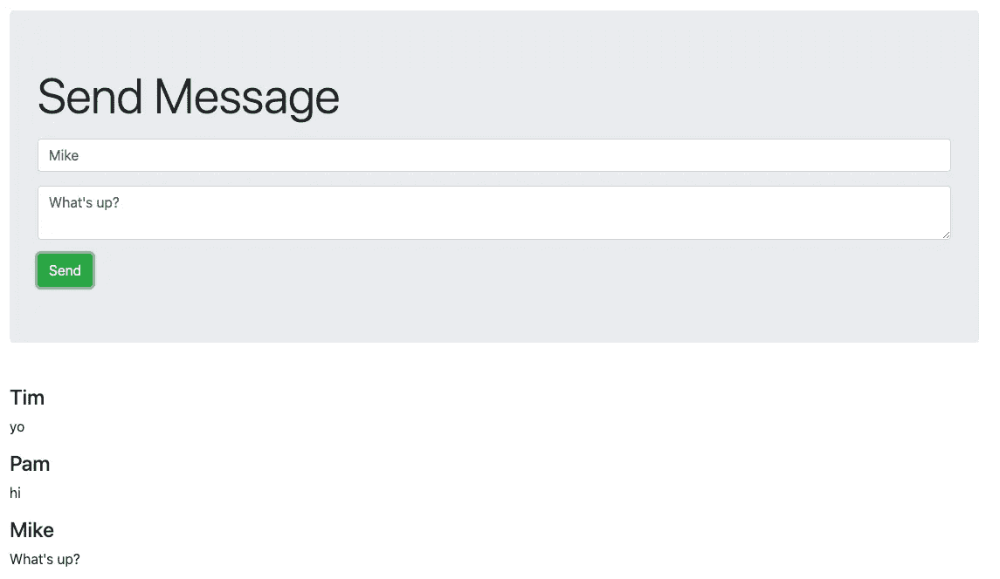

# 带 Socket 的聊天 App。使用节点的 IO 和 Express。射流研究…

> 原文：<https://medium.com/geekculture/chat-app-with-socket-io-and-express-using-node-js-2293b87f47c3?source=collection_archive---------5----------------------->

## Node 上 LinkedIn 学习课程的教程。JS [学习路径](https://www.linkedin.com/learning/learning-node-js-2017/get-started-with-node-js?contextUrn=urn%3Ali%3AlyndaLearningPath%3A5ade1c55498e39379949fb9c)。

# 我们将在这个项目中使用什么？

**节点。JS** —运行在 V8 引擎上的 JavaScript 运行时环境，该引擎具有支持异步 I/O 的事件驱动架构。JS 作为我们聊天应用的环境。

**表达—** 最小且灵活的节点。JS web 应用程序框架。

**插口。IO** —用于实时网络应用的 JavaScript 库。支持 web 客户端和服务器之间的实时双向通信。

# 入门指南

这里有一个演示和源代码的链接。

## 设置静态站点

> 创建基本的 HTML 文件并设置 Express 服务器。

首先创建一个新的项目目录。
使用以下命令创建一个基本的 HTML 文件:
`touch index.html && echo 'hello' > index.html`

接下来，运行以下命令将项目设置为节点。JS 应用:`npm init -y`

以项目设置为节点。JS app，使用以下命令安装 Express:`npm i express -s`
**注意:**此时，`package.json`应该包括以下内容:

```
...
"dependencies": {
  "express": "^some.version"
}
...
```

创建一个托管静态`index.html`文件的 Express web 服务器。
将以下内容保存到`server.js`:

```
const express = require('express');
const app = express();

app.use(express.static(__dirname));
const server = app.listen(3000, () => {
 const { port } = server.address();
 console.log(`Listening on port ${port}`);
});
```

运行:`node server.js`并访问`http://localhost:3000`
如果您能够在浏览器中看到单词`hello`，那么一切都在按预期运行。

## 前端

> 使用 Bootstrap 创建所有消息的显示和发送消息表单样式。

从用`<!DOCTYPE html>`替换`index.html`第 1 行的`hello`开始。

接下来，复制/粘贴引导 v4 CSS/JS 的链接。
**注意:**来自 Bootstrap 的 jQuery 链接是`.slim`。从链接中删除它。另外，删除 jQuery 链接的`integrity`属性。

在`index.html`中链接 Bootstrap 和 jQuery，为显示元素创建 HTML:
**注意:**注意 [Bootstrap v4](https://getbootstrap.com/docs/4.0/utilities/spacing/) 提供的间距类(`my-5`和`mb-3`)的用法。

```
<!DOCTYPE html><!-- BOOTSTRAP v4 CDN links --><div class="container">
  <div class="my-5 jumbotron">
    <h1 class="mb-3 display-4">Send Message</h1>
    <input class="mb-3 form-control" placeholder="Name" />
    <textarea class="mb-3 form-control" placeholder="Message"></textarea>
    <button class="btn btn-success">Send</button>
  </div>
  <div id="messages"></div>
</div>
```



Send message form display using Bootstrap v4 styles.

最后，在`index.html`的底部创建一个脚本标签来管理前端 javascript 代码:

```
<!DOCTYPE html><!-- BOOTSTRAP v4 CDN links --><!-- Main Display --><script>
  $(() => {
    console.log('loaded');
  });
</script>
```

如果你能在检查浏览器控制台时阅读`loaded`，那么一切都如预期的那样工作。

## 获取消息服务

> 创建从服务器获取消息并在前端显示它们的服务。

首先创建示例消息:

```
const messages = [
  {name:"Tim",message:"yo"},
  {name:"Pam",message:"hi"}
]
```

接下来，公开一个 GET `/messages`端点:

```
app.get('/messages', (req, res) => {
  res.send(messages);
});
```

创建 GET `/messages`端点后，在前端编写一个函数，请求端点并显示消息:

```
$(() => {
  getMessages();
});function addMessage({name, message}) {
  $("#messages").append(`<h4>${name}</h4><p>${message}</p>`);
}function getMessages() {
  $.get("http://localhost:3000/messages", messages => {
    messages.forEach(addMessage));
  });
}
```



Displaying the default messages.

如果您看到的结果与上图相似，那么一切都在按预期运行。

## 邮件服务

> 创建服务，通过单击发送按钮将消息添加到消息数据存储中。

要开始这一部分，我们必须安装另一个来自 NPM 的模块。`body-parser`。

默认情况下，Express 将 JSON 数据表示为字符串。`body-parser`模块附带的函数可以用作 Express 中间件，并允许将 JSON 表示为一个数据对象。

为此，运行以下命令:`npm i body-parser -s`。
**注:**在此，`package.json`应包括以下内容:

```
...
"dependencies": {
  "body-parser": "^some.version"
}
...
```

导入`body-parser`并设置 Express 应用程序以使用它来格式化 JSON 和编码 url:

```
const bodyParser = require('body-parser');app.use(bodyParser.json());
app.use(bodyParser.urlencoded({extended:false});
```

接下来，写一个 POST `/message`端点:

```
app.post('/message', (req, res) => {
  messages.push(req.body);
  res.sendStatus(200);
});
```

创建 POST `/message`端点后，更新`input`、`textarea`和`button`元素，使其具有 id 属性，如下所示:

```
<input id="name" class="mb-3 form-control" placeholder="Name" />
<textarea id="message" class="mb-3 form-control" placeholder="Message"</textarea>
<button id="send" class="btn btn-success">Send</button>
```

在前端编写一个请求 POST `/message` 端点的函数，并将该函数绑定到 send 按钮的 click 事件:

```
$(() => {
  getMessages();
  $("#send").click(() => {
    const message = {
      name: $("#name").val(),
      message: $("#message").val()
    }
    postMessage(message);
});function postMessage(message) {
  $.post('http://localhost:3000/message', message);
}
```



Adding your own message.

如果您看到与上图类似的结果，并且能够从浏览器提交消息，重新加载页面，查看新消息，那么一切都正常。

## 插座。IO 设置

> 安装和设置插座。超正析象管(Image Orthicon)

从安装插座开始。IO `npm i socket.io -s`。
**注意:**此时，`package.json`应包括以下内容:

```
...
"dependencies": {
 "socket.io": "^some.version"
}
...
```

这里的策略是使用节点。JS `http`模块，并用它绑定到 Express 和 Socket。允许建立连接的 IO:
**注意:**注意`.listen`呼叫现在必须来自`http`而不是`app`。

```
const http = require('http').Server(app);
const io = require('socket.io')(http);io.on('connection', () => {
  console.log('a user connected');
});const server = http.listen(3000, () => {
  const { port } = server.address();
  console.log(`Listening on port ${port}`);
});
```

带插座。安装 IO 并更新`server.js`，设置前端使用 Socket 建立与服务器的连接。IO:

```
<!DOCTYPE html><!-- BOOTSTRAP v4 CDN links -->
<script src="socket.io/socket.io.js"></script><!-- Main Display --><script>
  const socket = io()
  // ...top of script tag
</script>
```

如果您能够在终端中看到`a user connected`，那么一切都如预期的那样工作。

## 发出套接字。IO 消息

> 发布新消息时向前端发送消息。

这对一个用户来说非常有效。我们希望这能为大量用户工作，并可能允许分组和其他功能。比如 Slack，HipChat，或者 Discord。

为了得到我们想要的效果，当一个消息被发布的时候。IO 必须向前端发出一条消息。前端将监听发射，并有一个回调函数来响应。

首先更新`server.js`以发出消息:

```
app.post('/message', (req, res) => {
    messages.push(req.body);
    io.emit('message', req.body);
    res.sendStatus(200);
});
```

接下来，监听前端的发射:

```
socket.on('message', addMessage);
```

消息发出并添加到显示屏后，移除前端`postMessage`功能中的`addMessage`调用。

如果多个客户端能够实时发送和接收消息，那么本教程就完成了。

# 结论

我对 Node 了解了很多。JS 和 Socket。IO 在 LinkedIn 上学习的同时也写了这篇文章。希望有人觉得有帮助！如果有任何问题，请留下评论，以便我们讨论。