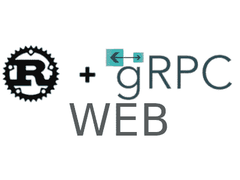

# Rust 和 gRPC-Web 聊天系统

> 原文：<https://medium.com/geekculture/chat-system-by-rust-and-grpc-web-2425104ec2a0?source=collection_archive---------8----------------------->

## 使用 Tonic 作为后端，gRPC-web 作为前端通信来构建聊天系统。proto buf+gRPC+rust/tonic+envoy+gRPC-web。

Image by Author

# 背景

Rust 是静态的，快速的，安全的。gRPC 是静态的，也很流行。为什么我们不能尝试使用 Rust + gRPC 来创建一个网络聊天系统？制造…