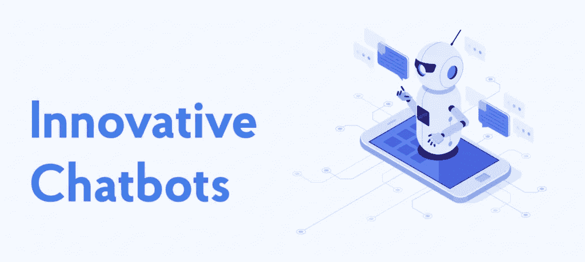
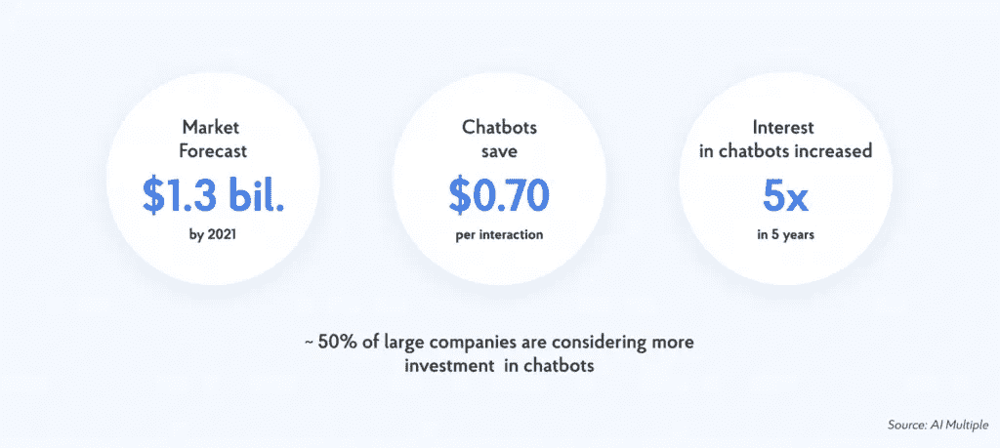
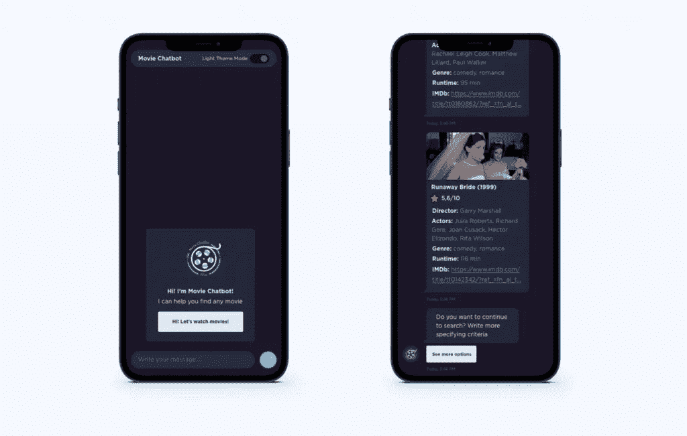

# 聊天机器人的发展:平台，类型，人工智能趋势

> 原文：<https://medium.com/geekculture/chatbot-development-platforms-types-ai-tendencies-nix-united-bea77bc5919?source=collection_archive---------51----------------------->

由于通信技术和人工智能的最新进展，客户互动正在发展到一个新的质量水平。[根据美国运通调查](https://www.superoffice.com/blog/customer-experience-statistics/)，86%的客户愿意为更好的体验支付更多。聊天机器人是客户体验的主要驱动力之一。

在我们的文章中，我们将讨论可以帮助您的业务的聊天机器人开发经验、市场趋势，以及目前哪些解决方案更有前途，为什么。

**目录**

1.  [什么是聊天机器人，它们是如何工作的？](https://nix-united.com/blog/innovative-chatbots-untapped-capabilities-able-to-boost-your-business/#what_are_chatbots_how_it_work)
2.  [聊天机器人的流行——开发平台](https://nix-united.com/blog/innovative-chatbots-untapped-capabilities-able-to-boost-your-business/#chatbots_development_platforms)
3.  [人工智能聊天机器人的优势](https://nix-united.com/blog/innovative-chatbots-untapped-capabilities-able-to-boost-your-business/#benefits_ai_chatbots)
4.  [为您的业务解决方案定制聊天机器人](https://nix-united.com/blog/innovative-chatbots-untapped-capabilities-able-to-boost-your-business/#chatbots_business_solutions)
5.  [NIX 聊天机器人专长](https://nix-united.com/blog/innovative-chatbots-untapped-capabilities-able-to-boost-your-business/#nix_chatbot_expertise)
6.  建立你自己的聊天机器人

# 什么是聊天机器人，它们是如何工作的？

聊天机器人是模拟书面或口头人类语言的应用程序，以刺激与真人的对话。它们可以应用于大多数客户互动，使他们的沟通更有吸引力和令人兴奋。

市场趋势导致机器人在商业中使用人工智能(AI)技术结合对话语音。您可以为不同的领域创建定制的聊天机器人:电子商务、银行、医疗保健等，例如，可以在信使、应用程序或网络上使用。

人工智能聊天机器人背后的领先技术是自然语言处理(NLP)和机器学习。基于人工智能的聊天机器人的一个主要方面是，它是动态的，并从分析对话中不断进化。当聊天机器人被问到一个问题时，一系列复杂的算法会处理收到的信息，理解用户在问什么，并确定适合该问题的答案。然而，处理复杂的对话是一个相当大的挑战；当使用不同的修辞格时，机器很难理解它们。在这种情况下，开发人员通过训练一部分机器学习来适应必要的模式，以便机器人可以识别和解释基本的对话组件，即使是来自有问题的查询。

今天，聊天机器人被用于许多商业领域，取代了传统上由人执行的功能，加快了与处理请求相关的所有过程。让我们来看看这些和其他的好处。

# 聊天机器人的流行——开发平台

谈到聊天机器人的流行，值得一提的是，根据埃森哲和 T2 的研究，大约 50%的大公司正在考虑增加对聊天机器人的投资。以下是一些统计数据:

*   56%的公司表示，对话机器人正在推动他们行业的转型变革
*   到 2022 年，估计 75–90%的请求将由机器人处理

在这样的背景下，我们来谈谈 chatbot 开发的经验:

# 排名第一的是 IBM Watson

有人可能会说，当谈到创建人工智能聊天机器人时，沃森是最受欢迎的平台之一。该平台的主要优势是易于管理复杂的交互，并且能够服务于不同的垂直行业。此外，Watson 非常适合在各种社交媒体平台以及您的网站上开发机器人。

一些提示:

1.  在这个平台上开发 bot 时，首先要收集需求，以了解 bot 应该在什么场景下运行。
2.  一旦你定义了范围，定义人物角色将帮助你创建一个移情图。
3.  在用户输入的背景下准备目标和目的(意图列表)。
4.  在将与 Watson Assistant 交互的 chatbot 开发期间，实现业务逻辑以处理交互的上下文，并实现补充业务需求的其他组件。

# #2 —微软 Azure Bot 服务

这项云服务几乎可以从任何地方访问，并支持多种语言。这项服务的工具有助于创建高度互动的机器人，它被认为是一个高度可扩展的服务。

# #3 — QnA 制造商

微软的另一个机器人名副其实。这对顾客经常询问产品问题的任何行业都是有益的。它允许您开发和训练机器人在几分钟内根据常见问题和结构化文档和产品手册的 URL 回答简单的问题。

更重要的是，使用微软认知服务可以让机器人尽可能地与人类互动。它还允许您集成第三方 API 和解决方案，提供更好的用户体验。

# #4 — SAP 对话式人工智能

一个聊天机器人开发平台，允许您通过使用针对特定行业的预配置聊天机器人来构建和训练您的机器人，从而减少集成时间并加快部署。

开发聊天机器人后，应该选择部署平台。让我们提及一些先进的 bot 平台生态系统:

*   Facebook Messenger(脸书聊天机器人)
*   松弛的
*   Skype for Business
*   Kik 等。

# 人工智能聊天机器人的优势

说到人工智能聊天机器人，值得一提的是它们的大量优势，以及它们的实现对您的业务是如何至关重要，不仅是在与客户合作时，而且在其他领域。

# 全天候可用性

用户无法立即得到答案，往往是他们拒绝购买的原因。随时帮助客户的能力是聊天机器人在商业上的巨大优势。

# 情绪稳定和无尽的耐心

有了聊天机器人，企业可以对其客户支持服务的质量充满信心。没有什么能破坏一个没有情感的聊天机器人的平衡。

# 即时数据分析

如果你使用聊天机器人为客户服务，他们可以收集，分析和处理多种形式和各种来源的信息。此外，他们有能力将不准确和错误扼杀在萌芽状态，从而不断提高客户服务质量。

# 不断自我学习

[得益于 ML 和](https://nix-united.com/blog/artificial-intelligence-vs-machine-learning-vs-deep-learning-explaining-the-difference/) NLP 聊天机器人拥有出色的快速自学能力。通过回答每一个连续的问题，他们能更好地解决问题，从而提高效率。这意味着即使你最初开发了聊天机器人，它也会继续变得更好。

聊天机器人的更多优势允许您:

*   自动化常见的业务流程和操作
*   提高客户参与度和忠诚度
*   降低客户支持成本和客户流失
*   从集成的数据源中收集和组织客户信息
*   与任何社交媒体平台和重要业务系统集成

# 为您的业务解决方案定制聊天机器人

聊天机器人可以根据您的任何需求进行调整:

*   **销售&营销。**聊天机器人全天候工作，为消费者提供完整的解决方案。因为他们不容易出现人为错误，他们可以通过提供一流的客户协助来帮助建立一个更好的品牌。
*   **企业资源计划。**这包括就假期、病假、公司活动和政策向员工提供咨询，协助招聘人员查询申请人，收集资格信息，以及处理简单的公司任务，如预订会议室和告知公司政策。
*   **医疗保健。**例如，为医生、药剂师、护士或患者定制的机器人可以安排预约、发送提醒，并帮助医疗专业人员收集和组织患者数据。
*   电子商务。机器人可以回答关于产品的问题，发送废弃物品的提醒，并使购买应用内的产品/服务变得更容易。其他用途可以改善追加销售、交叉销售和再销售。
*   **银行业**。机器人可以提供个人银行账户、余额、信用额度、银行服务、产品、交易历史、应计费用报告、费用、计算和申请抵押或贷款等信息。
*   **行程**。聊天机器人可以帮助用户找到并预订最合适的飞机、火车或汽车票，并发送变化和即将到来的旅行的通知。
*   **客户服务。聊天机器人可以按照预先编程的规则与用户互动。**
*   [据 IBM](https://www.ibm.com/blogs/watson/2017/10/how-chatbots-reduce-customer-service-costs-by-30-percent/) 称，聊天机器人可以帮助公司节省高达 30%的客户支持成本，方法是加快响应时间，让代理从事更复杂的工作，并回答高达 80%的常规问题。
*   Juniper Research 声称，到 2022 年，聊天机器人将能够保持 90%的客户互动成功率。
*   **娱乐。**这包括用户查找电影、购买节日或其他活动的门票等。

你可能也会对我们的文章[感兴趣，人工智能如何改善医疗保健、零售和银行业的流程。](https://nix-united.com/blog/how-ai-can-improve-processes-in-healthcare-retail-and-banking/)

# NIX 聊天机器人专业知识

NIX 团队最近推出了它的聊天机器人——**人工智能电影聊天机器人:寻找零痛苦选择观看的电影**。

这是一个聊天机器人，帮助用户在一分钟内找到与他们的请求最相关的电影，而不是列出谷歌或 IMDB 列表上所有可用的电影和连续剧。

该客户正在寻求一家可靠的技术供应商，以快速创建一个具有类似人类行为的人工智能聊天机器人的概念验证，该机器人可以在网络上和通过 Telegram 应用程序平稳运行。

为了提供以人为中心的智能聊天机器人体验，NIX 使用了 Azure Bot 服务的人工智能功能:

*   自适应对话机器人框架使聊天机器人能够在与用户交互时保持其一致的行为。因此，当用户中断对话链时，聊天机器人知道如何进一步正确对话。
*   为了教会机器人自然的人类语言，我们使用了基于 ML 的服务——LUIS。NIX 团队定制了 ML 模式的一部分，并对其进行训练，最终使机器人能够识别类似人类行为的模糊请求，然后恰当地回答问题。
*   为了提供更加用户友好的体验，我们使用了直线技术。

[立即联系我们](https://nix-united.com/blog/innovative-chatbots-untapped-capabilities-able-to-boost-your-business/#contact-us),让 NIX 帮助您为您的企业打造一个以人为本的助手。

# 构建您自己的聊天机器人

如果您准备用新技术和创新的解决方案来转变您的业务，并获得更大的竞争力，NIX 团队将为您提供我们的专家评估，哪些解决方案最适合您的特定业务。脸书和 Slack 的聊天机器人，或 AI 聊天机器人-种类繁多，但最好的选择。我们将了解您的业务需求，并开发聊天机器人来帮助您实现业务目标。

*原载于 2021 年 7 月 7 日*[*【https://nix-united.com】*](https://nix-united.com/blog/innovative-chatbots-untapped-capabilities-able-to-boost-your-business/)*。*