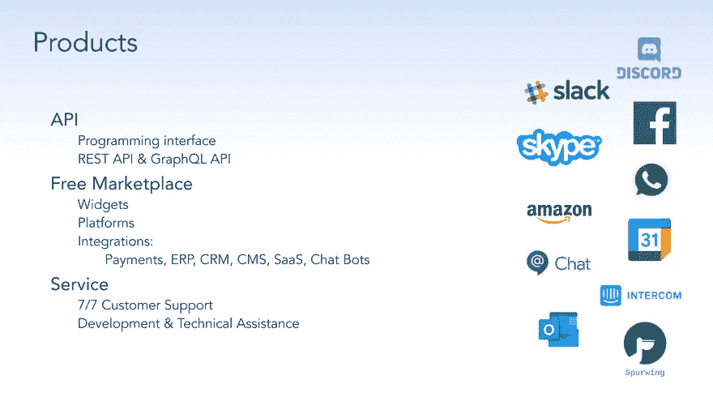
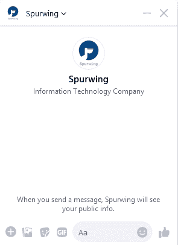

# 商务聊天机器人

> 原文：<https://medium.com/geekculture/chatbots-for-business-13510bbe7925?source=collection_archive---------26----------------------->

avvy 和战略企业正在他们的运营中实施聊天机器人，以提高效率、生产力和声誉。是什么让聊天机器人如此特别？为什么企业现在希望尽快利用它们？让我们再深入一点，找出答案！

虽然几十年来人们一直预测机器人将接管人类劳动力，但很少有人(如果有的话)认为这种敌意收购的“第一波”将是几乎完全在线的聊天机器人！

最重要的是，大多数人不会想到企业家和企业主不仅仅是对将聊天机器人纳入他们的业务感到渴望和兴奋——许多人正以几乎极快的速度急于这样做。

## 一开始为什么要使用聊天机器人？

甲骨文公司的人估计，到 2021 年底，将近 80%的企业(小型、中型和大型)将使用聊天机器人技术。

考虑到仅仅在五年前，甚至不到 10%的企业听说过聊天机器人，这将是广泛适应的一个重大飞跃。

是什么推动企业对这些人工智能工具进行如此大的投资？什么是**收益**？

## 节省大量时间和金钱

(可以理解的)企业总是在寻找方法**节省时间**、**省钱**和**节约资源**——尤其是当你谈论总是昂贵的人力资源的时候。

聊天机器人可以用来“减轻负担”，处理大量高层次的客户服务需求，而不是雇佣由真人组成的大规模客户服务团队，负责一遍又一遍地回答相同的客户服务问题。

显然，更精简的客户服务代理团队可以继续为更个性化或更复杂的服务请求服务。但是聊天机器人可以处理大部分繁重的工作，释放出可以转移到其他地方的时间、金钱和资源。

## 更快的客户服务

一项又一项研究表明，即使是最普通的客户服务请求，响应时间太短也会对企业的品牌和声誉造成巨大的损害。

如今，客户希望尽可能快地获得服务(以及对他们的问题或顾虑的回应)，有时就在他们提出请求后几分钟。

在真实的商业世界中——尤其是在线商业，来自世界各地的客户都受到全天候网站的帮助——期望人工客服人员的这种响应时间是不合理的，更不用说物理上可能的了。

然而，有了聊天机器人，拥有一个 24/7 全天候的客户服务部门，几乎有了即时响应时间，这不仅是可能的，而且实现起来几乎不费吹灰之力。

简单的请求可以由聊天机器人管理，如果事情变得太复杂，人工智能无法处理给客户的通知，让他们知道人类客户服务代理将尽快处理事情，通常足以让你的客户满意。

## 消除人为错误

聊天机器人人工智能工具的美妙之处在于它们是 **100%可编程的**，根据固定的指令进行操作，并且将永远——永远——按照它们被编程的方式运行。

人类雇员就不一样了。

世界上最好和最一致的培训不能解释人为错误、疲劳、简单的错误和事故，或者人们“脱离脚本”并以他们喜欢的方式处理客户互动。

有了聊天机器人，你就不会有这个问题。

您**消除了人为错误**，您简化并系统化了与客户的互动，并且您保证每次提供特定类型的问题或提示时，都提供完全相同的响应(相关的、有针对性的响应)。

## (几乎)无限的灵活性

聊天机器人技术最酷的一点是，我们确实处于这些工具的初级阶段，以及如何在当今的商业世界中使用它们。

这些工具的灵活性、适应性和功能现在令人难以置信，但随着时间的推移，它们只会变得更加强大，更加有用。

结合这些工具可以用于所有可以想象的行业的事实，从电子商务到医疗保健以及两者之间的一切，很容易看到商业世界将很快被人工智能影响的聊天机器人所主导！

## 约会日程安排

许多聊天机器人解决方案缺少的是安排与客户约会的能力，比如团队成员和(潜在)客户之间的演示或支持电话。多亏了 Spurwing API，我们可以轻松地将约会安排解决方案集成到(几乎)任何流行的聊天机器人框架中。

这是我们为 Facebook Messenger 制作的演示:

集成日程安排功能几乎是小菜一碟，我们已经在开源 GitHub [marketplace](https://github.com/SpurwingIO/Chat-Bots) 上构建并实现了许多流行的平台:Slack、Discord、Facebook Messenger 以及更多正在开发的平台(Intercom、WhatsApp、Skype、Amazon Lex、Google Chat 等等)。

如果您的企业使用特定或定制的聊天机器人解决方案，并且需要集成日程安排功能，那么请联系我们[https://www.spurwing.io/](https://www.spurwing.io/)