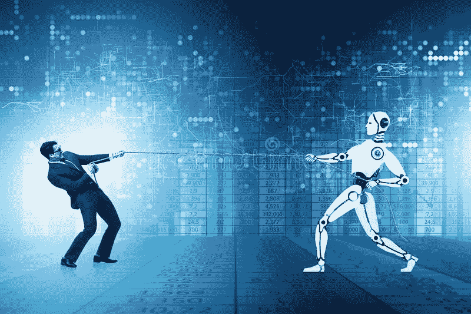

# ChatGPT: AI 处于最佳状态…！！

> 原文：<https://medium.com/geekculture/chatgpt-ai-at-its-best-9f2a2234634e?source=collection_archive---------4----------------------->

Credit: [FreePik](https://www.freepik.com/free-photo/ai-nuclear-energy-background-future-innovation-disruptive-technology_17850501.htm#query=AI&position=1&from_view=search&track=sph)

# 什么是 ChatGPT？

ChatGPT 是由 [OpenAI](https://openai.com/) 创建的，是最新上市的人工智能技术，它正在科技界掀起波澜。这个新软件旨在帮助你使用自然语言处理与其他人交流。换句话说，ChatGPT 可以理解人类的对话，并做出相应的反应。

ChatGPT 是一个非常先进的聊天机器人，它有可能使人们的生活变得更容易，并帮助完成日常繁琐的任务，如写电子邮件或浏览网页寻找答案。

这使得它非常适合客户服务、销售或任何其他需要人际交往的职业。如果你正在寻找提高沟通技巧的方法，ChatGPT 绝对值得一试。在这篇博客文章中，我们将探索 ChatGPT 如何工作以及使用这种人工智能技术的一些好处。

> OpenAI 是一家进行人工智能研究的公司。ChatGPT 于 2022 年 11 月 30 日由该事务所推出。如果该公司的名字似乎很熟悉，那是因为 OpenAI 还开发了自动语音识别系统 Whisper 和知名的 AI 艺术生成器[DALLE 2](https://openai.com/dall-e-2/)。

# 一个新的人工智能时代已经开始

Credit: [FreePik](https://www.freepik.com/free-photo/technology-human-touch-background-modern-remake-creation-adam_17851045.htm#query=new%20era&position=8&from_view=search&track=sph)

我们生活在人工智能(AI)的新时代。这在人工智能影响我们的生活和我们周围的世界的方式中显而易见。人工智能产生重大影响的一个领域是在线聊天机器人。

聊天机器人是模仿人类对话的计算机程序。它们被设计用来与人类对话，以帮助他们完成任务或提供信息。ChatGPT 就是这样一个聊天机器人，它基于开源的谷歌机器学习平台 TensorFlow。

ChatGPT 被设计成用自然语言与人类交流。它通过一种叫做迁移学习的技术来做到这一点。这意味着它可以从与人类的对话中学习，然后使用这些知识在未来进行更好的对话。

ChatGPT 如此特别的原因之一是它能够产生听起来像是来自真人的反应。这是由于它使用了神经网络，这是一种模仿人脑工作的人工智能。

神经网络由大量互连的处理节点或神经元组成。这些节点协同工作，通过在输入和输出数据之间建立联系来学习如何执行任务。输入神经网络的数据越多，其预测就越准确。

这就是 ChatGPT 不断从与人的对话中学习的原因。

# ChatGPT 是如何工作的？

ChatGPT 是一个聊天机器人，它使用人工智能(AI)来生成对问题的回答。它从对话中“学习”,并随着对话的进行产生新的反应。OpenAI 通过使用来自人类反馈的强化学习(RLHF)，[根据 OpenAI](https://openai.com/blog/chatgpt/) 来训练语言模型。人工智能培训师为模型提供了对话，他们扮演用户和人工智能助理两个角色。

要使用 ChatGPT，您只需输入一个问题或语句，chatbot 就会做出相应的响应。您还可以提出后续问题，以从聊天机器人获取更多信息。你和 ChatGPT 聊得越多，它就越能了解你的喜好并给出更好的回应。

# 使用 ChatGPT 有什么好处？

使用 ChatGPT 有很多好处，包括:

1.准确性提高— ChatGPT 不断学习和改进其算法，这意味着随着时间的推移，它会变得更加准确。与传统聊天机器人相比，这是一个巨大的优势，传统聊天机器人往往很不准确。

2.自然语言处理——chat GPT 能够理解人类语言，这使得它比其他聊天机器人更加友好。

3.个性化——chat GPT 可以针对每个用户进行个性化设置，这使得每个参与者的体验都更加愉快。

4.提高效率——chat GPT 在处理任务和请求方面非常高效，这意味着您可以比传统的聊天机器人更快地完成工作。

5.24/7 可用性— ChatGPT 是 24/7 可用的，这意味着您可以在需要时随时获得帮助。

# 局限性:

尽管看起来非常令人印象深刻，但 ChatGPT 仍然有局限性。这些限制包括不能回答以特定方式措辞的问题，需要重新措辞以理解输入的问题。

一个更大的局限是它提供的回应缺乏质量——有时听起来似乎合理，但没有实际意义，或者过于冗长。

该方法还对令人困惑的查询的含义做出假设，而不是寻求澄清，这可能导致意外的答案。结果，ChatGPT 生成的问题答案已经[在开发者问答网站 Stack Overflow](https://www.theverge.com/2022/12/5/23493932/chatgpt-ai-generated-answers-temporarily-banned-stack-overflow-llms-dangers) 上被暂时禁止。

“主要问题是，虽然 ChatGPT 产生的答案有很高的不正确率，但它们通常看起来*像*它们*可能*是好的，并且答案*非常*容易产生，”堆栈溢出版主在一篇帖子中说。

批评者声称，这些工具在以统计上有意义的方式排列单词方面非常有效，但它们无法理解意思或确定它们的说法是否正确。

# 我们应该担心 ChatGPT 这样的 AI 吗？

有人担心人工智能聊天机器人会让人类智力黯然失色或退化。例如，聊天机器人可以快速有效地撰写任何主题的文章，从而取代对人类作家的要求。此外，聊天机器人可以快速完整地生成整篇文章，让学生更容易作弊或跳过如何正确写作的学习。

虚假信息的潜在可能性是人工智能聊天机器人的另一个问题。该机器人可能会共享不准确的信息，因为它没有连接到互联网。事实上，一些人工智能驱动的聊天机器人澄清说要仔细检查答案，不要照字面理解。

此外，根据 OpenAI 的说法，ChatGPT 偶尔会提供“听起来合理但不准确或无意义的答案”。

## 是否意味着 AI 正在接管世界？

也许还没有…！！

好吧，OpenAI 的奥特曼当然认为人工智能中的人类式智能现在已经不远了。回应马斯克关于危险的强人工智能的评论，奥特曼在推特上说:“我同意接近危险的强人工智能，因为这种人工智能会带来巨大的网络安全风险。我认为我们可以在未来十年内到达皇家 AGI，所以我们也必须非常认真地承担这个风险。”

他还指出:“有趣的是，人们开始辩论强大的人工智能系统是否应该按照用户希望的方式或其创造者的意图行事。我们让谁的价值观与这些体系保持一致，这将是社会有史以来最重要的辩论之一。”

在它被广泛使用之前，有一些技术细节需要解决，以防止负面结果，如错误信息的传播。一般来说，AI 和 ML 模型依赖于大量的训练和微调来达到理想的性能水平。因此，没有人可以声称人工智能将接管人类的指挥权。

# 结论

嗯，ChatGPT 是目前可用的人工智能技术的最佳例子之一。它能够有效地与人类交流，并对各种各样的查询提供有帮助的和准确的响应。这项技术有很大的潜力，我们很兴奋地看到它在未来如何发展…！！