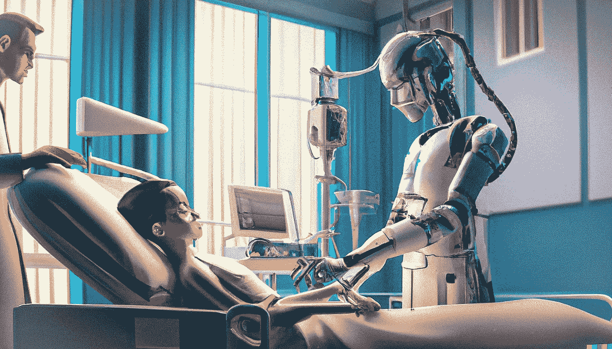
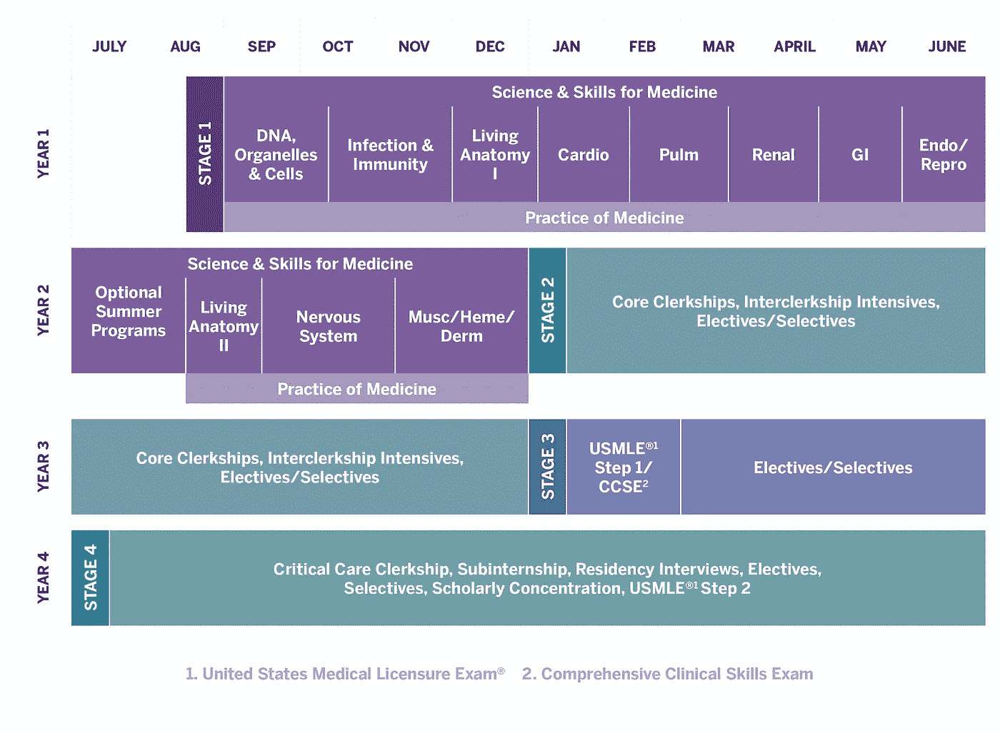
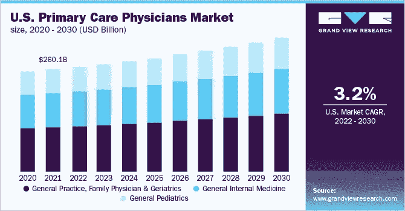
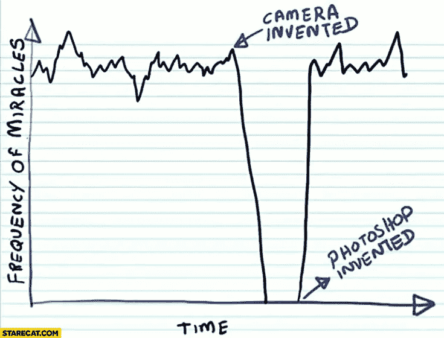

# ChatGPT 在一次美国医师执照考试中获得了 70%的分数

> 原文：<https://medium.com/geekculture/chatgpt-scores-70-on-a-sample-united-states-medical-licensing-exam-1da68ee4e018?source=collection_archive---------0----------------------->

A female humanoid robot doctor treating a patient, digital art, DALL-E 2

## 另外:商业文本到 3D 的生成器已经正式到来

W elcome to [**风口浪尖**](https://nicksaraev.com/#/portal/signup) :前沿 AI 新闻(及其含义)用简单的英语讲解。

在本周的杂志中:

*   商业文本到 3D 的生成器已经正式到来(这对行业意味着什么)
*   ChatGPT 在一份样本 USMLE 上的得分为 70% ,这让许多人想知道接下来会发生什么
*   Deepfakes 在质量和部署能力方面都在快速提升

让我们开始吧。

# 商业文本到 3D 的生成器已经正式到来

文本到 3D，仅仅是两年前的白日梦，现在已经在商业产品中实现了。

[Luma AI](https://captures.lumalabs.ai/imagine) ，一家专注于将 AI 应用于 3D 建模的公司，刚刚发布了[**Imagine**](https://captures.lumalabs.ai/imagine)**in alpha:**他们的产品可以让用户完全用文本创建 3D 资产。****

****这些也不是简单的渲染；它们是成熟的 3D 模型，可以导入流行的 CGI 软件平台，如 [Blender](https://www.blender.org/) 或 [Maya](https://www.autodesk.com/products/maya/overview) 。****

****例如，`spider man`可以生成一个栩栩如生的流行卡通人物模型——而且只需要几秒钟就能生成。额外收获: [**想象**](https://captures.lumalabs.ai/imagine) 还具有用户世代的旋转展示。[在浏览器中亲自检查质量](https://captures.lumalabs.ai/imagine?slug=awestruck-appreciated-yg-53037)。****

********

# ****我们如何利用这一点呢？****

****结果令人印象深刻: [**想象一下**](https://captures.lumalabs.ai/imagine) 能够在几分钟内生成高质量的模型，而这在以前可能需要专业人员几个小时(或几天)才能完成。****

****显然，这是有经济影响的:****

*   ****由于软件的改进，已经慢慢商品化的 3D 资产将变得更加便宜。****
*   ****CGI 艺术家可以在更短的时间内承担更多的工作，并服务于他们以前由于成本限制而无法进入的市场。****
*   ****企业将很快能够通过类似的服务按需创建 3D 资产，而无需雇佣专业设计师。****

****综合来看，这意味着一些机会。****

****首先，具有前瞻性思维的 3D 艺术家(即那些拥抱进步而不是[厌恶进步的人](https://twitter.com/tsurudraws/status/1603191985266753536/photo/2))将能够增加他们的影响力。个体自由职业者或顾问可以在像 [Fiverr](https://fiverr.com/) 或 [Upwork](https://upwork.com/) 这样的演出平台上，或者通过像 [Turbosquid](https://www.turbosquid.com/) 这样的资产出售市场快速赚钱。****

****其次，经常利用 3D 资产的企业和工作室将开始关注更雄心勃勃的项目，这将影响市场动态。****

****主要由于过高的资产成本(目前，设计和动画成本构成了总预算的一半左右)，已经有采用程序环境设计的游戏被创造出来。****

****但是当游戏市场下降到<1%?****

****Expect industry velocity to shift from years to months, and current “highly-anticipated” titles to quickly grow irrelevant (looking at you, [明星公民](https://www.youtube.com/watch?v=Wi_qwXk28Mc)时会发生什么呢。****

# ****ChatGPT 在样本 USMLE 上得分 70%****

****美国医师执照考试是一系列标准化考试，旨在评估受训医生的知识和技能。这被广泛认为是有史以来最具挑战性的考试之一。****

****ChatGPT 刚刚在上面打了 70 分。****

****需要澄清的是:ChatGPT 并没有得到一个真实的，活的 USMLE。这些通常需要长达 7 个小时，并涉及在隔离的物理条件下的严格监测。****

****相反，谷歌的员工工程师肯尼斯·古德曼(Kenneth Goodman)向 ChatGPT 提供了一系列 119 个问题，这些问题来自 USMLE 第一步的样本考试，并使用提供的答题卡进行评分。****

****其非凡的表现表明了现代医学教育的基础是多么的不稳固——以及在短短几年内，LLMs 将如何对医学和整个医疗保健行业产生巨大的影响。****

# ****这对社会意味着什么？****

****强大的医学临床前教育几乎完全依赖于实习医生记忆一系列事实、症状和诊断的能力。****

****考虑这样的事实:如果一个病人表现出症状 A、B 和 C，那么最有可能的诊断是 d。或者如果一个病人患有 X 病症，大约 Y 岁，血压为 120/80，那么最有可能的治疗是 z。****

****这构成了临床前医学院的大部分(通常是 1 年级和 2 年级)。而这恰恰是 ChatGPT 和其他 LLM 擅长的任务。****

********

****在不到十年的时间里，模型可能会达到这样一个点，即它们在咨询环境中的得分会比大多数医生高得多。****

****理论上，人工智能将能够提供更好的客观诊断和护理——速度/价格只是它的一小部分。****

****但是我们会开始使用它们吗？医疗监管委员会是最保守和抵制变革的。当他们的职业生涯岌岌可危时更是如此。****

********

****考虑到全科医生占美国所有医生的近[59%](https://www.aamc.org/data-reports/workforce/interactive-data/active-physicians-us-doctor-medicine-us-md-degree-specialty-2019)，而他们的角色*恰恰是*近期面临自动化最大风险的那一个，我怀疑我们正一头扎进一个可怕的伦理困境。****

****另一件需要考虑的事情是这种转变的经济性。如果高质量医疗诊断的供给增加几个数量级，需求会发生什么变化？****

****药物昂贵且享有盛誉，正是因为人类要做好这件事极其困难。漫长的训练时间和严格的规定增加了它令人垂涎的性质。****

****社会文化平衡法已经导致数十个价值数十亿美元的行业牢牢依赖医药作为基础——想想保险、制药公司等。但是，当市场动态颠倒过来时，你认为会发生什么？****

****对于有远见的思想家来说，这个领域的机会已经成熟。****

# ****Deepfakes 变得非常非常好****

****Deepfakes 正在以极快的速度改进。****

****但是，随着生殖媒体在流行和效用方面的爆炸式增长，有必要更清楚地定义一下什么是“深度假货”。****

****与人工智能艺术相比，deepfakes 是计算机生成的媒体，它(通常)在源视频上叠加一个逼真的目标图像。****

****目标被映射到源的运动上，使用一个模型，这个模型被专门训练来关联两者。****

****几年前的结果很不稳定。今年早些时候，普京的深度假像风靡一时——但即使是这些也经常脱靶，许多观众可以看出区别。****

****但是在过去的几个月里，新的方法已经显著提高了 deepfake 的质量；改进的照片真实感，更精确的面部和身体贴图等。****

# ****这对社会意味着什么？****

****我将与这里大多数危言耸听的媒体背道而驰，并说 deepfakes 是一个净积极的。****

****是的，它们将被用来传播假情报——但是合理的对策正在迅速发展。不管它们被滥用的程度如何，deepfakes 也将从总体上彻底改变视频制作、游戏和媒体。****

****大多数人很快就习惯了他们所看到的可能是真实的，也可能不是真实的。几年内，视频将不再是法庭证据的黄金标准，因为它已被证明具有可修正性，这意味着 deepfakes 造成全球混乱的机会非常小(我们可能已经基本脱离了危险区域)。****

********

****以下是一些其他影响和机会:****

*   ****演员和艺术家已经在向游戏工作室出售他们的肖像(见:赛博朋克中的[山谬·里维)，但是他们的脸经常被手工绘制在](https://www.eurogamer.net/keanu-reeves-will-return-in-cyberpunk-2077s-phantom-liberty-expansion#:~:text=Keanu%20Reeves%20is%20set%20to,PlayStation%205%2C%20PC%20and%20Stadia.)[一个艰苦而昂贵的过程中](https://youtu.be/FKgjRMCrweA?t=766)。高质量的 deepfakes 将使成本边际化，大大加速这一趋势，并导致品牌内容的爆炸式增长。****
*   ****Deepfakes 将帮助残疾人士(认为 ALS 或帕金森病)使用准确模仿他们预期面部表情的化身更有效地交流。****
*   ****首席执行官、高管和其他高知名度的个人将使用 deepfakes 来个性化他们的外联并增加他们的影响力。在谷歌工作的第一天？来自桑德尔·皮帅的个性化训练视频怎么样？****

****毫无疑问会有一些问题——比如女演员的极度虚假的色情作品，或者对政治镜头的非常轻微的改动，这些改动在很长一段时间内都不会被发现。但是，像大多数颠覆性技术一样，收益将超过成本。****

****这是一个总结！****

****喜欢这个吗？考虑和你认识的人分享。如果你读这篇文章是因为有人把它发给了你，请在这里注册获取下一期简讯。****

****如果你喜欢简短的形式，你也可以[在 Twitter 上关注我](https://twitter.com/nicksaraev)。****

****下周见。****

****尼克****