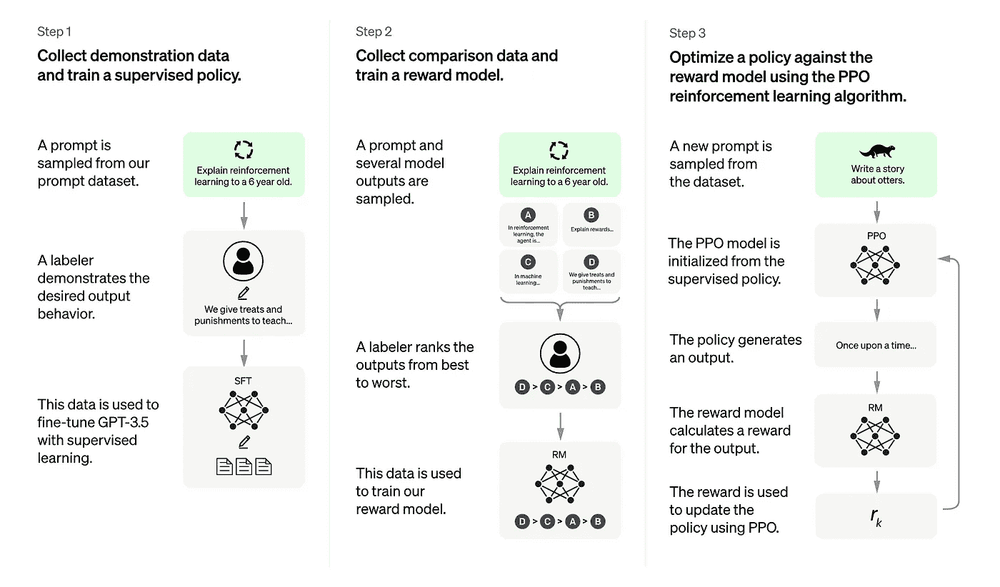

# chat GPT-它是什么，具体是如何工作的？

> 原文：<https://medium.com/geekculture/chatgpt-what-is-it-and-how-does-it-work-exactly-62e7010524d3?source=collection_archive---------1----------------------->

[https://openai.com/blog/chatgpt/](https://openai.com/blog/chatgpt/)

# 这是什么？

ChatGPT 是由 OpenAI 开发的最先进的自然语言处理(NLP)模型。它是流行的 GPT-3(生成相关变压器 3)模型的变体，该模型已经在大量文本数据上进行训练，以生成对给定输入的类似人类的响应。

# 它是如何工作的？

与依赖手工制作的规则和手动标记的数据的传统 NLP 模型不同，ChatGPT 使用神经网络架构和无监督学习来生成响应。这意味着它可以学习生成响应，而不需要被明确告知正确的响应是什么，这使它成为处理广泛对话任务的强大工具。

为了生成响应，ChatGPT 使用了多层变压器网络，这是一种深度学习架构，已被证明在处理自然语言方面是有效的。该模型获取输入句子，使用其内部知识对其进行处理，然后生成与输入相关的响应。

ChatGPT 的一个关键特性是它能够生成与对话上下文一致的响应。这意味着模型能够理解对话的流程，并生成与之前所说的内容自然相符的响应。这使得它对于客户服务等任务非常有用，在这些任务中，对话模型需要能够处理广泛的问题和后续问题，而不会丢失对上下文的跟踪。

除了生成响应，ChatGPT 还能够执行一系列其他 NLP 任务，如语言翻译、文本摘要和情感分析。这使得它成为一个多功能的工具，可用于各种应用。

总的来说，ChatGPT 是一个强大的 NLP 模型，能够对给定的输入生成类似人类的响应。它能够理解对话的上下文并生成相关的响应，这使它成为一种用于各种对话任务的有价值的工具。

# **限制**

ChatGPT 的局限性之一是它是一个庞大而复杂的模型，这使得它的运行需要大量的资源。这使得在实时应用中使用变得很困难，例如聊天机器人，在这些应用中可能需要快速响应。

ChatGPT 的另一个限制是它是一个生成模型，这意味着它并不总是能够为特定的问题提供准确的答案。在某些情况下，生成的响应可能是不相关的或无意义的，这使得在某些应用中很难使用。

此外，与所有 NLP 模型一样，ChatGPT 也受到数据质量和数量的限制。如果模型没有在多样化和代表性的数据集上进行训练，它可能无法对其训练数据之外的输入生成准确的响应。

总的来说，虽然 ChatGPT 是一个功能强大、用途广泛的 NLP 模型，但它也有其局限性。它的资源密集的性质和不相关或无意义的响应的可能性使得它对于某些应用不太理想。

# 结论

总之，ChatGPT 是由 OpenAI 开发的最先进的自然语言处理(NLP)模型。它使用神经网络架构和无监督学习来生成对给定输入的类似人类的响应。ChatGPT 能够理解对话的上下文，并生成与之前所说的内容自然相符的响应。这使得它成为各种对话任务的宝贵工具，如客户服务、语言翻译、文本摘要和情感分析。

想了解更多信息，请点击这里。

我的 Github 在这里:

 [## GitHub-eeman 1113/Study _ For _ Me _ AI:所以，有很多时候我有大量的文本…](https://github.com/Eeman1113/Study_For_Me_AI) 

请在 Twitter 上关注我的每日 AIML 更新:

感谢阅读😁回头见，伙计们👋🏼