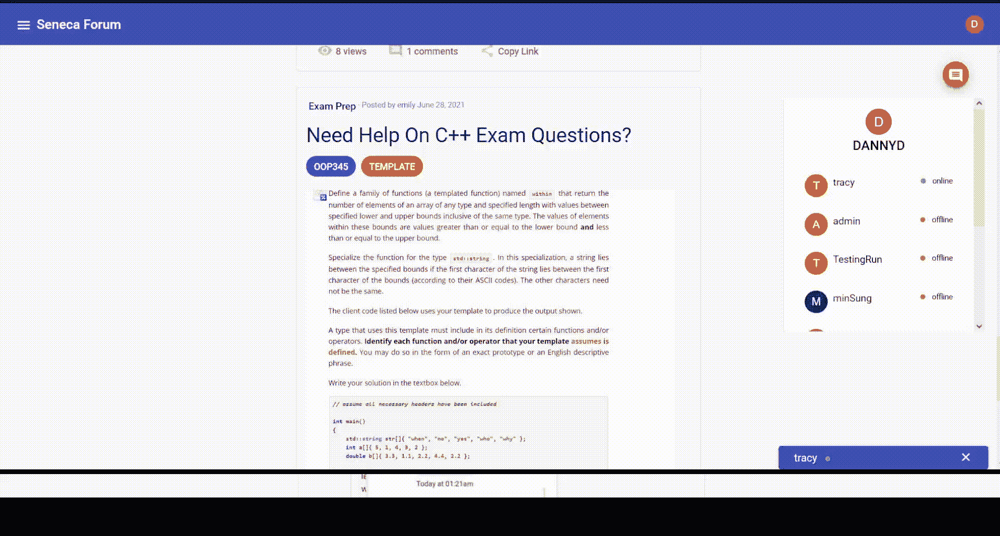

# 聊天室的历史对话，用户的在线状态，未读邮件通知使用 Spring Boot，Angular，MySQL

> 原文：<https://medium.com/geekculture/chatrooms-with-history-conversations-users-online-status-notification-of-unread-messages-using-722f3146a64a?source=collection_archive---------7----------------------->

我在做一个论坛项目，其中一个特色是允许多个用户互相聊天。我一开始以为很容易，因为有那么多关于实时聊天应用的教程。然而，事实证明，大多数教程都是关于建立一个基本的一对一聊天应用程序，而不存储历史对话，或者他们使用不同的技术堆栈(React，NodeJS，Firebase)，或者他们没有聊天应用程序的所有必要功能。我花了几天时间找到了解决方案，并完成了这些聊天功能。

> **有趣的事实:**当我与我的队友分享我想在我们的项目中拥有这个聊天功能时，他告诉我，他没有太多使用 WebSocket 的经验，不能帮助我太多。但我坚持要试一试。“如果我们不把自己推到极限，我们将无法学习新的东西，”——我说。最后，他让我学习 WebSocket，并在一周内尝试这些功能。
> 
> 我的方法是搜索教程和阅读文档；然后，我练习基本概念。在掌握了基础知识之后，我从应用程序最简单的功能开始，最后是最具挑战性的功能。然而，我仍然想改进一些东西，比如将 JSON 对象而不是文本发送到前端，但是这可能需要更高级的技术，比如 RabbitMQ。我留着以后项目用。
> 
> 当我向他展示完整的聊天功能时，他说:“你像石头一样坚固；

我想分享我的解决方案，这样一些人就不会像我一样花那么多时间。此外，我愿意接受任何更好的解决方案和性能的反馈。

我构建的功能包括:

1.  允许多个用户相互进行私人对话
2.  显示用户状态(在线/离线)
3.  存储历史对话
4.  获得任何未读邮件的通知
5.  防止匿名用户通过 WebSocket 连接

**允许多个用户相互进行私人对话**

为了向特定用户发送消息，我将消息发送到一个默认端点，例如以“/user”“/user/queue/messages”开头。

我的前端必须映射到这个端点。

**显示用户状态(在线/离线)**

当用户登录时，他们将开始订阅代理。但到目前为止，服务器只在用户开始向它发送消息时才知道用户的情况。当用户登录和注销(停止订阅)以及谁在订阅时，服务器如何观察他们的状态并通知控制器？

我发现 WebSocketEventListener 可以在这方面提供帮助。

基本上，handlewebsocketconnectdelistener(sessionconnectdevent 事件)捕获任何用户订阅的内容("/user ")，并提取标头以获取 userId 和用户名。然后，我创建了一组在线用户，并向其中添加了新用户。如果任何用户注销(取消订阅)，handleWebSocketDisconnectListener(SessionDisconnectEvent 事件)将被调用，并将该用户从集合<onlineuserdto>中删除。
为了获得在线/离线用户的列表，我将 WebSocketEventListener 注入到 WSUserController，该控制器每 3 秒钟将在线和离线用户的列表发送到前端。</onlineuserdto>

**商场历史对话**

我为两个用户之间的每次对话创建了一个聊天室，并生成了一个惟一的 id 来标识两个用户之间的交流。chatroomId 是通过串联 senderId_recipientId 生成的。对于每个对话，它将有两个具有相同 chatRoomId 的条目，一个房间在发送者和接收者之间，另一个在接收者和发送者之间。创建 02 条目的原因是为了确保两个用户获得相同的 chatRoomId，以便每次一个用户发送消息时，它都可以通过 senderId 和 recipientId 找到一个聊天室。

然后将 chatRoomId 设置为该消息，并将该消息保存到数据库中并标记为已接收，这意味着未读。

**获得任何未读邮件的通知。**

服务器不会直接向用户发送消息，而是发送通知。当用户点击聊天区域时，客户端将向服务器发出 HTTP 请求，加载发送方和接收方之间的所有消息，并标记为已发送。这张 gif 有助于更好地说明我的想法

**防止匿名用户通过 WebSocket 连接**

问题是 HTTP 和 WebSocket 的安全配置不同。尽管我可以为 HTTP 端点设置身份验证，但我不能为 WebSocket 重用 HTTP 配置。更具体地说，对服务器的每个 HTTP 请求都必须包含带有“Authorization”的头，以对用户进行身份验证，但是客户机中的 StompJs 不能在初始握手中设置那个自定义头。我目前的解决方案是让 WebSocket 服务器接受握手，不做任何认证检查；标准的 HTTP 头在这个阶段是可用的。此外，客户端检查用户是否被认证，然后聊天框就可以聊天了。

这些聊天功能是我的论坛网站项目的一部分。我把所有这些 websocket 代码都放在 [*这里*](https://github.com/trangntt-016/seneca-forum-backend/tree/master/src/main/java/com/seneca/senecaforum/websocket) 和 Angular 代码都集成在 [*chatbox*](https://github.com/trangntt-016/senecaforum-frontend/tree/master/src/app/chatbox) 和*[*chatpanel*](https://github.com/trangntt-016/senecaforum-frontend/tree/master/src/app/chatpanel)*组件中。**

**论坛项目源代码:
后端:[https://github.com/trangntt-016/seneca-forum-backend](https://github.com/trangntt-016/seneca-forum-backend)前端:[https://github.com/trangntt-016/senecaforum-frontend](https://github.com/trangntt-016/senecaforum-frontend)**

**如果你喜欢这篇文章，请鼓掌👏**并且分享出来让别人也能找到！**😄。**