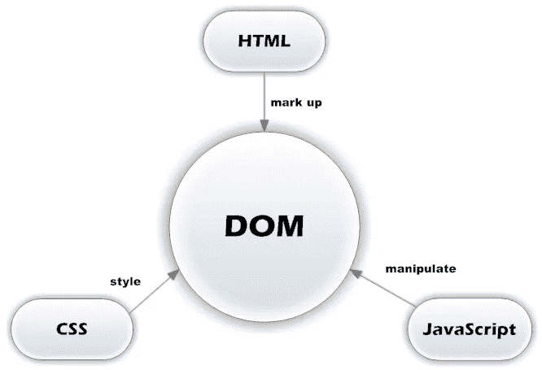

# JS 方法使用 DOM 的备忘单，第 2 部分

> 原文：<https://medium.com/geekculture/cheat-sheet-for-js-methods-to-work-with-dom-part-2-c0846167965c?source=collection_archive---------18----------------------->



# `Mixin ParentNode`

这种混合旨在处理父元素(祖先)，即包含一个或多个后代(子元素)的元素。

*   `children` —元素的后代

```
const { children } = list // list.children
log(children)
/*
HTMLCollection(3)
  0: li#item1.item
  1: li#item2.item
  2: li#item3.item
  length: 3
*/
```

这样的结构称为 HTML 集合，是一个类似手臂的对象(伪数组)。还有另一种类似的结构——`list of Nodes[(NodeList](https://dom.spec.whatwg.org/#interface-nodelist)`[)](https://dom.spec.whatwg.org/#interface-nodelist)。

类似数组的对象具有带有后代数量的`length`属性、`forEach()` 方法、(`NodeList`)，这允许您移动节点(进行迭代)。这种对象允许通过索引、名称(`HTMLCollection`)等获取元素。但是，它们没有真正的数组方法，如`map()`、`filter()`、`reduce()`等。，这使得和他们一起工作不是很舒服。因此，建议使用`Array.from()`或扩展运算符方法将数组对象转换为数组:

```
const children = Array.from(list.children)
// or
const children = [...list.children]
log(children) 
// [li#item1.item, li#item2.item, li#item3.item] - Normal array
```

*   `firstElementChild` —第一个后代—元素
*   `lastElementChild` —最后一个后代—元素

```
log(list.firstElementChild) // li#item1.item
log(list.lastElementChild) // li#item2.item
```

对于进一步的操作，我们将需要定期创建新元素，因此我们将创建另一个实用程序:

```
const createEl = (id, text, tag = 'li', _class = 'item') => {
  const el = document.createElement(tag)
  el.id = id
  el.className = _class
  el.textContent = text
  return el
}
```

我们的实用程序接受 4 个参数:标识符、文本、标签名和 CSS 类。2 个参数(标记和类)有默认值。该函数返回一个准备好进行操作的元素。随后，我们实现了这个实用程序的一个更通用的版本。

*   `prepend(newNode)` —将项目添加到列表顶部
*   `append(newNode)` —将元素添加到列表的末尾

```
// Create a new element
const newItem = createEl('item0', 0)
// and add it to the top of the list
list.prepend(newItem)// Create another item
const newItem2 = createEl('item4', 4)
// and add it to the end of the list
list.append(newItem2)log(children)
/*
HTMLCollection(5)
  0: li#item0.item
  1: li#item1.item
  2: li#item2.item
  3: li#item3.item
  4: li#item4.item
*/
```

其中一个有趣的特性`HTMLCollection`是它是“活的”，即通过引用返回的元素及其编号会自动更新。但是，此功能不能用于例如自动添加事件处理程序。

*   `replaceChildren(nodes)` —用新元素替换后代

```
const newItems = [newItem, newItem2]
// replace descendants with new elements
list.replaceChildren(...newItems) // list.replaceChildren(newItem, newItem2)log(children) // 2
```

获取元素引用的最通用的方法是`querySelector(selector)`和`querySelectorAll(selector)`方法。此外，与`getElementById()`不同，它们可以在任何父元素上被调用，而不仅仅是在`document`上。任何有效的 CSS 选择器都作为参数传递给这些方法。(`id`、`class`、`tag`等):

```
// get an element `li` with `id === item0`
const itemWithId0 = list.querySelector('#item0')
log(itemWithId0) // li#item0.item// get all elements `li` with `class === item`
const allItems = list.querySelectorAll('.item')
log(allItems) // array-like object
/*
NodeList(2)
  0: li#item0.item
  1: li#item4.item
  length: 2
*/
```

创建接收物料的通用实用程序:

```
const getEl = (selector, parent = document, single = true) => single ? parent.querySelector(selector) : [...parent.querySelectorAll(selector)]
```

我们的实用程序有 3 个参数:CSS 选择器、父元素和元素数量的指示器(一个或全部)。2 个参数(祖先和指示器)有默认值。该函数返回与选择器一致的一个或所有项目(作为常规数组)，具体取决于指示器值:

```
const itemWithId0 = getEl('#item0', list)
log(itemWithId0) // li#item0.itemconst allItems = getEl('.item', list, false)
log(allItems) // [li#item0.item, li#item4.item]
```

# `Mixin NonDocumentTypeChildNode`

这种混合旨在处理不是文档的子文档，即除`document`之外的所有节点。

*   `previousElementSibling` —前一个元素
*   `nextElementSibling`—下一个元素

```
log(itemWithId0.previousElementSibling) // null
log(itemWithId0.nextElementSibling) // #item4
```

# `Mixin ChildNode`

这种混合旨在处理附属元素，即其他元素的后代元素。

*   `before(newNode)` —在当前元素之前插入新元素
*   `after(newNode)` —在当前元素后插入新元素

```
// get `li` with `id === item4`
const itemWithId4 = getEl('#item4', list)
// create new element
const newItem3 = createEl('item3', 3)
// and insert it before `itemWithId4`
itemWithId4.before(newItem3)// create another one
const newItem4 = createEl('item2', 2)
// and insert it after `itemWithId0`
itemWithId0.after(newItem4)
```

*   `replaceWith(newNode)`—替换新的当前元素

```
// создаем новый элемент
const newItem5 = createEl('item1', 1)
// и заменяем им `itemWithId0`
itemWithId0.replaceWith(newItem5)
```

*   `remove()` —删除当前元素

```
itemWithId4.remove()
```

# `Node Interface`

该接口设计用于处理节点。

*   `nodeType` —节点类型

```
log(list.nodeType) // 1// other options
/*
 1 -> ELEMENT_NODE (element)
 3 -> TEXT_NODE (text)
 8 -> COMMENT_NODE (comment)
 9 -> DOCUMENT_NODE (document)
 10 -> DOCUMENT_TYPE_NODE (doctype)
 11 -> DOCUMENT_FRAGMENT_NODE (fragment) etc.
*/
```

*   `nodeName` —节点名称

```
log(list.nodeName) // UL// other options
/*
  - qualified name of the HTML element with capital (capital) letters
  - qualified attribute name
  - #text
  - #comment
  - #document
  - doctype
  - #document-fragment
*/
```

*   `baseURI` —主要路径

```
log(list.baseURI) // .../dom/index.html
```

*   `parentNode` —父节点
*   `parentElement`—父元素

```
const itemWithId1 = getEl('#item1', list)log(itemWithId1.parentNode) // #list
log(itemWithId1.parentElement) // #list
```

*   `hasChildNodes()` —如果元素至少有一个后代，则返回`true`
*   `childNodes` —子节点

```
log(list.hasChildNodes()) // true
log(list.childNodes)
/*
NodeList(3)
  0: li#item1.item
  1: li#item2.item
  2: li#item3.item
*/
```

*   `firstChild` —第一个节点-子节点
*   `lastChild`—最后一个子节点

```
log(list.firstChild) // #item1
log(list.lastChild) // #item3
```

*   `nextSibling` —下一个节点
*   `previousSibling` —上一个节点

```
log(itemWithId1.nextSibling) // #item2
log(itemWithId1.previousSibling) // null
```

*   `textContent` —提取/记录文本的获取器/设置器

```
// get text
log(itemWithId1.textContent) // 1
// edit text
itemWithId1.textContent = 'item1'
log(itemWithId1.textContent) // item1// get text content from all children
log(list.textContent) // item123
```

为了提取/写入文本，还有另一个(过时的)getter / setter— `innerText`。

*   `cloneNode(deep)` —复制节点。接受确定复制性质的逻辑值:浅表-仅复制节点本身，复制装配本身及其所有后代

```
// create a new list by copying the existing
const newList = list.cloneNode(false)
// remove the `ID` in the avoidance of collisions
newList.removeAttribute('id')
// change its text content
newList.textContent = 'new list'
// and insert it after an existing list
list.after(newList)// create another list
const newList2 = newList.cloneNode(true)
newList.after(newList2)
```

*   `isEqualNode(node)` —比较节点
*   `isSameNode(node)` —确定节点的身份

```
log(newList.isEqualNode(newList2)) // true
log(newList.isSameNode(newList2)) // false
```

*   `contains(node)` —如果元素包含指定的节点，则返回`true`

```
log(list.contains(itemWithId1)) // true
```

*   `insertBefore(newNode, existingNode)` —在现有节点(`existingNode`)之前添加新节点(`newNode`)

```
// create new element
const itemWithIdA = createEl('#item_a', 'a')
// and insert it before `itemWithId1`
list.insertBefore(itemWithIdA, itemWithId1)
```

*   `appendChild(node)` —将节点添加到列表的末尾

```
// создаем новый элемент
const itemWithIdC = createEl('#item_c', 'c')
// и добавляем его в конец списка
list.appendChild(itemWithIdC)
```

*   `replaceChild(newNode, existingNode)` —用新节点(`newNode`)替换现有节点(`existingNode`):

```
// создаем новый элемент
const itemWithIdB = createEl('item_b', 'b')
// и заменяем им `itemWithId1`
list.replaceChild(itemWithIdB, itemWithId1)
```

*   `removeChild(node)` —删除指定的子节点

```
// получаем `li` с `id === item2`
const itemWithId2 = getEl('#item2', list)
// и удаляем его
list.removeChild(itemWithId2)
```

# `Document interface`

该接口用于处理`Document` 对象。

*   `URL`和`documentURI` —文件地址

```
log(document.URL) // .../dom/index.html
log(document.documentURI) // ^
```

*   `documentElement`:

```
log(document.documentElement) // html
```

*   `getElementsByTagName(tag)` —返回带有指定标签的所有元素

```
const itemsByTagName = document.getElementsByTagName('li')
log(itemsByTagName)
/*
HTMLCollection(4)
  0: li##item_a.item
  1: li#item_b.item
  2: li#item3.item
  3: li##item_c.item
*/
```

*   `getElementsByClassName(className)` —返回具有指定 CSS 类的所有项目

```
const itemsByClassName = list.getElementsByClassName('item')
log(itemsByClassName) // ^
```

*   `createDocumentFragment()` —返回文档的一个片段:

```
// create a fragment
const fragment = document.createDocumentFragment()
// create a new element
const itemWithIdD = createEl('item_d', 'd')
// add element to fragment
fragment.append(itemWithIdD)
// add fragment to list
list.append(fragment)
```

片段允许你避免创建不必要的元素。它们经常在处理标记时使用，通过使用`template`标签对用户隐藏(方法`cloneNode()`返回`DocumentFragment`)。

*   `createTextNode(data)`—创建文本
*   `createComment(data)` —创建评论
*   `importNode(existingNode, deep)` —基于现有节点创建新节点

```
// Creates a new list based on existing
const newList3 = document.importNode(list, true)
// insert it before the existing list
list.before(newList3)
// and remove to avoid conflicts
newList3.remove()
```

*   `createAttribute(attr)` —创建指定的属性

# `NodeIterator`和`TreeWalker interfaces`

`[NodeIterator](https://dom.spec.whatwg.org/#interface-nodeiterator)`和`[TreeWalker](https://dom.spec.whatwg.org/#interface-treewalker)`接口被设计为绕过(遍历)节点树。我没有碰到它们实际使用的例子，所以我将限制这一对例子:

```
// createNodeIterator(root, referenceNode, pointerBeforeReferenceNode, whatToShow, filter)
const iterator = document.createNodeIterator(list)
log(iterator)
log(iterator.nextNode()) // #list
log(iterator.nextNode()) // #item_a
log(iterator.previousNode()) // #item_a
log(iterator.previousNode()) // #list
log(iterator.previousNode()) // null// createTreeWalker(root, whatToShow, filter)
// apply filters - https://dom.spec.whatwg.org/#interface-nodefilter
const walker = document.createTreeWalker(list, '0x1', { acceptNode: () => 1 })
log(walker)
log(walker.parentNode()) // null
log(walker.firstChild()) // #item_a
log(walker.lastChild()) // null
log(walker.previousSibling()) // null
log(walker.nextSibling()) // #item_b
log(walker.nextNode()) // #item3
log(walker.previousNode()) // #item_b
```

# `Element interface`

该接口用于处理元素。

*   `localName`和`tagName`——一个标签名

```
log(list.localName) // ul
log(list.tagName) // UL
```

*   `id` —标识符的获取器/设置器
*   `className`—CSS 类的 getter / setter

```
log(list.id) // list
list.id = 'LIST'
log(LIST.className) // list
```

*   `classList` —元素的所有 CSS 类(`DOMTokenList` 对象)

```
const button = createEl('button', 'Click me', 'my_button', 'btn btn-primary')
log(button.classList)
/*
DOMTokenList(2)
  0: "btn"
  1: "btn-primary"
  length: 2
  value: "btn btn-primary"
*/
```