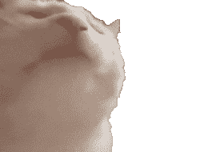

# Python 中统计分析的备忘单

> 原文：<https://medium.com/geekculture/cheat-sheet-for-statistical-analysis-in-python-e6bfa21cddb0?source=collection_archive---------29----------------------->

## 统计很复杂。为什么不简化一点呢？

作为一名相当新的用 Python 编程的数据科学家，我必须对一堆数据做相当多的统计分析。无论是进行假设检验，确定置信区间，还是绘制正态曲线，当试图准确地查看数据以进行预测和关联时，似乎有成千上万的事情要记住。因此，为了让我的数据科学家同事摆脱我在学习所有这些新工具时的那种压倒性的感觉，我编制了一份各种各样的备忘单，当你需要进行常见的统计分析时可以参考。

由于 Python 内置了许多统计分析工具和数学函数，我们将在大多数测试中使用它的基础包。


You skipping all the messy statistical math

**一般有用的功能**

在运行这些测试之前，您必须运行:

*   **从数学导入***
*   **从 itertools 导入***
*   **从集合导入***

这允许您在 python 中使用每个包中的所有工具，而无需调用它们，例如键入 factorial(~)而不是 math.factorial(~)。

> ***阶乘(#)***

这个函数返回给定数字的阶乘。例如，如果你给它 10 这个数字，它会计算出 10 * 9 * 8 *……* 1，然后给你 3，628，800 这个数字。这个函数对于查找集合中组合的数量非常有用。

> ***排列(iterable，n)***

这个函数为你放入的任何东西创建长度为 n 的所有排列。它可以是一列数字、一个字符串或任何可以迭代的东西(在 for 循环中使用)。例如，如果您使用“ABC”作为 iterable，3 和您的“n”，您将收到以下结果:

```
 ('A', 'B', 'C'),
 ('A', 'C', 'B'),
 ('B', 'A', 'C'),
 ('B', 'C', 'A'),
 ('C', 'A', 'B'),
 ('C', 'B', 'A')
```

> ***计数器(iterable)***

该函数接受一个 iterable，并返回该 iterable 的每个元素及其出现次数。这对于制作频率表或寻找集合的模式非常有用。例如，Counter(['a '，' a '，' b '，' c '，' c'])返回:

计数器({'a': 2，' b': 1，' c': 3})

# 统计显著函数(呵呵)

为了利用 Python 预加载的大部分统计函数，您必须导入 SciPy，更具体地说，是从 SciPy 导入“stats”模块:

*   **来自 scipy import stats(或*)**

从那里，可以访问您需要运行的大多数统计计算。接下来的几个函数都将被简要说明:

> ***stats.norm.ppf(比例)***

*   这个函数根据你给它的比例给出一个 z 值。例如，如果给它 0.95，它将给出包含 95%值的 z 值。

*   *与 ppf 功能相反。你给它一个 z 值，它给你低于 z 值的值的比例。如果您有一个特定值的 z 值，您可以将它代入此公式，以查看小于它的值的比例。*

*   **这将给出您用自由度指定的任何 t 分数右侧的区域。这有助于找到大于数据集 t 值的值的比例(本质上是 1 - cdf)。**

> *****statts.ttest_ind (x，y，equal_var = True/False)*****

*   **虽然这个看起来很复杂，但实际上非常简单。你给它两组数据，一个 x 和一个 y，然后指定这两组数据是否有相同的方差。它对两个数据集的平均值进行双样本 T 检验，并给出这些平均值差异的 T 得分和 p 值。**

# ****奖励功能！****

****

> *****np.random.normal(均值，标准差，大小)*****

*   **这将从正态分布中创建任意大小的随机样本，以您给出的平均值和标准偏差为中心。当您知道总体均值和标准差时，这对于为其他统计测试生成样本非常有用。**

*   ***为您输入的任何列表或数据提供倾斜。如果为 0，则没有偏斜。如果> 0，则表示向右倾斜。如果<0, you have a left skew.***

> ******峰度(x)******

*   **给出输入数据的峰度。如果=0，则数据为正常形状。如果> 0，数据高瘦。如果<0, the data is short and fat. (for more info on kurtosis, click [在这里](https://www.simplypsychology.org/kurtosis.html)**

> *****np.random.binomial(试验，成功概率)*****

*   **根据给定的试验次数和成功概率，随机生成成功次数**

# **最后…圣杯…**

> *****导入 statsmodel.api 为 sm*****
> 
> *****型号= sm。OLS(data1，sm . add _ constant(data 2))*****

***这几行代码将为您提供两组不同数据之间的大量统计数据。您可以将 DataFrames 中的特定列作为两个数据集传递，这也是我个人最常使用它的地方。此摘要图表为您提供了数据的偏斜度、峰度、均值差异的 p 值、R 平方值、趋势线方程等数据。在比较两组不同的数据时，这种统计建模技术非常关键。***

***就是这样！负责任地使用这些作弊代码！***