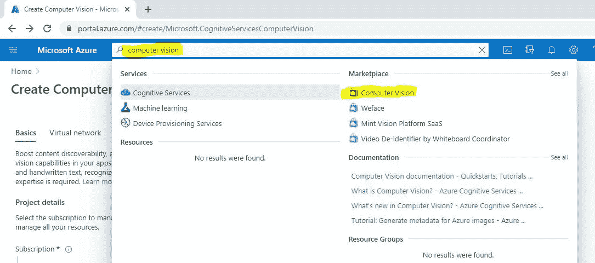
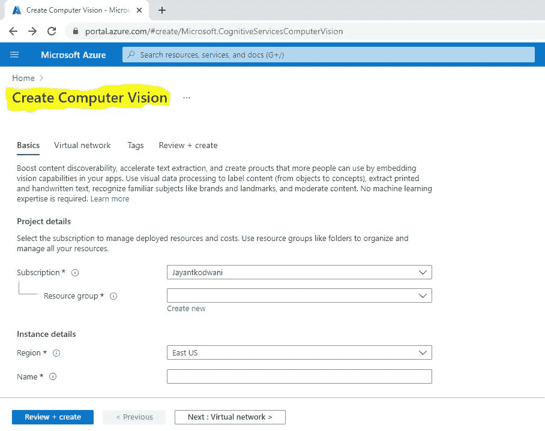
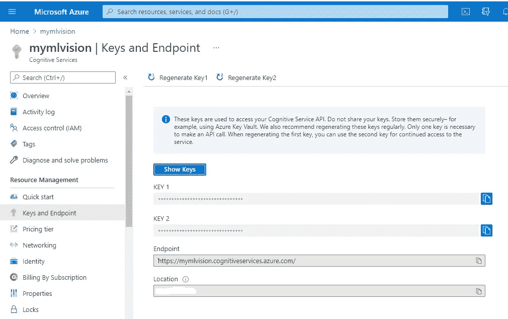
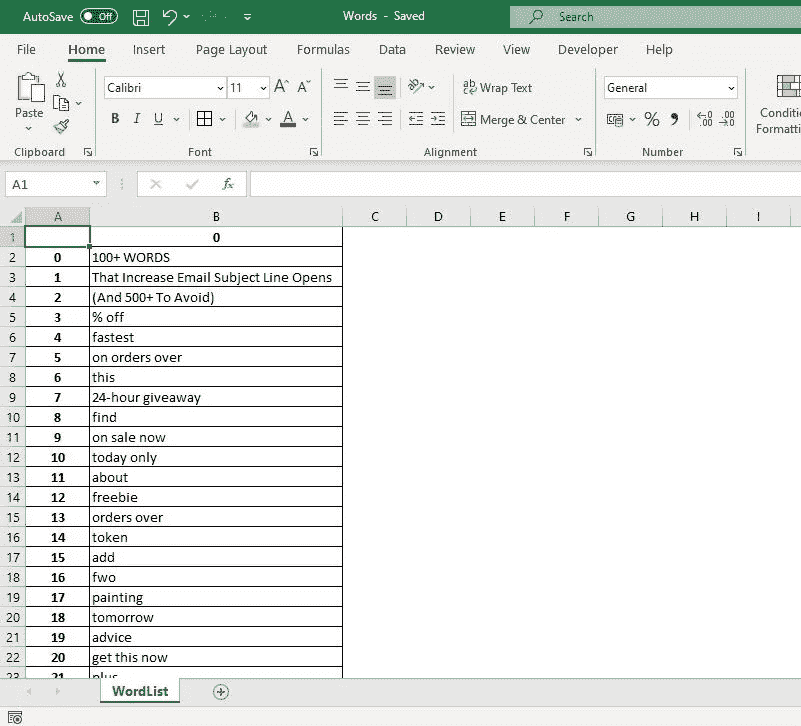

# 将死的 OCR 挑战:图像到文本提取

> 原文：<https://medium.com/geekculture/checkmate-the-ocr-challenge-image-to-text-extraction-d0f947abfbbc?source=collection_archive---------36----------------------->

## [计算机视觉](https://towardsai.net/p/category/computer-vision)

# 通过 3 个简单的步骤从图像中提取文本

使用 Python 释放 Microsoft Azure 计算机视觉的力量


Checkmate the OCR challenge : Image to Text Extraction using Python & Azure, (Photo by [GR Stocks](https://unsplash.com/@grstocks?utm_source=medium&utm_medium=referral) on [Unsplash](https://unsplash.com?utm_source=medium&utm_medium=referral))

OCR 光学字符识别，或者通俗地说，从图像中提取文本，已经成为当今最显著的特征之一。组织雇佣成千上万的人只是为了从图像中键入文本的日子已经一去不复返了！今天，这是几个人的工作，他们可以在几分钟内处理成千上万的图像。从图像中提取文本已帮助组织大规模改善客户服务，增加存储空间，并以合规的方式保护敏感数据。

## 我们将讨论什么？

我们将学习如何使用微软 Azure 计算机视觉认知服务从图像中提取文本。

1.  我们将使用存储在 Azure 容器 Blob 存储中的示例图像([https://jayantml 1356189034 . Blob . core . windows . net/jayantcontainer/0001 . jpg](https://jayantml1356189034.blob.core.windows.net/jayantcontainer/0001.jpg))
2.  处理给定的图像提取 100+字。
3.  将提取的结果存储在本地 MS Excel 文件中。

# 所需资源

*   Python 实例(即 Spyder IDE)
*   Microsoft Azure 订阅(运行计算机视觉认知服务和存储服务以在 Blob 中存储图像)

# 步骤 1:创建 Azure 计算机视觉

1.1 登录 Azure 门户:【https://portal.azure.com/#home ，搜索“**计算机视觉**



Search for “Computer Vision” on Azure Portal

1.2 通过选择订阅、创建资源组(只是绑定资源的容器)、位置和[定价层来创建计算机视觉服务。](https://azure.microsoft.com/en-us/pricing/details/cognitive-services/computer-vision/#pricing)一个免费的 web 容器每月允许***5000 笔免费交易*** 。点击“**查看+创建”**后，Azure 可能需要几分钟来创建资源。



Create Computer Vision service

1.3 一旦创建了计算机视觉服务，导航至**“密钥和端点”**，并可能在记事本中复制密钥和端点详情。



Keys and Endpoint for Computer vision service

> *⚠️请注意，密钥和端点不应透露给未经授权的人，因为它们可能会影响您的 azure 消费成本。如果您不小心泄露了密钥，请重新生成密钥。*

现在，您已经完成了 Azure 门户部分，可以导航到 Python (Spyder IDE)了。

# 步骤 2:安装 AZURE 包

**安装:**打开 Python 实例(即 Spyder🐍)并发出下面的命令来安装所需的 azure 包。

```
pip install — upgrade azure-cognitiveservices-vision-computervision
pip install pillow
pip install azure-storage-blob
```

# 步骤 3: Python 代码魔术

使用以下脚本并替换(a)订阅密钥(b)端点并执行！您可以通过替换字段**‘remote _ image _ hand _ text _ URL’来尝试使用其他图像执行脚本。**脚本已更新为不言自明的注释。欢迎在评论区提出更多问题。

这就是你的输出结果。你可以在这里下载 [Excel。](https://github.com/jayantkodwani/Image-to-Text-Extraction-Microsoft-Azure-Computer-Vision-Python/blob/main/Words.xlsx)



Exported MS Excel Workbook

# 结论

我们学到了📘如何从图像中提取文本并在 MS Excel 中输出以供进一步分析..您可以使用其他图像并定制代码，看看什么最适合您的用例！👍

有问题吗？？请放在评论里！

# 参考

[1][https://docs . Microsoft . com/en-in/azure/cognitive-services/computer-vision/quick starts-SDK/client-library？tabs = visual-studio&pivots =编程语言-python](https://docs.microsoft.com/en-in/azure/cognitive-services/computer-vision/quickstarts-sdk/client-library?tabs=visual-studio&pivots=programming-language-python)