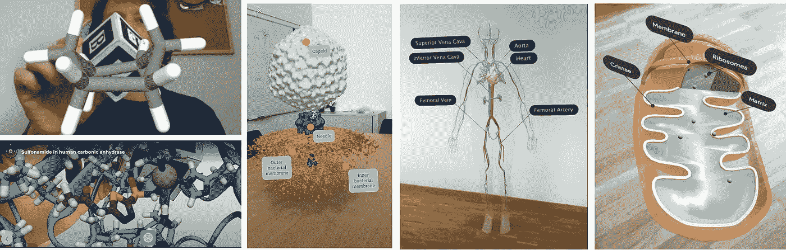

# 化学和生物教育使用商品网络增强现实-在任何设备！

> 原文：<https://medium.com/geekculture/chemistry-and-biology-education-using-commodity-web-augmented-reality-in-any-device-9fa9fdc4ab35?source=collection_archive---------14----------------------->

Left: a small molecule, a protein with a clinical drug bound, and a bacteriophage, seen in web-augmented reality in moleculARweb. Right: the human circulatory system and a mitochondrion, offered in web-augmented reality by Google. Figure composed by author Luciano Abriata.

## 教育的未来

## 由于现代教育内容在我们的 moleculARweb 站点和 Google 中使用了基于网络的增强现实，学生、教师和科学传播者现在可以…