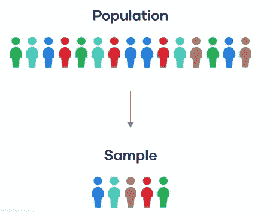
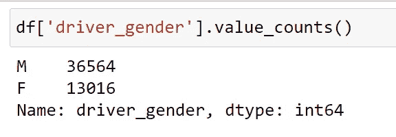
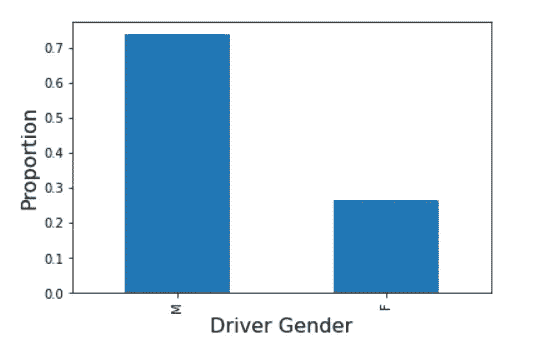
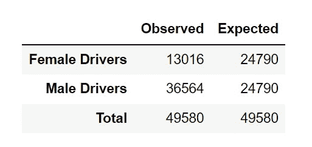
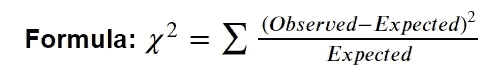
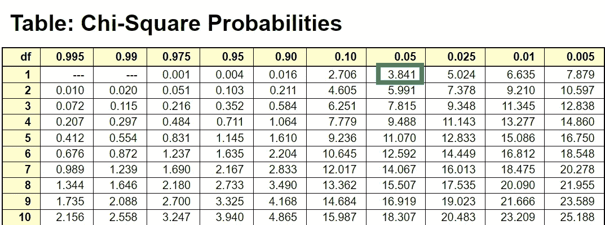
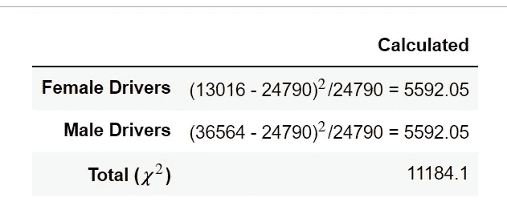
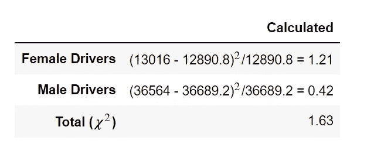

# 卡方假设检验

> 原文：<https://medium.com/geekculture/chi-square-hypothesis-test-65444d9e5c08?source=collection_archive---------7----------------------->

卡方检验有 **2** 种类型:

1.  **卡方拟合优度检验**
2.  **独立性卡方检验**

这里我们将讨论**卡方拟合优度检验。**

# **卡方拟合优度检验:**

*   用于检查**样本**数据是否与**总体**匹配。

*   主要用于检验**总体分类分布**和**样本分类分布。**

比方说，我们有**交通规则违反数据集**，其中报告了所有可能的事件，详细信息包括**驾驶员性别、驾驶员年龄**等。,

我们将把这个数据集视为**人口**(观察值)。数据集总共包含 **49，580** 行。

您可以在这里 从 [**下载数据集。**](https://github.com/priyanka-ddit/Statistical-Tests/blob/master/Data/traffic_violaions.csv)

# 观察结果:

下面是观察到的**司机 _ 性别**在人群中的类别分布。

Category wise count

Category wise proportion

假设我们几乎没有假设样本数据集中**驾驶员 _ 性别**的类别分布的理论。

我们将执行**卡方拟合优度假设检验**来验证这些理论。

# 理论一:“女性和男性司机同样违反交通规则。”

*   这里，

> **零假设(H0):** 男女司机同样违反交通规则。
> 
> **替代假设(HA):** 女性和男性司机“不”同样违反交通规则。

# 期望值-1:

*   50%的女司机和 50%的男司机**违反交通规则。**
*   **预期女司机** =总记录的 50% = 0.5 * 49580 = 24790
*   **预期男司机** =总记录—预期女司机= 49580**—24790 = 24790**

****

**Observed and expected values for theory-1**

# **计算卡方(理论-1):**

****

**让我们来看看:**

*   **显著性水平= 5%(我们将使用该值来衡量观察值和期望值之间的差距)**
*   **自由度= 1(类别数-1)**
*   **查卡方概率图 [**这里**](https://people.richland.edu/james/lecture/m170/tbl-chi.html) 和匹配**列值=0.05 (5%)** 和**行值= 1 (DF)** 在这里你会发现 **3.84****

****

**如果𝜒2 **> 3.84** ，拒绝原假设，接受备选假设。换句话说，如果χ2**3.84**，我们可以说上述理论是错误的**

****

**Calculated chi square value**

# **结论 1:**

*   **当χ2 > 3.84 时，**拒绝零假设，接受女性和男性司机违反交通规则的情况并不相同。****
*   **即使我们与下面显示的初始分布进行比较，它表明大约 25%的女司机违反交通规则，而不是 50%。**

****

**Category wise proportion**

# **理论二:“74%的男司机违反交通规则”**

*   **这里，**

> **零假设(H0): 74%的男性司机违反交通规则。**
> 
> ****另类假设(HA):** 74%男司机“不”违反交通规则。**

# **期望-2:**

*   **26%的女性司机和 74%的男性**司机违反交通规则。****
*   ****预期女司机** =总记录的 26% = 0.26 * 49580 = 12890.8**
*   ****预期男司机** =总记录—预期女司机= 49580—12890.8 = 36689.2**

****

**Observed and expected values for theory-2**

**如果χ2**3.84**，拒绝原假设，接受备择假设。换句话说，如果χ2 **> 3.84** ，我们可以说上述理论是错误的**

****

**Calculated chi square value**

# **结论二:**

*   **由于χ2 < 3.84, **我们未能拒绝零假设。所以我们承认大约 74%的男性司机违反交通规则。****
*   **即使我们与下面显示的初始分布进行比较，也表明超过 70%的男性司机违反交通规则。**

****

**Category wise proportion**

# **注意:**

*   **你越是提高显著性水平，观察值和期望值之间的差距就会越小。**
*   **如果您将**设置为 100%显著性水平**，那么观察值和期望值必须相同。**

**你可以从我的 GitHub 账号 [**这里**](https://github.com/priyanka-ddit/Statistical-Tests) 下载 jupyter 笔记本。**

**谢谢你。**