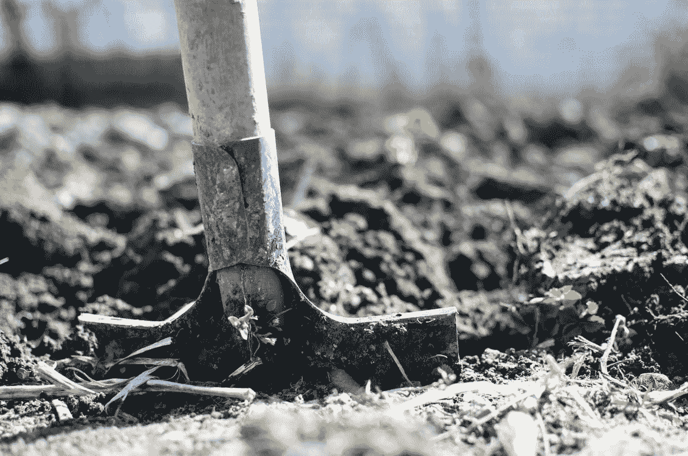

# Chia 网络绘图优化

> 原文：<https://medium.com/geekculture/chia-network-plotting-optimization-7f0d6380eded?source=collection_archive---------1----------------------->

让我们试着理解在 Chia 网络绘制期间发生了什么以及优化它的方法

Photo by [Lukas](https://www.pexels.com/@goumbik?utm_content=attributionCopyText&utm_medium=referral&utm_source=pexels) from [Pexels](https://www.pexels.com/photo/brown-shovel-296230/?utm_content=attributionCopyText&utm_medium=referral&utm_source=pexels)

本周早些时候，埃隆·马斯克表示，特斯拉不再接受比特币作为特斯拉汽车的支付形式。在一条推文中，特斯拉表示，由于气候问题，该公司已暂停使用比特币购买车辆。