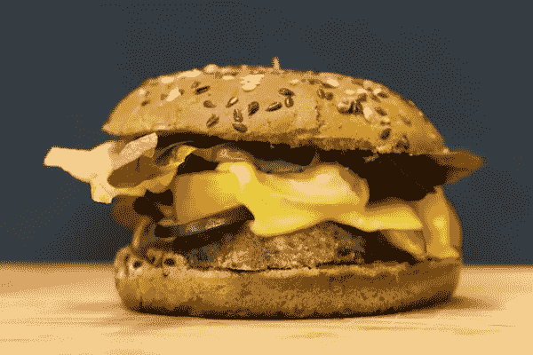
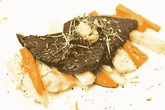

# 不可能食品公司的首席法律官有目的地领导

> 原文：<https://medium.com/geekculture/chief-legal-officer-of-impossible-foods-leads-with-purpose-bb3603b4ccf2?source=collection_archive---------11----------------------->

Photo by [Alexander Sinn](https://unsplash.com/@swimstaralex?utm_source=unsplash&utm_medium=referral&utm_content=creditCopyText) on [Unsplash](https://unsplash.com/s/photos/veggie-burger?utm_source=unsplash&utm_medium=referral&utm_content=creditCopyText)

不可能食品公司是一家生产肉类产品的植物替代品的公司。它有一个首席法律官，专门领导公司的法律和合规职能。这家加州公司出售不可能的汉堡和其他植物性肉类。它还肩负着减少碳排放和创造更清洁环境的使命。

## **技术背景为瓦格纳提供了宝贵的经验**

达纳·瓦格纳是不可能食品公司的首席法务官。他有在大型科技公司担任法律职位的职业经验，他利用这些经验来帮助不可能的食物成长。Wagner 之前是杰克·多西创立的颇具影响力的支付处理公司 Square 的法律总顾问。在此之前，瓦格纳负责谷歌的反垄断、竞争和消费者保护事务。

虽然科技行业的经验可能看起来不相关，但事实上它提供了一些有见地的教训。瓦格纳在 Square 和谷歌的经历教会了他如何驾驭影响消费品市场的法律法规。此外，就像快速发展的科技产业一样，植物性肉类产业近年来飞速发展。瓦格纳在适应不断变化的趋势方面的技能延续到了他目前作为不可能食品公司首席法律官的角色。

## **不可能的食物 vs .超越肉类**

不可能食品的主要竞争对手是超越肉类的。虽然两家公司的目标都是注重健康的消费者或希望减少环境足迹的消费者，但每家公司都有独特的属性。Beyond Meat 成立于 2009 年。不可能食品公司由斯坦福大学生物化学教授帕特里克·奥莱利·布朗于 2011 年创立。

Image credit: [Piqsels](https://www.piqsels.com/en/public-domain-photo-fbqfb)

就产品本身而言，Beyond Meat 和 Impossible Foods 使用一种不同的植物蛋白混合物来制造无肉肉类。除了肉类，还含有豌豆、绿豆、大米蛋白和椰子油的混合物。“不可能食品”肉类的主要成分是大豆、土豆蛋白和葵花籽油。两家公司对肉制品的定价相似。一般来说，植物性肉类比动物性肉类稍微贵一点。

## **寻找具有独特挑战的职业**

在 2018 年被聘用之前，瓦格纳探索了许多不同的工作机会。“我在海湾地区寻找了很多不同的全职角色，我对不可能食品的使命和他们建立的团队印象深刻，”瓦格纳说。在考虑他的下一步职业发展时，瓦格纳指出，他对具有独特监管挑战的工作或在使命驱动的非营利组织工作特别感兴趣。

Wagner 热衷于成为一家公司的首席法律官，该公司面临着新的监管挑战，发展迅速，并具有可持续的使命。他取代了迈拉·帕塞克，后者在之前的五年里一直是不可能食品公司法律部门的负责人。

在目前的职位上，他经常从他作为 Square 总法律顾问的最后一份全职工作中吸取经验教训。瓦格纳在公司发展的相对早期阶段加入 Square，并帮助指导它在 2015 年进行首次公开募股。事实上，瓦格纳是 Square 的首位总法律顾问。他于 2016 年离开公司，将更多时间投入到教学、咨询和其他个人努力中。

他带领 Square 度过了几个关键的高增长年，这给了瓦格纳一个帮助不可能食品公司法律部门的工具包。“我以前见过公司经历过这个增长阶段。瓦格纳评论道:“我知道，随着我们继续发展并取得成功，我们会遇到一些相同的问题，比如与监管机构的互动增加。”。“像不可能的食品一样，Square 在一个相当规范的空间运营，我了解业内现有参与者的动态。”

## 过去的经验有所帮助

在弄清楚如何与监管机构打交道时，瓦格纳还借鉴了早期的职业经验。在担任 Square 的总法律顾问之前，Wagner 在谷歌的法律部门工作了四年多。他在谷歌负责反垄断事务，并最终在 2011 年成为法律总监。在此之前，瓦格纳是美国司法部反垄断部门的出庭律师。随着 Impossible Foods 获得更多市场份额，并成为肉类替代品领域的主导行业，他的反垄断知识将变得越来越有用。

## **不可能的食品扩张计划**

不可能的食物已经出现在许多杂货店的过道上和几家著名连锁店的餐厅菜单上。沃尔玛、塔吉特(Target)、克罗格(Kroger)和全食超市(Whole Foods)等杂货店出售该公司的产品，包括植物肉饼、猪肉、香肠和鸡块。包括汉堡王、苹果蜂和许多当地餐馆在内的连锁餐馆也将不可能的肉加入到他们的菜单中。全美有超过 2000 家餐厅供应不可能的汉堡。为了迎合素食顾客，星巴克现在提供不可能的早餐三明治，其特色是植物香肠馅饼。

国际扩张也在加速。Impossible Foods 于 2018 年在香港推出，这是该公司在美国以外的第一个市场。随着世界各地的人们对减少他们的环境足迹越来越感兴趣，它继续获得市场份额。该公司声称，与安装太阳能电池板或使用电动汽车相比，调整饮食对减少温室气体排放的影响更大。