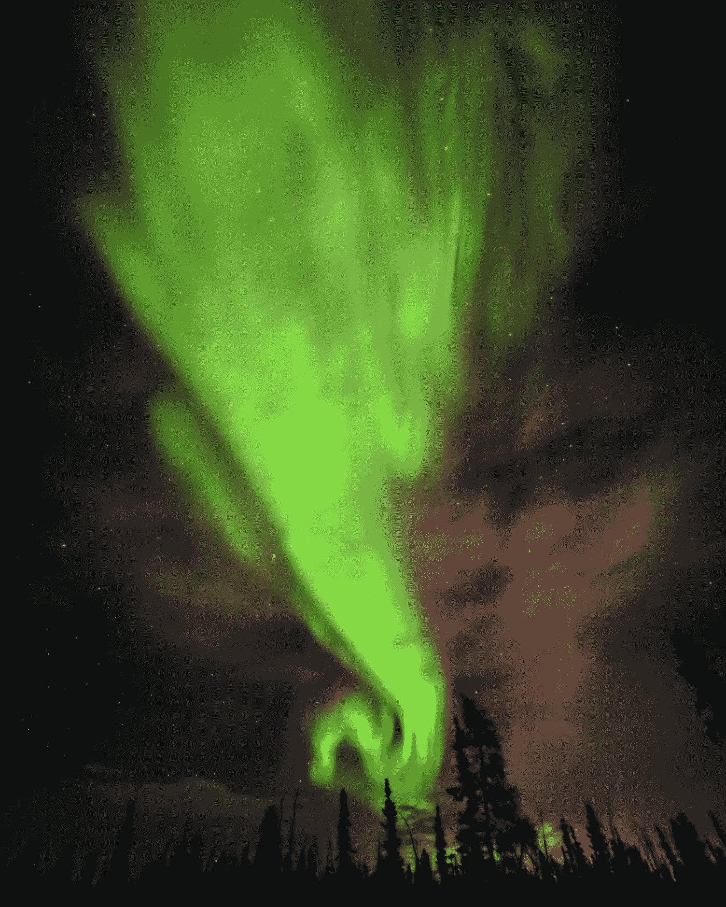

# 中国称可能探测到外星信号

> 原文：<https://medium.com/geekculture/china-says-alien-signal-may-have-been-detected-8a833909d9bc?source=collection_archive---------12----------------------->

## 中国称其巨大的天眼望远镜可能捕捉到了外星文明的迹象。

source:pexels

天眼过去捕捉过不同种类的窄带电磁信号。不清楚为什么这篇报道似乎已经从中国科技日报网站上撤下。