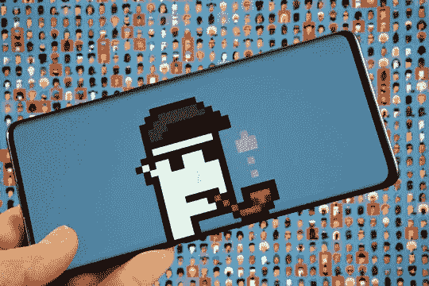

# 凿一个迷人的 NFT 市场像 Cryptopunks 启动你的创业

> 原文：<https://medium.com/geekculture/chisel-an-enchanting-nft-marketplace-like-cryptopunks-to-kickstart-your-entrepreneurial-venture-fcd5acdb7169?source=collection_archive---------19----------------------->

还记得当学历证书作为文件分发时，你不得不随身携带它们吗？还记得你手机上 PDF 格式的教育细节是如此容易操作吗？还记得有人伪造学位证吗？但是，现在随着 NFTs 的进入，完全不需要这种麻烦了。NFT 的存在让一切变得简单。我们谈论了很多关于 NFT 的话题；在我们讨论建立一个像 [cryptopunks](https://www.larvalabs.com/cryptopunks) 这样的 NFT 市场之前，让我们简要地看看它们是什么。

Image Source: Adobe Stock

**NFT——他们是什么？**

NFT 代表不可替代的代币。这些代币可以用任何东西作为模型来铸造。你只需要你想要铸造的物品的数字表示。例如，如果你有一个具有一定意义的古代马克杯，并想将其制作成 NFT，你所需要的只是一张高分辨率的图片。你可以在 [NFT 市场](https://www.fool.com/the-ascent/cryptocurrency/nft-marketplaces/)铸造它。现在让我们来了解一下 NFT 的市场。

**NFT 市场-快速简介**

NFT 市场是专门为处理不可替代的收藏品而设计的交易论坛。这些交易平台基于区块链技术运行，并在其中编码了智能合约。这个特点使得 NFT 交易场成为最安全的交易场所。由于你可以将任何东西铸造成有价值的虚拟收藏品，你可以看到人们涌向这些平台开展业务。对这些平台的需求与日俱增，平台上的流量也越来越大。我们都知道这些城镇在全球产生的影响，没有人能否认这一点。这就是为什么在数字时代，建立一个 NFT 市场对一个企业家来说是一个好主意。

**NFT 市场发展-一瞥**

发展非金融交易市场似乎是当今时代最有潜力的行业。由于世界正在适应艺术、游戏、体育、教育等各个领域的非功能性交易，NFT 市场的发展变得十分必要。每当有创造性思维的人参与进来时，NFT 的用例似乎就在无休止地增长。尽管现在市场上有很多有效的市场，我们建议你去建立一个像 Cryptopunks 一样的 NFT 市场。下面列出了原因。

我为什么要去建立一个像 Cryptopunks 这样的 NFT 市场？

像 Cryptopunks 这样的 NFT 数码收藏品平台是你作为新兴企业家的最佳选择之一。你听到 NFT 世界的热点新闻了吗？这是一个投资者在投资了密码朋克后获得了 170 亿美元。这是告诉你市场效率的最明智的证明之一。

这个 NFT 交易场是现存所有新市场的原型。尽管在 NFT 世界有许多发展和变化，这个市场似乎保持其声誉至今。随着时间的推移，它通过提供更多成功的项目和增加投资回报而得到改善。

**我怎样才能建立一个像 Cryptopunks 一样的 NFT 市场？**

说到虚拟平台——就此而言，任何平台都有两种不同的选择。您可以使用传统或白标解决方案创建一个 NFT 市场。

从分析市场到多次试运行后部署平台，每一个过程都需要以最有效的方式进行，以打造一个完美的 NFT 交易场所。当你选择前者时，你需要花费大量的时间、金钱和资源来为你的平台打下完美的基础。然而，选择后者只需要你从 NFT 开发公司获得一个克隆脚本。然后，您可以将原始编码脚本开发成一个工作平台。

**哪种方法更好？**

从给出的两个选项来看，如果非要选一个，一定要知道两者的利弊。只有这样，你才能决定哪一个最适合你和你的期望。当我们考虑传统方法时，你有机会监控市场发展的整个过程。然而，即使在开始市场开发过程之前，你也需要在分析和其他步骤上花费大量时间。你可能不得不花费大量的金钱和资源来铺设平台的基本布局，而不是在未来的开发上。另一方面，白标解决方案可以更加节省时间，并且您还可以个性化您的脚本。除此之外，它们的性价比也非常高。所以，你会有钱打基础，以后再发展。你可以在两个选项中选择最符合你的预算和期望的。现在轮到你来决定了。

**包装完毕，**

创建一个像 Cryptopunks 这样的 NFT 市场并保持下去是一项巨大的责任。然而，对于一个有抱负的商人来说，这是一个非常合适的开始。对于企业家来说，没有比 NFT 市场更好的地方来开始他们的旅程，因为我们处于一个数字时代。