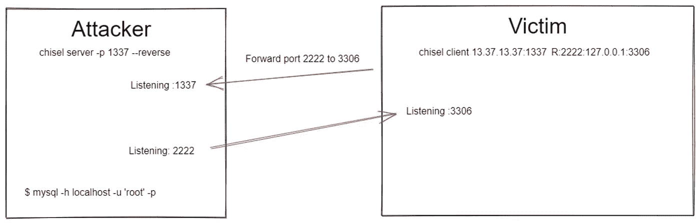

# 凿子:类固醇上的网络隧道

> 原文：<https://medium.com/geekculture/chisel-network-tunneling-on-steroids-a28e6273c683?source=collection_archive---------2----------------------->

## 端口转发和 SOCKS 代理

H ello，世界！在最近的一次测试中，我攻破了一台只允许入站流量而不允许出站流量的 Windows 机器，这很奇怪，因为通常情况下情况正好相反。然而，我想从被入侵主机的角度看看网络上还有哪些机器，所以我将`chisel`转移到目标机器上…