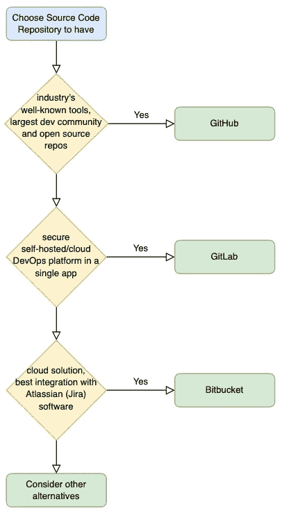

# 选择正确的源代码托管服务

> 原文：<https://medium.com/geekculture/choose-the-right-source-code-hosting-service-37edf097903?source=collection_archive---------11----------------------->

在开始软件开发之前，需要做出的第一个重要决定是——在哪里托管源代码？当选择源代码库时，重要的是考虑 DevOps 工具和围绕平台的集成，这允许构建高效的软件开发过程。现在有很多这样的服务，但是让我们来看看最受欢迎的 3 个: *GitHub、GitLab 和 Bitbucket* 。

Photo by [Roman Synkevych](https://unsplash.com/@synkevych?utm_source=medium&utm_medium=referral) on [Unsplash](https://unsplash.com?utm_source=medium&utm_medium=referral)

[**GitHub**](https://github.com) 被称为是其中最大的代码库和开发者社区存储。因此，这是了解您的开源项目并获得反馈、就改进、功能和技术决策进行合作的最佳场所。GitHub 在云、本地和混合部署选项上也有面向企业的功能，在这里您可以[比较计划](https://github.com/pricing#compare-features)。所有这些都来自业界知名的自动化工具，如 GitHub Actions、Dependabot 等。

[**Gitlab**](https://gitlab.com) 是领先的 DevOps 平台，专注于企业用例，允许端到端配置整个软件开发流程。它通常被选为安全的自托管或云解决方案，不仅可以托管您的源代码，还可以配置您的应用程序和基础架构、发布、计划、验证等等。基于[开源](https://gitlab.com/gitlab-org/gitlab)的 Gitlab 允许他们利用社区贡献来更快地提供功能。

[**Bitbucket**](https://bitbucket.org) 是 Atlassian 公司的产品，该公司最著名的产品是问题和项目跟踪软件——吉拉——所以这两种产品有最好的相互集成。Atlassian [停止销售](https://www.atlassian.com/migration/assess/journey-to-cloud)自管理解决方案，包括用于内部发布管理的 Bamboo，因此只有云版本可用于 CI/CD 的 Bitbucket 管道。在他们的[市场](https://marketplace.atlassian.com/)中也有丰富的应用程序，可以与第三方解决方案集成。

下面是一个简单的流程图，可以帮助您决定选择什么:

Summary flow chart to choose source code repository

我还建议考虑其他选择，以下是其中一些:

*   [Azure DevOps](https://azure.microsoft.com/en-us/services/devops/) -微软的 DevOps 平台，与 Azure 云紧密集成
*   [SourceForge](https://sourceforge.net)——控制和管理开源软件项目和研究商业软件的 web 服务
*   [Gitea](https://gitea.io) -轻量级开源跨平台代码托管解决方案

最后，有用的链接可以获得更多关于这个主题的细节:

*   [G2 的顶级版本控制托管软件](https://www.g2.com/categories/version-control-hosting)
*   [谷歌代码库趋势](https://trends.google.com/trends/explore?date=today%205-y&q=github,gitlab,bitbucket,azure%20devops,sourceforge)
*   [Gitlab 的对比网格](https://about.gitlab.com/devops-tools/)
*   [Atlassian 的代码库解决方案选择指南](https://bitbucket.org/product/code-repository)