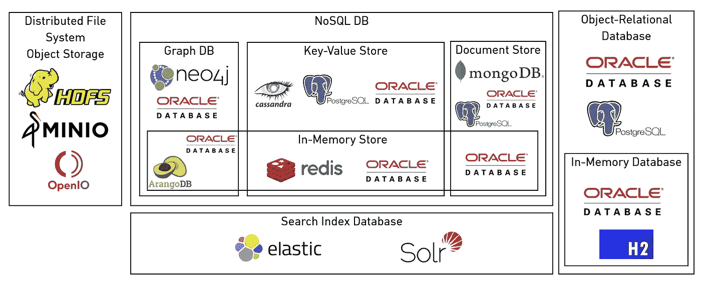
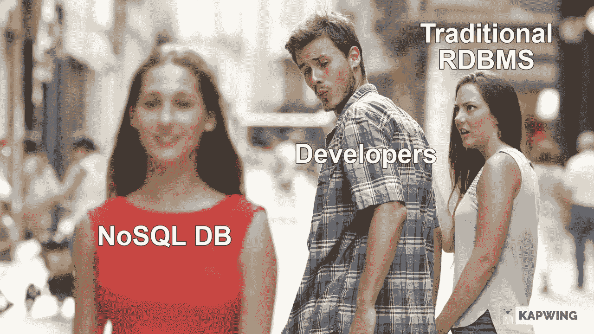

# 用 5 个问题选择您的新数据存储解决方案！

> 原文：<https://medium.com/geekculture/choose-your-new-data-storage-solution-with-5-questions-f31308dd5e84?source=collection_archive---------11----------------------->

📸 Foto von [**Pixabay**](https://www.pexels.com/de-de/@pixabay?utm_content=attributionCopyText&utm_medium=referral&utm_source=pexels) von [**Pexels**](https://www.pexels.com/de-de/foto/bokeh-301664/?utm_content=attributionCopyText&utm_medium=referral&utm_source=pexels)

## 就数据存储解决方案而言，没有放之四海而皆准的方法。数据存储领域提供了大量的技术。有些是单一用途的数据存储；其他的是多用途数据库。

我们通常区分单用途数据存储解决方案和多用途数据存储解决方案。

下图显示了这一广阔的数据存储环境的一个子集。但是如何选择合适的呢？

A small subset of possible Data Storage Solutions and their purpose

单一用途的数据存储通常可以很好地解决一个用例，但不支持其他存储方法。单一目的的数据存储是 ArangoDB、neo4j、Cassandra、Redis、MongoDB、HDFS 或 H2。

多用途数据存储为广泛的存储方法提供数据存储。通常是关系存储以及文档和键值存储。例如 Oracle 数据库和 PostgreSQL。

Working with NoSQL — career goals for many developers.

以下五个问题可能有助于您决定哪种技术最适合您的使用情形，从而选择最佳的数据存储解决方案。

## 1.我是否已经维护了解决我的用例的技术？

维护更多的技术总是比维护更少的技术更昂贵。这就是为什么最便宜和最有效的方法不是向您的技术堆栈添加新的数据存储解决方案，而是使用现有的解决方案。这样，拥有现有知识的当前员工可以实现您的用例。

如果您向现有技术体系中添加新技术，请记住还需要添加以下内容:

*   维护新增加的技术的人。
*   在运营和开发方面了解新增加的技术。
*   额外的基础设施成本在云和内部以及生命周期工作中都是必要的。

## 2.我能找到愿意使用这项技术的人吗？

第二个问题是，周围是否有人愿意使用这项新技术。这些人可能已经在你的公司工作，或者可以被招聘。无论哪种方式，都需要保证现有的工作人员接受要培训的技术，或者市场上有足够多的候选人可以雇用来使用该技术。如果你对第二个问题的回答是“不”，这是一个很好的指标，表明技术是不正确的。重新雇用和再培训的成本将会非常高。

## 3.如果我有技术问题，找到答案有多容易？

无论你准备选择什么技术，最终都会在某一点上面临问题。当这些问题出现时，你需要确保你能够快速找到解决方案。当技术普及成为一个重要的考虑因素时，这种对快速解决方案的需求就出现了。技术越流行，社区就越有可能已经解决了最常见的问题。

然而，如果您有一个有才能的团队，能够深入研究源代码并通过分析代码找到解决方案，那么您也可以有信心选择一个不太常见的框架。当选择这条路时，确保有不止一个开发人员精通你所选择的技术。否则，您将会遇到单点故障。

## 4.对于任务来说，技术选择是否明显错误？

如果你相信数据存储技术供应商的话，每一个解决方案都是最适合你的用例的。因此，询问技术是否适合你是非常偏颇的。

这就是为什么你应该问自己，对于任务来说，技术选择是否明显是错误的。一个指标是，这项技术是否已经过时，变得无关紧要。

另一个指标可能是该技术完全不适合您的用例。

你也要确保技术不是最前沿的，并且你本质上只是一个没有报酬的测试者。如果你没有获得使用尖端技术的竞争优势，你就不应该使用它。

## 5.技术是否已为企业做好准备？

如果你将一项技术用于你的业余项目或关键业务，并且需要可靠，那就有很大的不同。许多(免费的)单一用途的数据存储解决方案几乎没有工具来维护和生命周期的生产。对于大多数免费的单一用途的 NoSQL 商店来说，你所支付的是非常准确的。如果您选择的技术是这种情况，您需要确保…

*   …您有足够的预算让技术为企业做好准备。企业就绪性包括备份、恢复、监控、安全性、身份和访问管理等集成。
*   …人们拥有知识、时间和技能来使技术为企业做好准备。如果您的项目在短时间内依赖于一个完成的解决方案，您可能应该选择一个带有所有工具的解决方案。

## 结论

以上问题告诉我们在选择数据存储解决方案时需要牢记的一些关键因素。要记住的关键点是:

*   不要盲目选择最新的技术！选择最符合您需求的技术。
*   如果“多做一点”能给你带来长期的优势，你应该去做。
*   要知道你的要求会变的！准备好 B 计划，并确保你的工具也支持你的 B 计划。