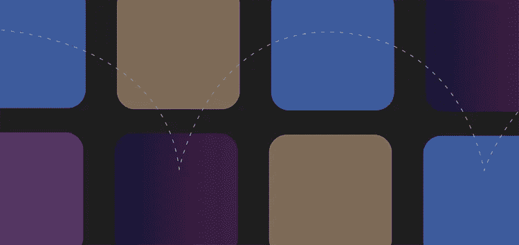
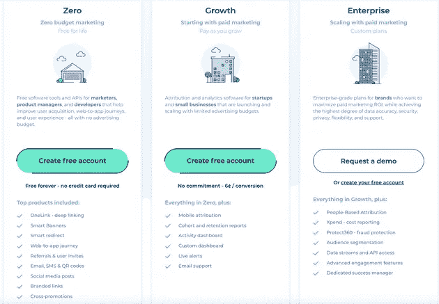
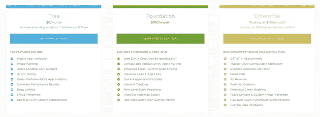
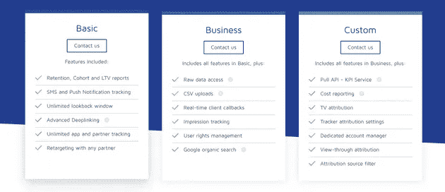
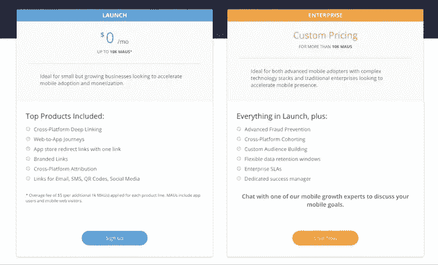

# 选择移动归因的最佳工具:Kochava、AppsFlyer、Adjust、Branch

> 原文：<https://medium.com/geekculture/choosing-the-best-tool-for-mobile-attribution-kochava-appsflyer-adjust-branch-b8d5cf40424a?source=collection_archive---------36----------------------->

现代企业严重依赖多渠道战略，如营销活动、定向信息等。，了解他们的营销工作对投资回报率的影响。这些策略还能帮助他们更好地理解客户的旅程，并优化它以提供更好的产品体验。

移动归因是一项伟大的技术，它允许营销人员评估用户如何、在哪里以及何时与他们的品牌互动。

在我们深入比较之前，让我们快速看一下移动归因需要什么。

# 什么是移动归属地？

简而言之，移动归因是一种营销策略，用于确定对销售、转化和客户参与贡献最大的移动营销策略。它有助于营销人员确定对客户转换或采取产品旅程下一步的决定有最大影响的确切渠道和信息。

借助移动归属，企业可以高效地跟踪用户的旅程——从通过点击移动广告或短信链接安装应用程序，到决定是否使用该产品。每个用户行为对应一个数据点，归因模型可以利用该数据点来帮助他们了解其产品的最佳营销渠道。

不同的组件在实现移动属性中扮演着至关重要的角色——cookie、网站标签和 UTM 参数就是其中的一些。

# 理解归因模型

归因模型本质上是一个或一组规则，用于确定不同营销渠道或客户接触点(或数据点)对销售或转化的影响。它基于“信用”原则运行，根据用户在转化过程中的重要程度，模型在不同的用户接触点之间“信用”或分配一个值。

有不同类型的归因模型:

*   第一次接触，或第一次互动归因
*   最后一次接触或最后一次互动归因
*   上次非直接点击归属
*   多点触摸归因
*   线性归因
*   衰减时间
*   基于位置的归因

本节将快速查看这些归因模型，并理解每个模型的优缺点。

# 首次接触归因

在首次接触归因模型中，导致用户转化的第一接触点被赋予完全的信任。这种类型的归因主要来自有机搜索，并帮助营销人员了解客户是如何被介绍给他们的产品的。

优点:实现起来非常简单明了

**缺点**:忽略了潜在的重要营销渠道的影响，例如，广告重新定位。

# 最后接触归因

在这个模型中，只有引导用户到达目标的最终接触点会被赋予 100%的权重。这是谷歌分析等许多平台使用的默认归因模型。

**优点**:和第一次接触归因一样，这也是非常简单直接的实现方法。如果非转换点对企业没有价值，这是可以考虑的最佳归属模型。

**缺点**:由于这种模式忽略了所有其他可能影响用户转化的因素，它可能无法让你对用户的旅程有一个完整的了解。

# 上次非直接点击归属

顾名思义，这种模式对不重定向流量的最后一次点击给予充分的权重，消除了转换发生前的任何“直接”交互。

**优点**:比上次接触归因模型更有洞察力，因为它消除了直接点击。

**缺点**:和以前的模型一样，这种模型将所有的权重分配给一个单独的接触点，并忽略以前任何有意义的交互。

# 多点触摸归因

在这个模型中，我们为不同的客户接触点分配不同的权重。每当用户与你的产品或活动互动时，这给我们提供了多种渠道。多点触摸属性模型可以进一步分为以下类型:

*   线性归因
*   时间衰减归因
*   基于位置的归因

## 线性归因

在这个模型中，所有导致转化的接触点被赋予相等的权重。

**优点**:多点触控归因模型中最简单的。

**缺点**:可能对转换有较大影响的接触点没有被赋予正确的权重。

## 衰减时间

该模型类似于线性归因模型，除了越接近转换时间的点被分配越大的权重。

**优点**:权重赋予驱动转化的点。这在销售周期较长的情况下尤其有用。

**缺点**:这个模型无助于理解导致转变的真正原因。与其他模式相比，这种模式的实施成本也很高。

## 基于位置的归因

在该模型中，大部分权重或信用在第一次交互接触点和转换发生的点之间被分割。其余的权重在其他接触点之间分配。

**优点**:适用于在转化之前的旅程中有多个客户接触点的企业。

反对意见:在两者之间发生的有意义的互动不会被赋予更多的权重。

考虑到上述所有模型，营销人员的一大任务是为他们的用例选择最合适的移动归因平台。

# 不同的移动归因平台

有许多移动归因工具，您可以利用它们来更广泛地了解是什么帮助您根据客户的行为模式获得客户。事实上，你可以为你的用例使用不止一个移动属性平台。您也不需要为每个平台编写特定的 SDK，而只需直接使用 [RudderStack](https://rudderstack.com/) 即可，因为它会将事件数据路由到您想要使用的所有平台。

# 选择最佳移动归因工具

在本节中，让我们快速了解一下选择移动归属平台的一些注意事项。

# 属性

显然，能够交付最高效的移动归属是最重要的要求。在选择平台时，你要决定的主要属性类型是用户获取、多点接触、用户重定向属性。上面提到的所有平台都提供了这些属性。但是注意，Kochava 只提供了一个多点触摸归属的报告，你无法看到全程。分支具有很大的以人为本的属性。

# 欺诈检测

过度归因和欺诈性数据是您最有可能遇到的一些问题。因此，选择能够全面解决这些问题的移动归因工具非常重要。上面提到的平台都有超强的欺诈检测能力。也就是说，在我们看来，Adjust 拥有最佳的欺诈检测和防范生态系统。

# 仪表盘

所有移动归属平台都有群组和保留报告。像 AppsFlyer 和 Kochava 这样的工具提供了数据透视表来获得数据的汇总视图，并且具有非常友好的 UI。一些工具的仪表板上也有吸引观众的功能，这对许多企业来说非常重要。

# 安全性和隐私

在处理用户数据时，数据泄露是一个潜在的危险问题，会影响用户的隐私。因此，您的归属平台需要最大限度地保护您的数据安全。像 Adjust 和 AppsFlyer 这样的工具有一个很好的安全层。

# 与平台集成

在移动属性平台中，与外部应用程序集成的能力非常重要，因为一个工具或应用程序可能没有您想要的所有功能。

# 基础设施

有些归因工具如 Adjust 使用他们的私有云基础设施，而有些使用第三方云基础设施如 AWS。考虑到前面讨论的数据隐私和安全问题，这也是选择归属平台时的一个重要考虑因素。

# 定价

一些归属平台提供功能有限的免费计划。例如，以下是 AppsFlyer 的计划:

**AppsFlyer Pricing Plan**

以下是 Kochava 提供的内容:

**Kochava Pricing Plan**

其他一些工具需要你从他们的销售团队那里获得报价才能使用他们的产品。例如，查看 Adjust 的定价页面:

**Adjust Pricing**

以下是 Branch 提供的服务:

**Branch Pricing**

大多数企业选择其中一种(或多种)归因工具。

以下平台被认为是提供高度准确和高效的移动归属，同时确保完全灵活性和数据隐私的最佳平台:

*   调整
*   Appsflyer
*   科恰瓦
*   树枝

# 总结一下

鉴于有大量的移动属性工具，有时很难选择特定于您的用例、应用和项目的平台。不存在“完美”的归因工具——你需要根据你的市场需求选择最好的工具。

例如，大多数独立开发人员选择像 Kochava 这样的工具，因为它可以免费使用，非常适合他们有限的用例。另一方面，Branch 等工具提供了强大的深度链接功能，可以成为电子商务应用程序的优秀解决方案，使其成为营销专业人士的理想选择。他们也更喜欢 Adjust 和 AppsFlyer 等工具，这些工具功能丰富，但对独立开发者来说成本很高。

最终，工具的选择应该取决于你想用它做什么，而不是相反！

# 免费注册并开始发送数据

测试我们的事件流、ELT 和反向 ETL 管道。使用我们的 HTTP 源在不到 5 分钟的时间内发送数据，或者在您的网站或应用程序中安装我们 12 个 SDK 中的一个。[入门](https://app.rudderlabs.com/signup?type=freetrial)。

本博客最初发表于:
[https://rudder stack . com/blog/chopping-the-best-tool-for-mobile-attribution-Koch ava-apps flyer-adjust-branch](https://rudderstack.com/blog/choosing-the-best-tool-for-mobile-attribution-kochava-appsflyer-adjust-branch)