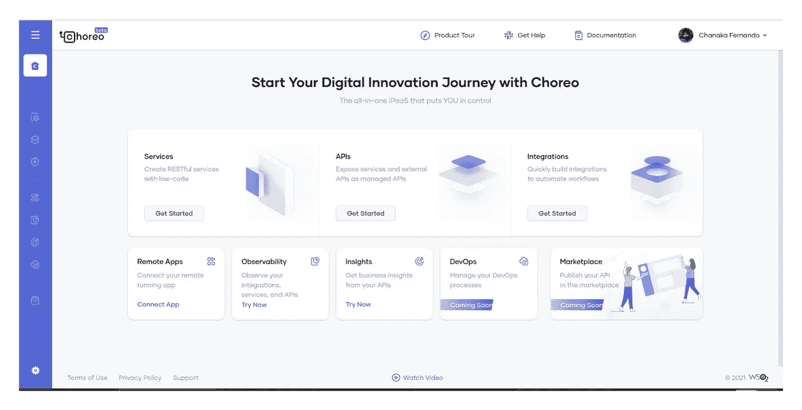
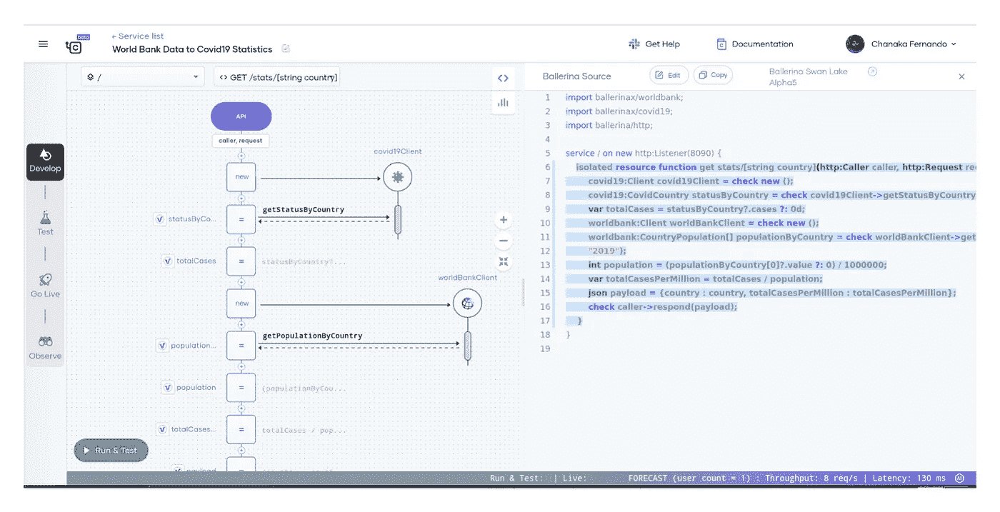
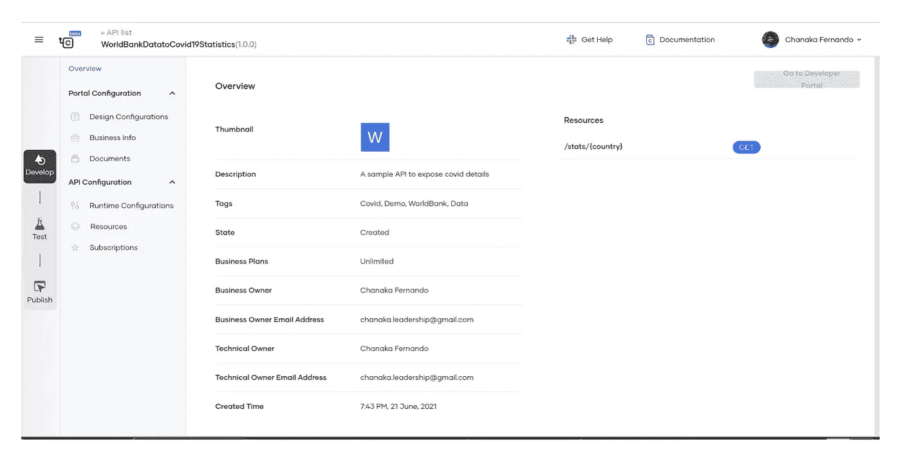
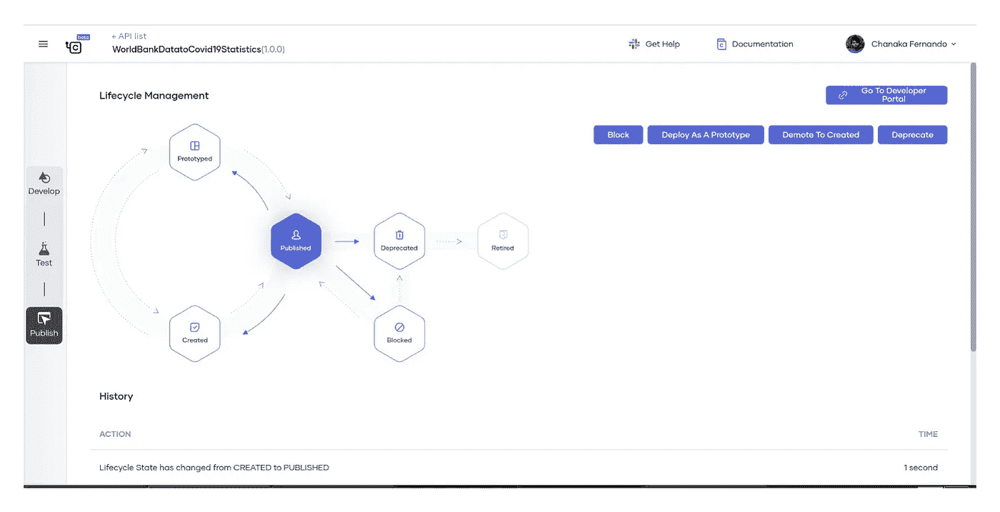
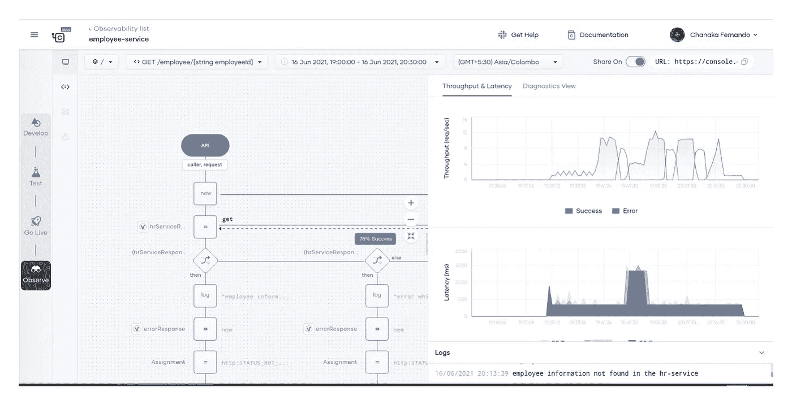
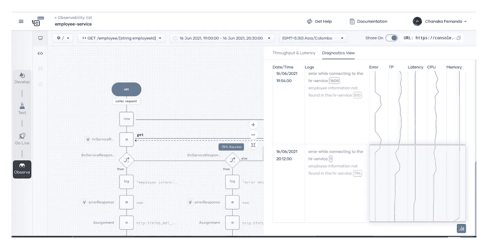

# Choreo，WSO2 的 iPaaS 正在公测中！

> 原文：<https://medium.com/geekculture/choreo-an-ipaas-by-wso2-is-in-public-beta-95fe33e586b?source=collection_archive---------52----------------------->

让我们了解一下 WSO2 最新的 iPaas 解决方案 Choreo

# Choreo 公测公布！

WSO2 团队很高兴地宣布将于 2021 年 6 月 15 日公开测试其最新创新产品 Choreo，即集成平台即服务(iPaaS)。

Source: [https://wso2.com/choreo/blogs/wso2-choreo-a-platform-for-innovation/](https://wso2.com/choreo/blogs/wso2-choreo-a-platform-for-innovation/)

您可以在下面的链接中找到该公告的新闻稿。

*   [Choreo 公告 PR](https://wso2.com/about/news/wso2-introduces-choreo-a-next-generation-integration-platform-as-a-service/)

# 什么是 Choreo？

“Choreo”一词源于“舞蹈”的概念。在编舞中，演员们通过表演他们自己的动作，同时间接地互相交流，作为一个团体来工作。Choreo 是一个集成平台即服务(iPaaS ),允许开发人员构建云原生应用。下面的视频介绍了 Choreo 及其对技术世界的承诺。

*   [什么是 Choreo？(视频)](https://youtu.be/7Bue8C-ab0E)

# 为什么是 Choreo？

Choreo 允许组织快速构建 API、集成和微服务。以下是 Choreo 提供的优势列表。

*   构建服务(API、集成和微服务)的无服务器平台，无需担心底层基础设施
*   使用基于序列图的编程模型的低代码方法来快速开发服务
*   平台内置强大的 API 管理功能，以保护和管理服务交付
*   使用内置的 CICD 管道自动部署服务，这些管道将服务部署到 Kubernetes 运行时
*   人工智能驱动的自动化性能分析和数据映射帮助开发性能优化的服务
*   高级观察功能可直接从平台自动对生产事故进行故障排除
*   API marketplace 在团队、业务部门和组织之间共享微服务和 API，并扩展到 API 经济

# Choreo，先睹为快

这里有几张 Choreo 公测的截图。

Figure: Choreo home page

Figure: Side-by-side view of code and low-code representation of a program

Figure: Choreo API Overview

Figure: Choreo API Lifecycle management

Figure: Choreo API Developer portal (marketplace)

Figure: Choreo Observability, Latency and TPS view

Figure: Choreo observability, diagnostics view

想试试 Choreo 吗？继续读。

# 如何入门？

Choreo 可供大家试用！您可以使用下面的 URL 注册 Choreo 门户，并开始构建您的 API、集成和微服务。

*   [Choreo 报名](https://wso2.com/choreo)

# Choreo 价值主张

通过阅读下面链接中 [Asanka Abeysinghe](https://medium.com/u/7eee31670986?source=post_page-----95fe33e586b--------------------------------) 和 [Eric 新人](https://medium.com/u/51d185385857?source=post_page-----95fe33e586b--------------------------------)写的博客，你可以找到更多关于 Choreo 试图解决的问题的细节。

*   [WSO2 Choreo，创新平台](https://wso2.com/choreo/blogs/wso2-choreo-a-platform-for-innovation/)

# 额外资源

你可以在下面的链接中找到更多关于 Choreo 的资源。

*   [Choreo 资源](https://wso2.com/choreo/resources/)
*   [Choreo 文档](https://wso2.com/choreo/docs/)

# 与 Choreo 接触

Choreo 有一套社交媒体渠道，用户可以直接与团队互动。在下面找到社交媒体渠道的链接。

*   [松弛状态下的 Choreo](https://join.slack.com/t/wso2-choreo/shared_invite/zt-qm86tg1f-R2kXf~26GB6X6Ux0GcuYbQ)
*   [推特上的 Choreo](https://twitter.com/ChoreoDev)
*   [红迪网上的 Choreo](https://www.reddit.com/r/ChoreoDev/)

祝您愉快！