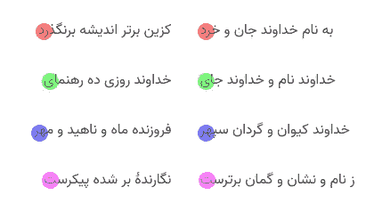
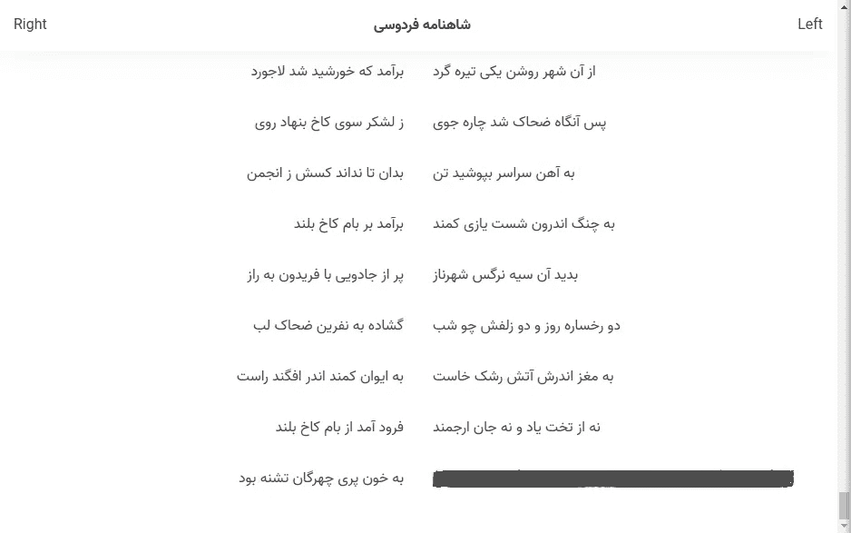
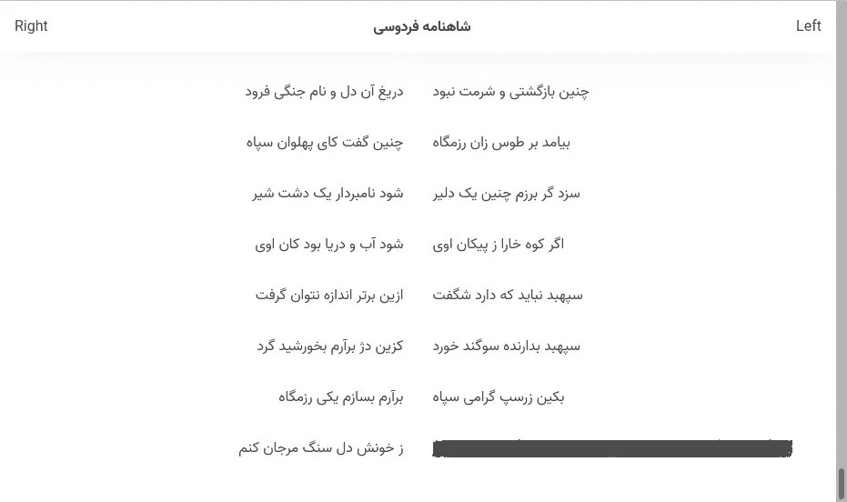
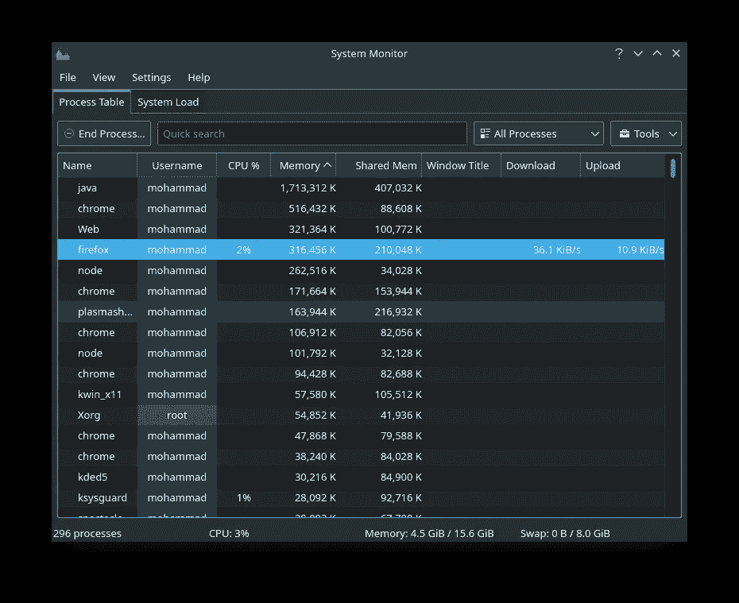
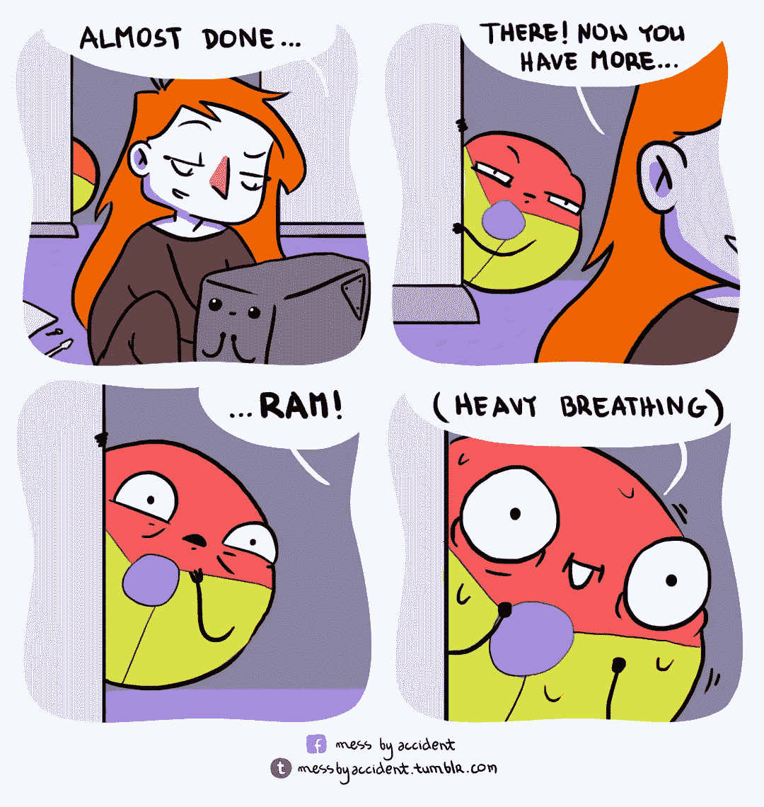

# Chrome 和 Firefox 都在 CSS 网格上窒息，但其中一个渲染了另一个的 10 倍！

> 原文：<https://medium.com/geekculture/chrome-and-firefox-both-chock-on-css-grid-42da0b7f3093?source=collection_archive---------6----------------------->

Chrome vs. Firefox illustration. Image source: [Xahlee.info](http://xahlee.info/js/i/chrome_vs_firefox.jpg)

作为一名程序员，你的工作就是不断想出一些会耗尽你空闲时间的兼职项目，然后因为不再具有挑战性而被放弃！我想到的最新想法是在 Github 页面上建立一个网站，通过 [Shahnama](https://en.wikipedia.org/wiki/Shahnameh) 进行阅读和搜索。这导致了我想谈论的与两大网络浏览巨头的有趣经历。但首先，请允许我解释什么是沙纳玛。

《沙纳玛》是[大伊朗](https://en.wikipedia.org/wiki/Greater_Iran)的民族史诗，讲述了这个地区自文明开始以来王国和帝国兴衰的故事。Shahnama 实际上是一首写在 [mathnawi](https://en.wikipedia.org/wiki/Mathnawi) 系统中的长诗。你可能会问，这和网页设计有什么关系？在 mathnawi 中，诗句以旋律对句的形式出现，每一句都由两个彼此押韵的半诗组成。因此，这样的诗歌常常表现为如下图像:

The first four verses of Shahnama. The rhyming parts have been highlighted. Note that Persian is a right-to-left language.

正如您所看到的，这看起来是一个在 CSS 网格中使用这个不太新的特性的绝佳机会！设置非常简单。每个 hemistich 都有自己的块，父类获得下面的 CSS 类来启用网格并为内容设置模板:

这样做之后，我立即在我常用的浏览器 Google Chrome 中加载了我在 Nuxt.js 2.15.7 中构建的 SPA。乍一看，一切都很好。但是后来我想起了我通过废弃[这个奇妙的网站](https://kaffeketab.ir/ferdowsi/)收集的 Shahnama 版本有 88830 个半针。滚动条看起来非常小，只有 44415 行。按下结束键显示了以下暴行:

Chrome, choking on a CSS Grid with too many elements.

我们在这里看到的是，在一定数量的半缝合之后，其余的都被一个接一个地覆盖，形成了那个巨大的黑色矩形。有趣的是，最后一次出现的به خون پری چهرگان تشنه بود海米斯蒂奇恰恰是沙纳玛的第 2000 次海米斯蒂奇！为什么是这个数字？这不是 c 语言中任何典型数据类型的上限，那么，到底是什么在起作用呢？我认为回答这个问题需要查看我从 [Arch 用户库](https://aur.archlinux.org/packages/google-chrome)得到的谷歌 Chrome 91.0.4472 的源代码。但是让我们继续前进吧！

然后我想到了我的老朋友火狐，我已经有一段时间没和他说话了。Manjaro 为我更新了它，所以我就一头扎进去了。结果完全一样！

Firefox, choking on a CSS Grid with too many elements, but less than Chrome!

老实说，不完全一样。事实上，我从官方 Manjaro 库安装的最后一个由 Firefox 91.0.2 正确渲染的 hemistich 正是 Shahnama 中的第 19998 个 hemistich！我不知道为什么这个数字离 Chrome 的 10 倍只差 2 位！

这种行为在两种浏览器中都可以重现。我重启了两个浏览器，清理了所有其他标签和后台任务，确保有足够的内存，甚至从头开始重新安装了同一个版本。结果是一样的。这只能说明这个限制是开发者自己强加的。我心想这可能与浏览器的内存使用有关。我们让 KSysGuard 去调查:

Chrome and Firefox, rendering the same page simultaneously.

不要介意 WebStorm 在顶部有将近 2GB 的内存！如果我们总结一下每个浏览器创建的进程，Chrome 占用的内存是 952MB，而 Firefox 使用的是 622MB，渲染的内容多了 10 倍！在体验过程中，两种浏览器都没有出现明显的延迟。然而，在 Chrome 中 Ctrl+F 比在 Firefox 中花费的时间要长一些。但公平地说，我预计 Chrome 会比这些新手使用更多的内存！

Chrome just loves RAM! Illustration by [mess by accident](https://messbyaccident.com/).

我很好奇是什么导致一个浏览器渲染 2000 个块，而另一个渲染 19998 个块，然后将所有剩余的块一个接一个地叠加起来！如果你有什么想法，请告诉我。