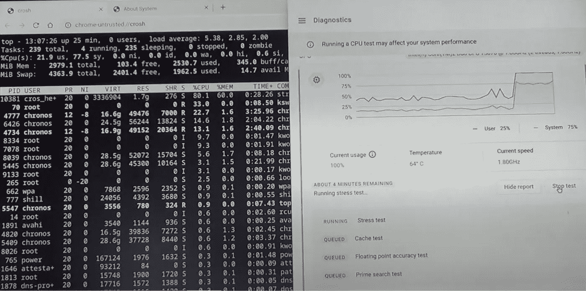
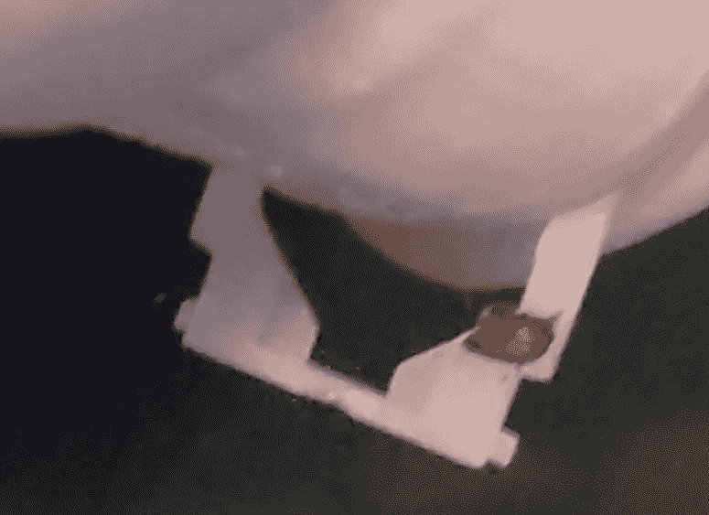

# 仅 3GB 内存的 Chrome OS Flex

> 原文：<https://medium.com/geekculture/chrome-os-flex-in-only-3gb-ram-7b110c00ad8?source=collection_archive---------2----------------------->

网上到处都是关于 Chrome OS Flex 的文章。如何安装，有什么用等。这不是那个。这是关于在 14 岁的 40 美元笔记本电脑上运行 OS FLex。

以下是我对运行 OS Flex 的实际最低硬件要求的调查结果。谷歌表示，AMD 或英特尔的 64 位芯片组 CPU 需要 4GB 内存。他们接着说，“2010 年之前制造的组件可能会导致糟糕的体验。”我在一台旧的内存较低的笔记本电脑上运行得很好。关于所述要求的所有细节都在[https://support.google.com/chromeosflex/answer/11552529?hl=en](https://support.google.com/chromeosflex/answer/11552529?hl=en)

# 真正的最小值

当我听说 Flex OS 时，我决定在一些旧硬件上试用它。我去旧货店花 20 美元买了一台又脏又破的笔记本电脑。它没有硬盘。我用一张“live Linux”CD(https://www.ultimatebootcd.com/download.html[的令人敬畏的 UBCD)试了一下，发现键盘也不好用——有几个键总是打错键。例如，“o”总是“5”。罪魁祸首是按键铰链下面的一团粘性食物，它导致 FN(功能键)总是被按下。清理后，键盘和笔记本电脑功能齐全，只是少了一个硬盘。](https://www.ultimatebootcd.com/download.html)

Why not to eat at your computer

我安装了一个 SATA III 固态硬盘(又是 20 美元，一共 40 美元)。如果你在想，“SATA II 笔记本电脑怎么可能用 SATA III 固态硬盘？”答案是非常好的，只是没有使用全部吞吐量。我知道这是一个巨大的性能提升，因为我已经在许多老化的系统上用固态硬盘取代了旋转硬盘。

还有一个错误的开始。微软 Edge 声称支持 Chrome 扩展，我确信有些工作。用于制作 Chrome OS Flex 启动驱动器的 Chromebook 恢复实用程序不在其中。我不得不使用谷歌浏览器来创建启动驱动器。

最后，我在 2008 年的 Dell Vostro 成就 1310 上安装了 OS Flex，只有 3GB RAM。这种内存量在使用 32 位操作系统的机器上是典型的，因为这是它们能够访问的所有内存。然而，这款笔记本电脑拥有 64 位 Core 2 Duo(1.8 GHZ t 5670)，这使其成为 OS Flex 的候选产品。我的有限基准测试将其性能置于 2.4-2.6GHZ 奔腾 4 之间(这只是单核比较)。

那么成功了吗？是的。安装程序中没有任何东西阻止您在内存小于 4GB 的机器上安装。它非常适合 Chromebook 的任务。该视频展示了操作系统的更多内容，包括 CPU 和 RAM 利用率的性能信息。

$40 laptop running OS Flex

上述视频中的 WebGL 数字非常糟糕。我重新运行了来自 https://www.webglsamples.org 的 WebGL 水族馆测试，重启后效果好了很多:500 条鱼每秒 15 帧，10000 条鱼每秒 5 帧。最初的结果并不好-我唯一的想法是，在那之前我一直使用两个显示器，可能当我拔掉外部显示器时，一些图形资源没有释放。我在 chrome://gpu 上查了 GPU 信息，看到 OS Flex 中的 Mesa 驱动支持 WebGL 的硬件加速。

我还制作了一个展示 Youtube“书呆子统计”的快速视频。只需在视频窗口中右键单击并从菜单中选择该选项，即可获得如下所示的性能详情。

Stats for Nerds

# 结论

所以你有它。谷歌推出了比他们官方所说的更好的东西。笔记本电脑的电池寿命也很好。甚至可能更好，因为 SSD 需要更少的电力，操作系统也非常精简。我注意到 CPU 时钟速度也是由操作系统需求控制的。不确定 Windows Vista 是否会这样做。

我查阅了一些早期 64 位 CPU 的信息，我相信您可以在 2005 年的 64 位奔腾 4 上安装和运行 OS Flex great on)。我建议一个固态硬盘和一个像样的显卡(在那个时代)来制造一个非常强大的机器。AMD Athlon Socket 939 CPU 应该也可以工作，因为它是 64 位的，支持双通道内存。我把这作为一个练习留给读者！

# 更新

2GB 呢？没问题。

# 额外提示

*   启动 linux 终端(crosh shell)- Control Alt T
*   GPU 信息:chrome://cpu
*   设置信息:chrome://settings
*   Chrome 任务管理器:右上角三点菜单:更多工具:任务管理器
*   Youtube 书呆子统计:右击视频，从菜单中选择