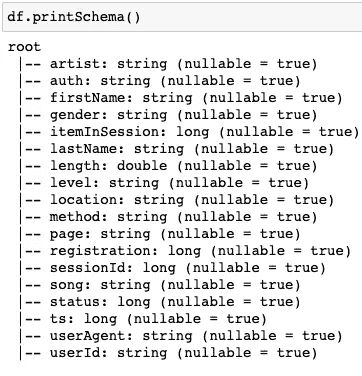
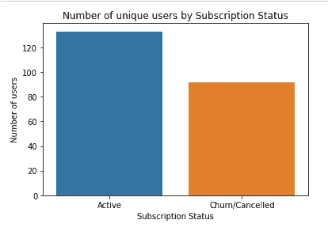
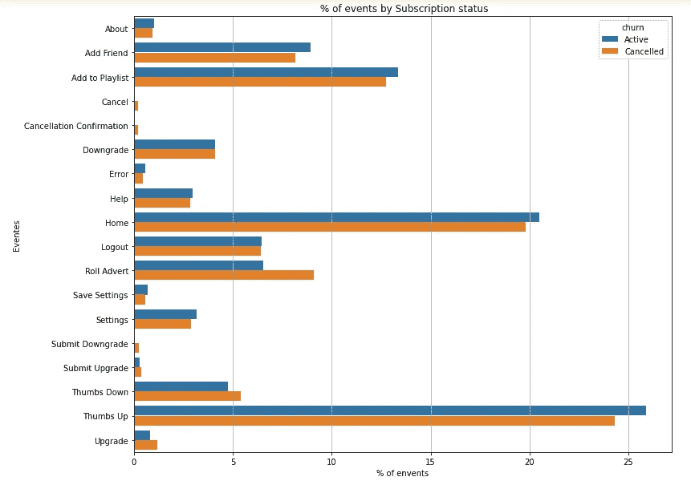
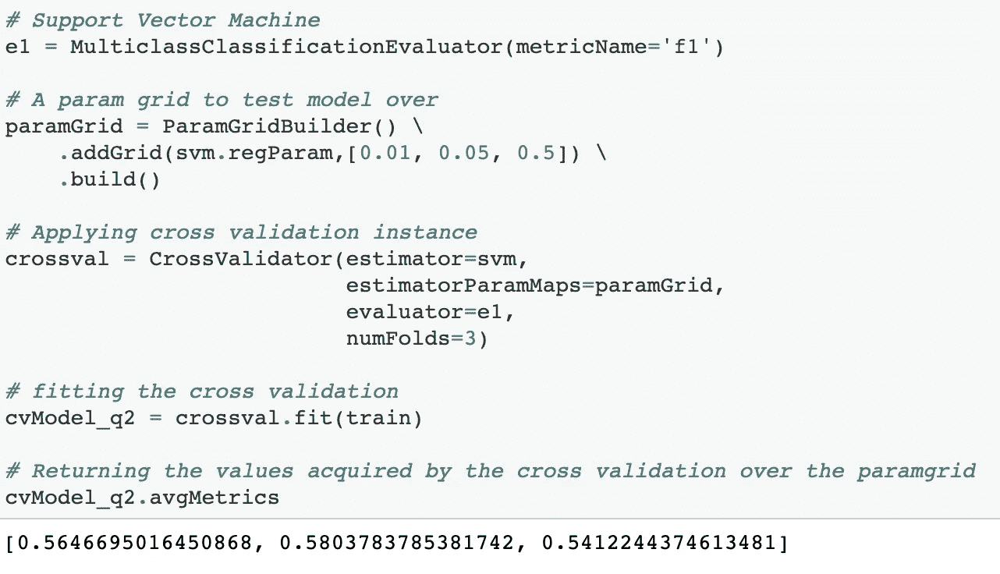
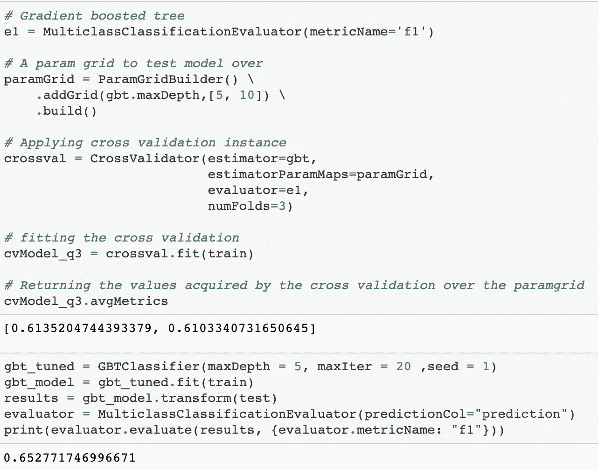
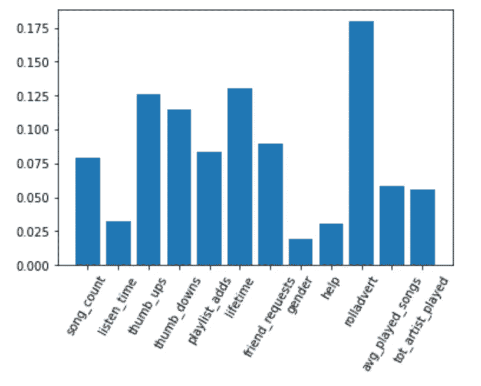

# 使用 Apache Spark 进行流失用户分析

> 原文：<https://medium.com/geekculture/churn-users-analysis-using-apache-spark-1799d0ddded0?source=collection_archive---------58----------------------->

Music app

# 项目定义

为什么我们会失去现有客户？

## 1.项目概述

Sparkify 是一款音乐应用，提供付费高级会员和免费订阅。提供服务的公司持有每个用户和应用程序之间的交互日志。这个数据库是营销团队的财富。

通过对日志数据的正确分析，我们可以看到用户和应用程序之间的交互。尽管该应用的免费层对我们公司来说是一项巨大的投资，但我们仍然希望将注意力集中在购买高级订阅的用户的行为模式上。

研究高级订阅用户和我们的应用程序之间的交互模式可以在两个方面帮助我们:

*   让使用我们服务的体验更令人满意
*   研究“流失”用户的特征以减少其数量。

## 什么是流失用户？

在面向客户的领域中，如果不度量不可避免的失败，就很难度量成功。虽然你的目标必须是让 100%的客户从第一天开始一直呆在你的公司，但这可能是不现实的。这就是客户流失的原因。

**不满意的客户是指停止使用贵公司产品或服务的个人**。

## 2.关于数据

该数据由用户在应用程序使用期间的所有事件或操作的日志组成。在数据集中的每个实例内，会记录以下要素:

Features in the database

## **3。问题陈述**

该研究旨在使用提供的数据库识别一个潜在的客户流失用户。在给定的目标中，基于来自所提供的用户日志数据库的工程特征，训练监督学习模型来识别潜在的流失用户将是合理的。

用于分析的工具是 **Apache Spark** ，因为它在处理大型数据集方面有很强的能力。

## 4.韵律学

我们必须定义一个指标来衡量我们的模型在捕获潜在流失用户方面的成功。我们的性能指标是一个分类指标。然而，在我们的特定情况下，与活跃用户的数量相比，数据集中流失用户的数量相当小，因此准确性指标不合适。我选择使用 **f1 分类指标**来衡量我们模型的性能。

这三个过程被编码为一个名为 **clean** 的函数，采用原始数据帧并返回一个干净的数据帧，其中的三个问题已被纠正。原始数据帧中的行数是 286500，结果数据帧中的行数是 278154。原始数据帧中的特征数量是 18；现在，它是 20。

# 分析

## **1。**数据探索

在使用数据集参与学习过程之前，执行清理过程。在这个过程中，需要解决三个主要问题:

*   用户日志中的一些实例没有关联的相应用户 id，或者是空值或者是空字符串。在每种情况下，实例都从数据集中删除，因为它对于我们的计算可能是多余的。
*   一些会话 id 作为空值丢失。这些会议可能是多余的。我已经把它们从数据集中删除了。
*   为每个用户的注册和每个用户的交互提供的时间戳被破坏；因此，执行校正过程。

这三个进程被编码为一个名为 **clean** 的函数，它获取原始数据帧并返回一个干净的数据帧，其中的三个问题已被更正。原始数据帧中的行数是 286500，结果数据帧中的行数是 278154。原始数据帧中的特征数量是 18；现在，是 20.2。探索

在这一步骤中，获得了对用户停止使用该服务的特征和临时原因的更深入的理解。然而，在数据框架中，对于用户来说，他们是否被认为是客户流失并没有一个明显的标签。因此，需要创建一个新的特征来定义用户是否流失。

在这一步骤中，获得了对用户停止使用该服务的特征和临时原因的更深入的理解。然而，在数据框架中，对于用户来说，他们是否被认为是客户流失并没有一个明显的标签。因此，需要创建一个新的特征来定义用户是否流失。

## 2.定义客户流失

在开始标记用户是否流失之前，我们必须标记出导致用户流失的特定交互。在我们的案例中，与像**【取消确认】**或**【提交降级】**这样的页面的交互被称为流失交互。

我在用户日志中的数据框架内创建了一个列，根据与客户流失页面的交互将实例标记为客户流失/非客户流失，并汇总了每个用户的最大值。如果用户已经与这些页面交互，则该步骤导致将用户交互的所有实例标记为流失；否则，他们不是流失用户。

在定义了流失列之后，很少创建探索来分析潜在的流失用户。

## 3.数据可视化

正如我们从下面的图表中看到的，由于数据集不平衡，选择适当的指标是必要的。此外，这张图表显示了用户离开服务的速度，这对于公司的营销团队来说是一个惊人的速度。

Number of unique users by Subscription Status

从下面的图表来看，除了与“角色广告”页面的互动次数之外，在应用页面的使用中，流失用户和活跃用户之间的差异非常相似。使用该应用程序时，与劳斯莱斯广告页面的交互可能会带来不愉快的体验。

% of events by Subscription status

# 方法学

## 1.数据预处理

为了训练模型来识别潜在的流失用户，数据集必须是面向用户的。面向用户的数据集将每个实例(行)呈现为用户，概述它们各自的特征，这些特征可用于诱导统计监督系统来预测潜在的流失用户。

在特征工程过程中，创建面向用户的数据框架；使用 SPARK 创建了各种功能，如:

*   每个用户收听的歌曲总数
*   每个用户花费的总时间
*   每个用户竖起大拇指的总次数
*   每个用户给出的否决总数
*   每个用户添加到播放列表的次数
*   用户订阅生命周期的长度
*   每个用户发送的添加朋友请求的总数
*   用户的性别
*   每个用户请求帮助的次数
*   每个用户滚动广告的数量
*   每个用户每次会话收听的平均歌曲数量
*   用户听过的艺术家总数

此外，使用 vector assembler，将特征组装到一个单独的列中，将之前创建的特征组合在一起。组合的列被分成训练集和测试集，以准备将目标列作为“变动”进行建模。

最后，使用训练集初始化和拟合标准定标器，并将其转换为训练集和测试集。

此时，训练集和测试集已经为建模做好了准备。

## 2.履行

在这一步中，三个监督学习模型被训练和测试用于预测潜在的流失用户。

*   逻辑回归
*   支持向量机
*   梯度增强树

这三个模型已经使用两种技术进行了训练和测试:

*   Paramgrid:用于优化每个模型的超参数。
*   交叉验证:在训练集上测试模型的性能。

Logistic regression model results

Support Vector Machine model results

虽然在最初的试验中，逻辑回归分类器得分更高，但在梯度增强树的细化中有更好的机会。

经过试验，已经证明梯度增强树是训练集和测试集上表现最好的模型，f1 得分为 0.65。

## 3.精炼

在选择梯度提升树作为我们学习预测潜在流失用户的方法之后，对模型进行进一步的改进以获得更好的性能。对超参数的微调略微提高了 f1 指标；然而，f1 指标中的大部分性能调整和提高都是由于调整了上一步中执行的数据预处理方法。

在第一个模型中，模型的迭代次数是默认值 10。该值已更改为 20，从而产生更高的 F1 性能指标。更高的迭代次数可能会带来更好的性能；然而，计算量将远远高于可用资源。

Gradient Boosted Trees Model refinement

# 结果

该项目的第一个成果是预测潜在流失用户的模型。在定义客户流失的过程中，产品模型只是一个开始。

模型稳健性的评估以两种方式进行:

1.  通过 Paramgrid 对不同型号和不同配置进行比较，确定最佳型号。这一步导致选择 5 作为梯度增强树中每棵树的深度。
2.  使用三重交叉验证评估模型的性能。这证明了在使用测试集进行验证之前梯度提升树对训练集的鲁棒性。

正如在细化部分中所述，在第一次试验中，其他模型可能比梯度增强树得分更好，但是，可能有更大的机会改善所述模型的性能。因此选择了它。

该项目的第二个结果是了解我们创建的功能在预测用户是否是潜在客户时的不同重要性。

Feature importance according to Gradient Boosted Trees

预测潜在流失用户的最重要特征是:

*   每个用户滚动广告的数量
*   用户订阅生命周期的长度
*   每个用户竖起大拇指的总次数

这种见解对管理层来说是一个很好的建议。洞察流失用户的互动模式。这一观点与我们的分析假设相一致，即广告的质量和时间可能是用户是否离开该服务的决定性因素。

# 结论

该项目的目的是分析停止使用我们服务的用户的行为“流失用户”。此外，训练有监督的机器学习模型来帮助预测潜在的流失用户。

已经采取了几个步骤。首先，对提供的数据集进行数据分析。这帮助我们假设用户离开我们服务的原因。

第二，从数据集中创建了几个特征，以帮助被监管者归纳出一个统计模型来预测一个不愉快的用户。

# 丰富

由于我在获得更好的模型性能时面临的主要障碍是计算资源的可用性，Spark 在大数据计算方面是一个非常好的工具。我会推荐使用 AWS 提供的 EMR 集群服务。这一步可以提供更多的空间来调整超参数，甚至更多，以更好地预测潜在的流失用户。