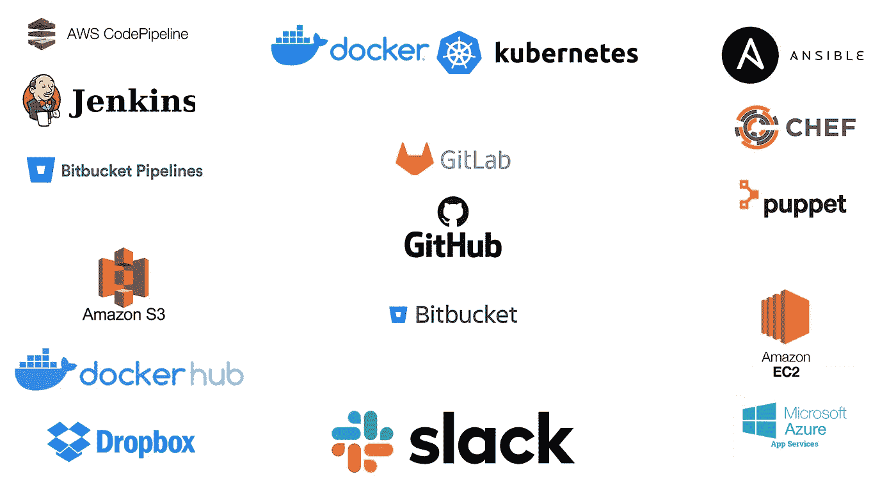

# CI/CD 变得简单:您需要了解的 7 个模块

> 原文：<https://medium.com/geekculture/ci-cd-made-easy-7-modules-you-need-to-know-79e18abe1dee?source=collection_archive---------13----------------------->

不要用复杂的文档和脚本为难自己。阅读这个故事，并开始实施您的管道。

CI/CD Tools and Technologies

持续集成和持续交付/部署(CI/CD)是目前软件开发领域最热门的话题之一。

CI/CD 背后的主要思想是使软件测试、构建和开发的整个过程…