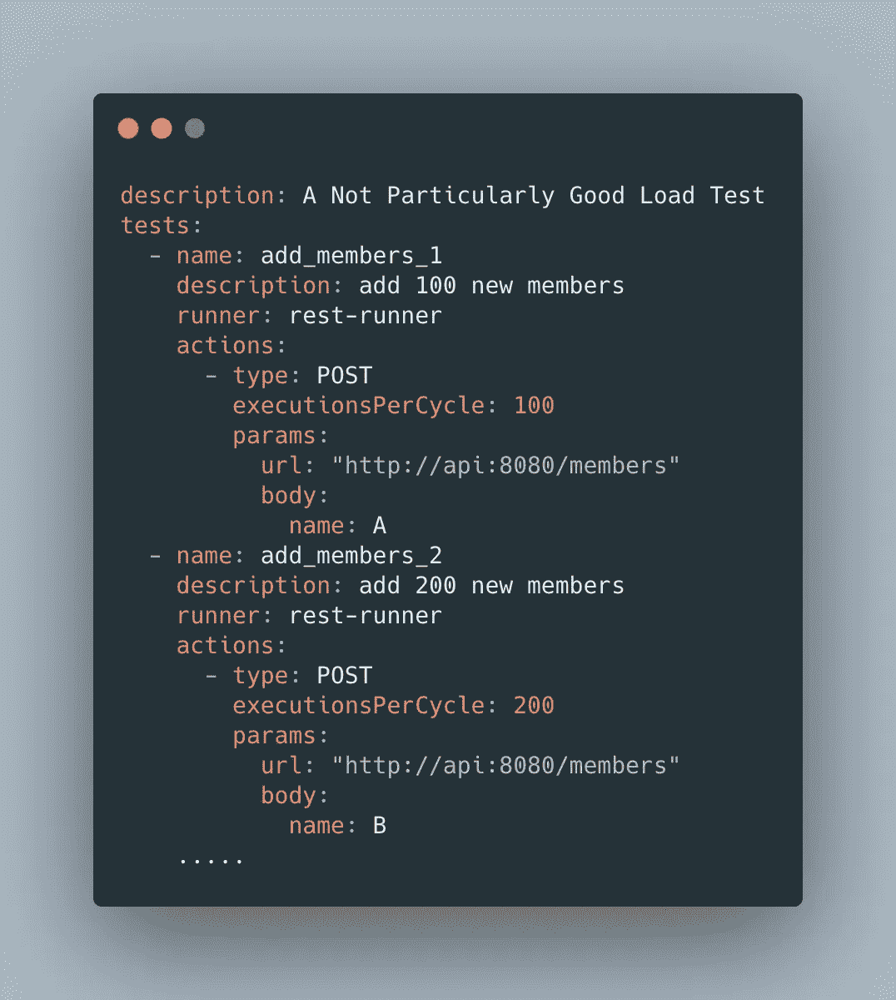
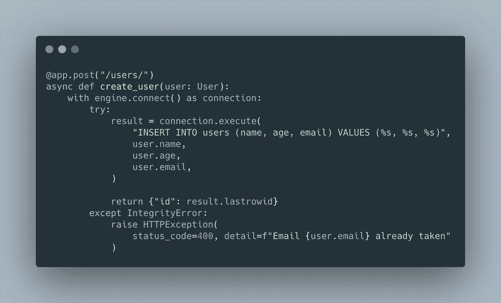
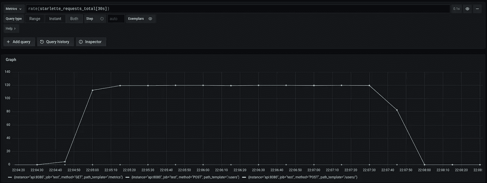
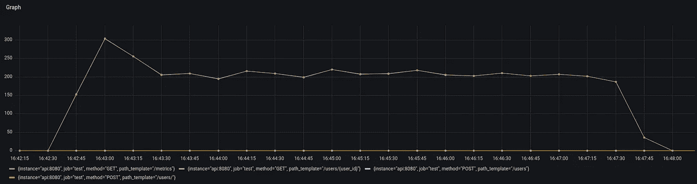

# 蝉分发:重大改进！

> 原文：<https://medium.com/geekculture/cicada-distributed-major-improvements-27c9ddd092b9?source=collection_archive---------48----------------------->

# 从头开始重写蝉测试框架


去年，我写了[蝉-2，一个低代码测试框架](/@jeremyaherzog/cicada-an-integration-testing-framework-for-docker-and-kubernetes-7eee5624cc55)。自从它发布以来，我一直在考虑改进它的方法，特别是运行负载测试。这是我如何创建[蝉分布式](https://cicadatesting.github.io/cicada-distributed-docs/)的故事，一个基于 Python 的负载测试框架，以及为什么我相信它应该是测试你的服务的首选工具。

# 为什么是重写的时候了

蝉-2 基于我在测试复杂应用程序时学到的经验。虽然它对于集成测试来说很棒，但是它没有我编写有效负载测试所需的特性。当编写测试时，除了“多次点击我的 API”之外，cadcia-2 的硬编码负载模型是有限制的。我想要一个工具，它能足够猛烈地攻击一个服务，知道它真正的极限是什么。

考虑到这一点，我开始在蝉-2 中添加更多的编程测试特性。然而，我很快意识到，我宁愿能够用 Python 编写测试，而不是用一些笨拙的递归 YAML 混合 Jinja2。所以我重新开始，从头开始写《蝉》。



A not particularly good load test written in Cicada-2 YAML

# 一遍又一遍地重写《蝉》

我希望新的蝉拥有的核心特性是允许用户完全控制测试的负载模型。一个测试应该不仅能够调用一个服务一定的次数，而且能够交付斜坡负载，扩展到一个阈值，以及一堆我没有考虑到的其他情况。

为了做到这一点，蝉使用了一个虚拟用户模型。本质上，模拟用户动作的代码是并行运行的，以创建负载。我编写了它的初始版本，在线程内部运行虚拟用户。不幸的是，这并不是一个很好的方法。打印语句会破坏测试的其余部分。我会遇到奇怪的错误，不知道什么可以在线程中运行，什么不可以。在测试之外编写的代码并不总是有效的。此外，管理用户线程的进程成为了一个瓶颈。很难控制哪些用户可以在不显著影响性能的情况下启动和停止。

# 新蝉是如何工作的

经过几次修改后，我选定了一个分布式用户模型，它通过事件代理(Kafka)与场景松散耦合。虚拟用户不是在管理实例上运行，而是在容器内部运行。这极大地简化了虚拟用户代码，因为它允许蝉利用容器编排器来管理用户池，而不是管理一台或多台机器上的单个线程。此外，事件模型允许用户以自己的速度接收命令并发回结果，这使得测试不容易出现性能瓶颈。


Bird’s eye view of Cicada Distributed’s Architecture

另一个主要的改进是，与 Cicada-2 相比，Cicada Distributed 的负载模型更具可配置性。它允许您用普通 Python 编写它，并通过 API 控制场景。这意味着您可以通过编程来增加和减少用户，以及在用户池中分配负载。最后，通过用户可定义的聚合和错误过滤功能，您可以完全控制如何收集和分析结果。

# 一个简单的例子

为了演示改进的蝉分布式负载测试特性，我们将通过一个简单测试的例子。对于这个例子，我已经创建了一个 API[和一个端点，用于创建一个用户并将其存储在数据库中:](https://github.com/cicadatesting/cicada-distributed-demos/tree/main/rest-api/app)



[Create user endpoint code](https://carbon.now.sh/?bg=rgba%28171%2C+184%2C+195%2C+1%29&t=material&wt=none&l=python&ds=true&dsyoff=20px&dsblur=68px&wc=true&wa=true&pv=56px&ph=56px&ln=false&fl=1&fm=Hack&fs=14px&lh=133%25&si=false&es=2x&wm=false&code=%2540app.post%28%2522%252Fusers%252F%2522%29%250Aasync%2520def%2520create_user%28user%253A%2520User%29%253A%250A%2520%2520%2520%2520with%2520engine.connect%28%29%2520as%2520connection%253A%250A%2520%2520%2520%2520%2520%2520%2520%2520try%253A%250A%2520%2520%2520%2520%2520%2520%2520%2520%2520%2520%2520%2520result%2520%253D%2520connection.execute%28%250A%2520%2520%2520%2520%2520%2520%2520%2520%2520%2520%2520%2520%2520%2520%2520%2520%2522INSERT%2520INTO%2520users%2520%28name%252C%2520age%252C%2520email%29%2520VALUES%2520%28%2525s%252C%2520%2525s%252C%2520%2525s%29%2522%252C%250A%2520%2520%2520%2520%2520%2520%2520%2520%2520%2520%2520%2520%2520%2520%2520%2520user.name%252C%250A%2520%2520%2520%2520%2520%2520%2520%2520%2520%2520%2520%2520%2520%2520%2520%2520user.age%252C%250A%2520%2520%2520%2520%2520%2520%2520%2520%2520%2520%2520%2520%2520%2520%2520%2520user.email%252C%250A%2520%2520%2520%2520%2520%2520%2520%2520%2520%2520%2520%2520%29%250A%250A%2520%2520%2520%2520%2520%2520%2520%2520%2520%2520%2520%2520return%2520%257B%2522id%2522%253A%2520result.lastrowid%257D%250A%2520%2520%2520%2520%2520%2520%2520%2520except%2520IntegrityError%253A%250A%2520%2520%2520%2520%2520%2520%2520%2520%2520%2520%2520%2520raise%2520HTTPException%28%250A%2520%2520%2520%2520%2520%2520%2520%2520%2520%2520%2520%2520%2520%2520%2520%2520status_code%253D400%252C%2520detail%253Df%2522Email%2520%257Buser.email%257D%2520already%2520taken%2522%250A%2520%2520%2520%2520%2520%2520%2520%2520%2520%2520%2520%2520%29)

对于一个基本的负载测试，我们可以在一段时间内用有限数量的用户达到这个端点。首先，我们需要安装 [Docker](https://docs.docker.com/get-docker/) 和 Cicada Distributed 并创建一个空白项目:

```
pip install cicadadmkdir load-test
cd load-testcicada-distributed init .
```

在`load-test`目录中，您会看到几个文件:

*   `Dockerfile`
*   `test.py`

因为 Cicada 使用 Docker 来打包测试，所以您可以向图像添加任何依赖项，以便在用户或场景中使用。将`requests`包添加到`Dockerfile`中:

接下来，用基本负载测试更新`test.py`:

在这个例子中，蝉将执行`post_user`测试，用`30`个用户创建一个`180`秒的用户。此外，每个用户被限制为每秒发送`4`个请求。要执行测试，您需要启动集群(一个事件代理和一个创建容器的服务)并运行测试:

```
cicada-distributed start-clustercicada-distributed run
```

当它运行时，我们将得到如下所示的负载曲线(我使用 Prometheus + Grafana 来监控 API):



The API’s load with 30 users at 4 requests per second

如果我们想看看 API 在 3 分钟内可以加载多少负载呢？去掉线`@user_loop(iterations_per_second_limited(4))`，换成`@user_loop(while_alive())`(用`from cicadad.core.scenario import while_alive`导入)。这将消除对每秒请求数的限制，因此虚拟用户可以发出尽可能多的请求。在我的机器上，我每秒能够处理大约 200 个请求(尽管蝉的虚拟用户能够在更强大的主机上发出更高的 RPS)。请在评论中告诉我你的系统能够处理多少负载。



Load with iterations per second limit removed

# 结论

总之，我对蝉分布式的灵活性比蝉-2 更满意。请随时[尝试蝉散发的](https://cicadatesting.github.io/cicada-distributed-docs/docs/introduction/installation)并让我知道你的想法！