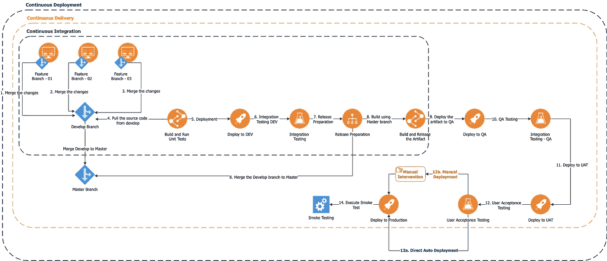
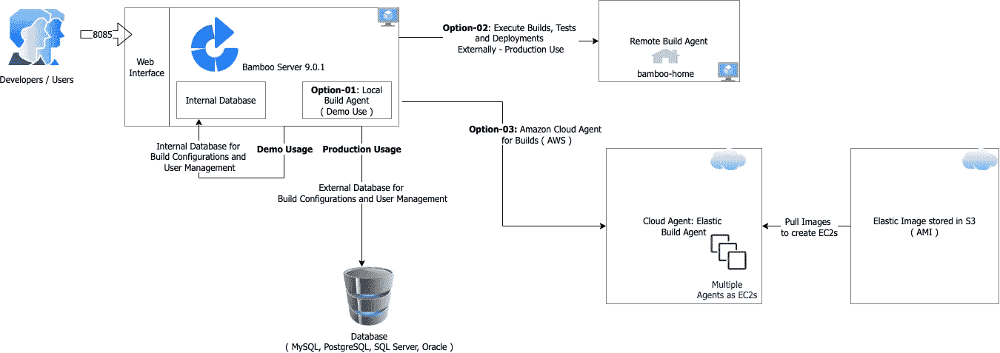
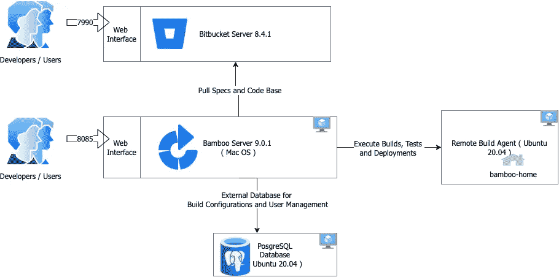
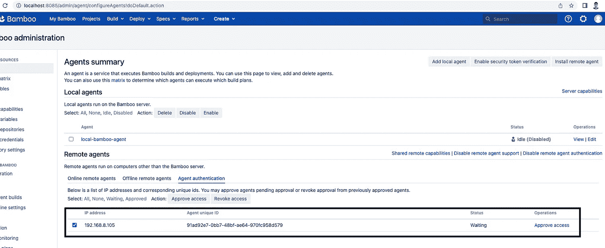
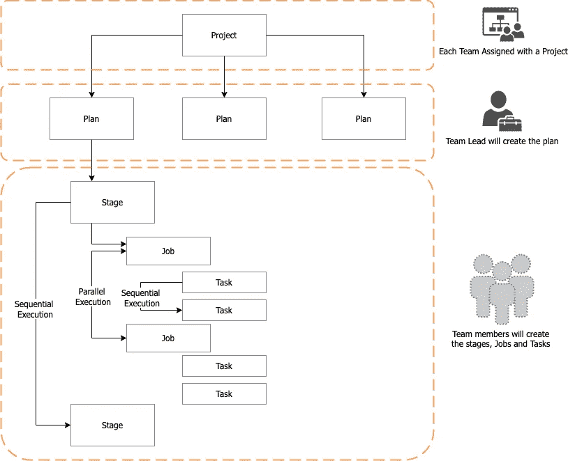
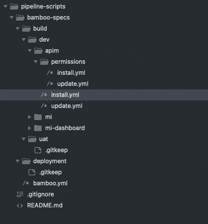
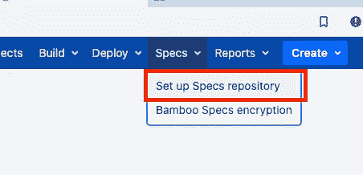
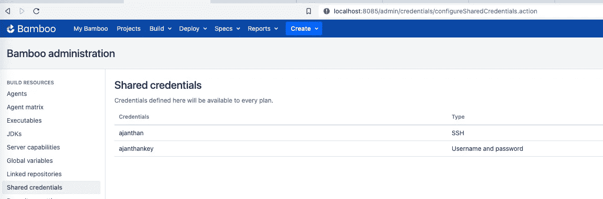
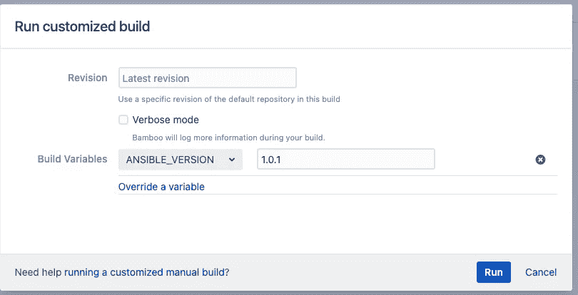

# CICD 与亚特兰蒂斯竹 9.0.1 和竹 YAML 规格

> 原文：<https://medium.com/geekculture/cicd-with-atlassian-bamboo-9-0-1-and-bamboo-yaml-specs-3b4d8e5583e1?source=collection_archive---------9----------------------->

当谈到 CICD 时，即使是 CI 和 CD，也有三个词起作用，它们是持续集成、持续交付和持续部署。根据开发生命周期中从开发- >部署到生产的典型步骤，对每个步骤进行了划分。

下图将帮助你快速理解三者之间的区别。

*在这里，在下图中，你可以看到开发人员正在处理一个特性分支，并且最初将它们合并成开发分支，然后最终使用主分支发布。为了降低复杂性，还有另一个选择，将主分支作为主分支，然后创建多个特性分支，并根据每个特性发布特性分支，一旦测试完成，就合并代码主分支。*

CICD Explanation

在本文中，我的目的是解释我们如何使用 Bamboo 9.0.1 来实现我们的 CICD 目标，从安装到构建工件并将其部署到生产。

像往常一样，在我们开始做任何事情之前，最好先了解一下架构以及竹子组件是如何相互连接的。

## 竹子部署架构

Bamboo Deployment Architecture and Agent Options

*   **Bamboo Server 9.0.1:** 主安装服务器，维护 Bamboo 的构建配置和用户管理部分。
*   **数据库:**支持多个数据库，竹服务器的所有持久需求都将存储在这里。
*   **代理:**多个选项可用作代理。代理是实际运行我们通过 Bamboo 配置的构建、测试和部署的人。在生产环境中，是否建议使用外部代理，例如，如果您有 AWS 支持，则可以使用云代理，如果没有，则可以使用基于虚拟机的单独代理安装。建议使用外部代理，因为主要是作业的执行将由代理来处理，它需要大量资源，如果我们保持它的独立性，我们就可以轻松地只扩展特定的代理机器。此外，由于高负载导致的代理问题不会影响 Bamboo 服务器。

到目前为止，我们已经了解了架构和设置中涉及的组件。

**下一步是什么…**

## 装置

根据您的操作系统，可以在[https://confluence . atlassian . com/bamboo/installing-and-upgrading-289276552 . html](https://confluence.atlassian.com/bamboo/installing-and-upgrading-289276552.html)找到安装步骤

需要注意的是，在部署生产环境时，要确保使用外部数据库和远程代理来构建计划。

在本文中，我将在我的一个 ubuntu 虚拟机中设置一个远程构建代理，主机 Mac 系统将在本地设置 Bamboo 并使用 Bitbucket cloud。

**本地设置信息**

Local Setup Diagram

作为初始设置，在其中一个 VM 中安装 PostgreSQL 并创建空数据库供 Bamboo 使用。还要确保端口被适当打开[参考这里](https://confluence.atlassian.com/bamkb/troubleshooting-remote-agents-216957427.html)。

然后按照[https://confluence . atlassian . com/bamboo/installing-bamboo-on-MAC-OS-x-289276789 . html](https://confluence.atlassian.com/bamboo/installing-bamboo-on-mac-os-x-289276789.html)设置 bamboo。

对于代码存储库设置，请遵循此[https://confluence . atlassian . com/bitbucketserver/install-a-bit bucket-trial-867192384 . html](https://confluence.atlassian.com/bitbucketserver/install-a-bitbucket-trial-867192384.html)

**现在我们需要配置远程构建代理**

SSH 到我们将要安装代理和 java 的虚拟机

1.  sudo 安装 openjdk-8-jre-headless
2.  验证版本:openjdk 版本“1.8.0_342”
3.  从[这里](http://localhost:8085/agentServer/agentInstaller/atlassian-bamboo-agent-installer-9.0.1.jar)下载。提供安装了 Bamboo Server 的机器的确切 IP 地址，而不是 localhost。您需要使用 scp 将它推送到您的代理服务器。
4.  然后运行:Java-dbamboo . home =/home/vagger/bamboo-home-jar atlassian-bamboo-agent-installer-9 . 0 . 1 . jar[http://192 . 168 . 8 . 105:8085/agentServer/](http://192.168.8.105:8085/agentServer/)
5.  对于步骤 4，您也可以使用 Java-dbamboo . home =/home/vagger/bamboo-home-jar atlassian-bamboo-agent-9 . 0 . 1 . jar[http://192 . 168 . 8 . 105:8085/agentServer/](http://192.168.8.105:8085/agentServer/)。
6.  将代理配置为服务
7.  现在需要做竹服务器作为代理接受这一批准。

一旦获得批准就可以开始使用该代理。

**注意:** *运行代理即服务在 Windows、Linux 和 Mac OSX 中都可用，但在基于 ARM 的 Linux OS 中无法获得成功，尽管这里有* [*中提到的选项*](https://confluence.atlassian.com/bamkb/how-to-run-install-start-and-stop-remote-agents-958455495.html) *。大多数情况下，这可能是由于基于 arm 的，如果有人试图在典型的 x64 让知道状态。本文在控制台模式下启动了代理。*

## 配置

现在我们可以开始配置我们的构建和部署了。在竹子方面，我们有两种选择。

1.  通过用户界面创建配置
2.  通过 Bamboo Specs 创建和管理配置(支持 YAML 和 Java)

在这里，选项-2 适用于生产级配置，因为我们可以在 bitbucket 中维护配置，并将项目下的计划准备为代码形式的配置。在深入研究配置之前，最好先了解一下 Bamboo 配置的层次结构。下图描述了这一点。

在上图中，您可以看到项目位于顶部，计划将有助于对包含工作和任务的阶段进行分组。特别是作业将并行运行，所以如果任何独立的工作，我们要做的任务可以包含在单独的作业，所以它将并行执行。

**注:** *作为实践，可以为每个团队创建一个项目，团队领导可以管理计划的创建，团队成员可以参与工作和任务。当使用竹规格使用计划和部署权限配置时，还可以管理* [*计划*](https://docs.atlassian.com/bamboo-specs-docs/9.0.0/specs.html?yaml#plan-permissions) *和* [*部署*](https://docs.atlassian.com/bamboo-specs-docs/9.0.0/specs.html?yaml#deployment-permissions) *的访问权限。YAML 规范(基于 9.0.0 规范)无法管理项目权限。*

## **竹规格项目结构**

作为第一步，最好是定义竹规格的结构，这样在添加计划时就不会变得复杂。下面提到了我曾经遵循的一个典型结构，你也可以想出自己的结构。这摘自**参考文献**中的一些参考文献和实践。

根据部署的场景，我们可以有两种类型的部署

1.  环境构建—当您使用 ansible 为特定的虚拟机或容器化环境提供产品时，这可以是 ansible 脚本执行或 helm 脚本执行。
2.  应用程序构建 WAR 或 JAR 或 Image 构建，您可以在其中部署带有版本控制的应用程序。

在本文中，我们将关注使用 ansible 示例构建的**环境。在我的下一篇博客中，我将关注**应用程序构建**。**

对于**环境营造，**竹子规格的较佳项目结构如下:

**pipeline-scripts:** 主回购名称，因为我们可以为生产和非生产使用不同的 bamboo 规格回购，所以我们可以根据需要选择命名约定为“非生产-pipeline”。

**bamboo-specs:** 这个目录需要 bamboo 来扫描 bamboo.yml 文件。

然后，文件夹结构将由您决定，在我的例子中，我们正在构建 wso2 产品环境，文件夹结构如上所述。另请注意，由于环境构建主要涉及建立配置代码库和向环境进行配置，因此我们可以使用构建计划。

示例 build/dev/apim/permissions/install . yml

Sample bamboo.yml

同样，您可以将所需的文件添加到 bamboo 规范中。这些包含的文件将仅应用于配置。

示例 build/dev/apim/install.yml

这是一个示例构建计划，它从 bitbucket 中提取代码(ansible 脚本)并执行 ansible 脚本。在这个示例中要注意的主要事情是变量的使用，这意味着当执行 ansible 时，我们可以通过运行定制选项来覆盖变量，这将有助于参数化构建。

## 配置步骤

1.  作为第一步，配置 bamboo-specs 存储库，从 bitbucket 获取配置。

2.要配置以上内容，我们需要两件东西，一个是 bitbucket 的应用程序密码，然后是 bitbucket 的 SSH-KEY。一旦在共享凭证下配置了这两个。

3.一旦配置了规格库，您就可以在创建的项目下查看计划。确保您创建项目作为第一步，因为它不能通过 bamboo-specs 创建。

4.为可解析执行配置代理

因为我们的脚本将在代理服务器上执行，所以需要在其上安装特定的依赖项。对于这个示例，我们需要 ansible，所以执行下面的命令来安装 ansible。

sudo apt 更新
sudo apt -y 安装软件-属性-公共
sudo apt-添加-储存库 PPA:ansible/ansi ble-5
sudo apt 安装 ansi ble

5.完成所有工作后，我们就可以开始运行了。有两种选择

*   奔跑
*   定制运行

如上所述，Run Customized 对于参数化构建非常有用。

就是这样。计划在我的下一篇博客中讨论部署选项。希望这有助于初始设置。

***注:*** *示例 ansible 剧本只是一个日志，它的任务，* ***main.yml***

*和****site-test . yml***

## 参考

[1][https://www.redhat.com/en/topics/devops/what-is-ci-cd](https://www.redhat.com/en/topics/devops/what-is-ci-cd)

[2][https://docs . atlassian . com/bamboo-specs-docs/9 . 0 . 0/specs . html？yaml](https://docs.atlassian.com/bamboo-specs-docs/9.0.0/specs.html?yaml)

[3][https://medium . com/geek culture/bamboo-YAML-specs-tips-and-tricks-1 FEA 57 a 83728](/geekculture/bamboo-yaml-specs-tips-and-tricks-1fea57a83728)

[4][https://www.youtube.com/watch?v=3JsxOKd7SQQ&t = 2931s](https://www.youtube.com/watch?v=3JsxOKd7SQQ&t=2931s)

https://www.youtube.com/watch?v=D_Lg3EqN0IA[的& t=1061s](https://www.youtube.com/watch?v=D_Lg3EqN0IA&t=1061s)

[6][https://www . udemy . com/course/bamboo-continuous-integration-for-devo PS-developers/](https://www.udemy.com/course/bamboo-continuous-integration-for-devops-developers/)