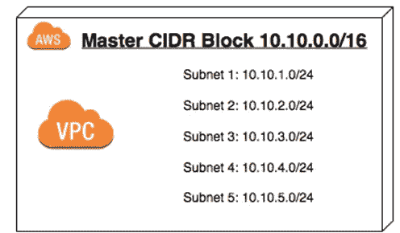
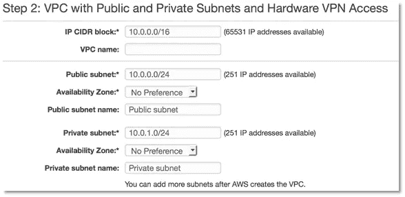

# CIDR 街区

> 原文：<https://medium.com/geekculture/cidr-block-7a271db4ef8f?source=collection_archive---------39----------------------->

# 介绍

在使用无服务器技术之前，我工作的大多数应用程序都是在本地托管的。我曾经与基础设施团队交流过，他们问的问题有时是应用程序开发人员无法理解的。关于防火墙、ip 地址、ssl、ftp、connect 直连的讨论太多了，最初难以理解。在无服务器应用程序开发中，虽然应用程序开发人员不需要了解这些术语，但是了解幕后的情况是有好处的。

AWS 为应用程序开发人员打开了了解其应用程序所使用的网络配置的大门。通常在本地应用程序中，网络服务由不同的团队管理，开发人员不知道配置。每当连接到我们的应用程序出现错误时，网络团队通常会共享日志的片段，这样就会发生交互。但是随着越来越多的应用程序在云服务上开发，开发人员至少可以访问较低的环境配置(dev 或 staging ),这通常是模仿生产的。让我们从了解什么是 CIDR 街区开始这个系列

# CIDR 块(无类域间路由)

无类域间路由( **CIDR** )是一套互联网协议(IP)标准，用于创建网络和单个设备的唯一标识符。在 AWS 中创建 VPC 时，第二步是提供 IP CIDR 块，即要分配给此 VPC 的 IP 地址范围。

VPC Creation Wizard — CIDR Block Range

其格式为 10.0.0.0/16 (IP 地址后跟/和一个数字)。我们大多数人都知道 IP 地址的格式，但是这个数字在 CIDR 街区意味着什么呢？

*   该数字是 IP 地址中必须匹配才能被视为所选 CIDR 块一部分的位数。
*   每个 IP 段，即点之间的数字是 8 位，使得整个段由 32 位组成。
*   让我们将 ip 地址`10.0.0.0`用二进制表示为`0000 1010\. 0000 0000\. 0000 0000\. 0000 0000`。
*   让我们把 CIDR 方块记法当作`10.0.0.0/16`。这里的数字表示任何前 16 位匹配的 ip 地址都是 CIDR IP 地址块的一部分。由于前 16 位必须保持不变，因此剩下的 16 位可以取任何值。因此，2(power)16，`65536` ip 地址在此范围内可用。

# 额外资源

[https://www.colocationamerica.com/ip-calculator](https://www.colocationamerica.com/ip-calculator)

*最初发表于*[*https://www.pradheepa.com*](https://www.pradheepa.com/posts/networking-cidr)*。*