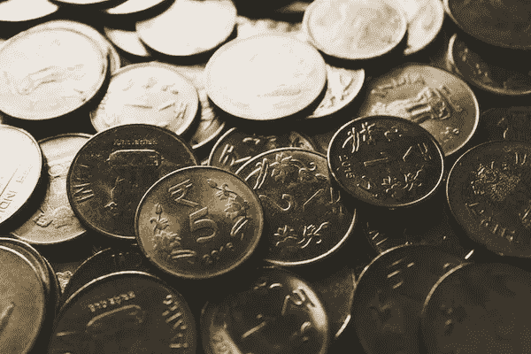
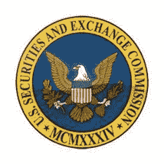

# 美国证券交易委员会收购加密公司的案件

> 原文：<https://medium.com/geekculture/circle-to-settle-sec-case-over-acquisition-of-crypto-company-aa41af29bf35?source=collection_archive---------61----------------------->

Photo by [rupixen.com](https://unsplash.com/@rupixen?utm_source=unsplash&utm_medium=referral&utm_content=creditCopyText) on [Unsplash](https://unsplash.com/s/photos/stable-coin?utm_source=unsplash&utm_medium=referral&utm_content=creditCopyText)

Circle Internet Financial 是加密货币领域最大的公司之一。该公司透露，将预留 1040 万美元与美国证券交易委员会(SEC)达成和解。该案件涉及该公司之前对 Poloniex 的收购，Poloniex 是一家现已停产的加密交易所。

Circle 在 2018 年以 4 亿美元收购了 Poloniex。此后，这家加密货币公司面临一系列法律困境。2017 年，在 Circle 收购 Poloniex 之前，美国证券交易委员会(SEC)对 Poloniex 提出了“可能被定性为证券的加密货币交易”的投诉。

该公司在 2019 年底切断了与 Poloniex 的联系。尽管断绝了联系，证交会的案子仍在继续。外国资产控制办公室(OFAC)也调查了该公司违反制裁的情况。该公司收到了 OFAC 和伊朗政府机构的行政传票。这些传票涉及 Poloniex 在受制裁管辖区注册的交易所账户中的交易。

## Circle 认为波洛涅克斯会帮助它扩张

当该公司首次收购 Poloniex 时，其联合创始人杰里米·阿莱尔和肖恩·内维尔曾设想 Poloniex 有助于该平台的扩张。通过收购，该公司认为它可以建立一个影响深远的数字资产市场，其中将包括各种数字令牌。据估计，仅在 18 个月后，Circle 通过收购和出售 Poloniex 就损失了 1 . 56 亿美元。

为了解决 SEC 的案子，Circle 已经预留了超过 1040 万美元。该公司聘请了一名新的首席合规官来帮助防止未来的监管失误。该公司新任首席合规官 Mandeep Walia 此前曾担任数字钱包应用 Novi Financial 的首席合规官和企业风险管理负责人。基于区块链技术，Novi 数字钱包将促进脸书支持的数字货币 Diem 的移动。

## 以稳定的硬币闻名的公司

总部设在波士顿的 Circle 因推动 stablecoin 的发展而闻名。稳定的货币被设计成与美元保持等值。通过与政府发行的货币挂钩，稳定的货币旨在避免价格大幅波动。

Circle 创造了 USDC 稳定币，如今其市值约为 250 亿美元。USDC 稳定币今年的涨幅超过了 3400%。对数字美元稳定币的需求不断增长，部分原因是寻求更快支付和结算选项的企业需求增加。

## 对稳定资本的怀疑

一些监管者对稳定的硬币表示怀疑。波士顿美联储公司总裁埃里克·罗森格伦评论说:“有许多理由认为许多稳定的硬币实际上并不特别稳定。”Circle 试图通过发布关于其稳定的硬币储备的月度报告和提供其他披露材料来提高透明度。

该公司自称是一家在线支付和资金基础设施公司。Circle 的总体使命是建立一个更加开放、全球化和无障碍的金融系统。Circle 成立于 2013 年，在建立一个将法定货币系统与加密和区块链生态系统集成的平台方面取得了很大进展。

Circle 与 Visa 合作整合其 USDC 支付基础设施。这一整合将使 Visa 的数字货币钱包网络实现稳定的货币支付。Circle 还与 Crypto.com 和 FTX 的加密交易平台建立了合作关系。

## 但是 Circle 要上市了

今年，Circle 跟随许多其他科技公司的脚步，最近宣布将通过与一家特殊目的收购公司(特殊目的收购公司)的合并上市。Circle 将与之合并的上市公司特殊目的收购公司被称为 Concord Acquisition Corp .此次交易对 Circle 的估值为 45 亿美元。

Circle 的联合创始人兼首席执行官 Jeremy Allaire 表示:“今年年初，我们在 USDC 经历了非常显著的增长，我们推出的新产品和服务也产生了非常强劲的吸引力。我们认为，我们处于一个非常独特的位置，可以快速建立和扩展一个主要的特许经营，围绕在全球提供基于数字货币的金融服务。这是一个独一无二的机会，不仅可以筹集到那么多的资金，还可以将公司转变成一个对公众负责的公司。"

Circle 在特殊目的收购公司宣布合并之前有很多积极的动力。2021 年 5 月，Circle 创造了一项纪录，筹集了有史以来由加密初创公司筹集的最大一轮风险投资。这轮融资为 4.4 亿美元，包括富达管理研究公司和彭博慈善机构的参与。

许多其他加密货币和区块链公司最近转向公开市场筹集额外资本。值得注意的是，比特币基地于 4 月首次公开上市。通过上市，Circle 将能够更快地扩大规模。作为一家上市公司，也意味着要接受持续的报告要求和更严格的审查。Circle 认为，透明度的提高将有助于减弱对其商业行为的批评。