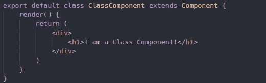
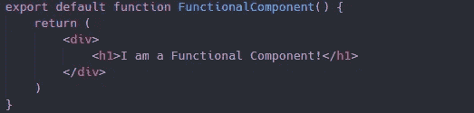
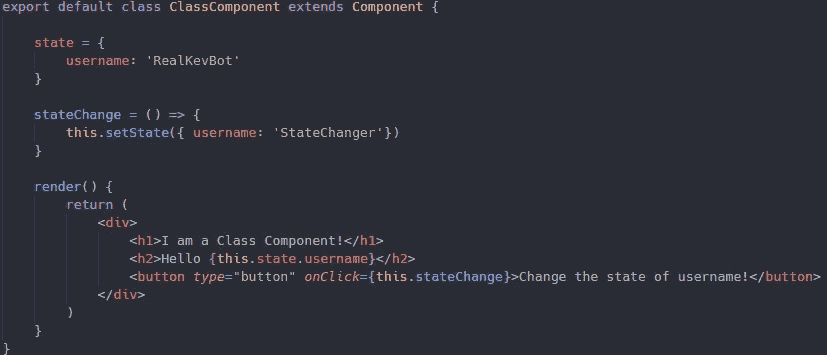
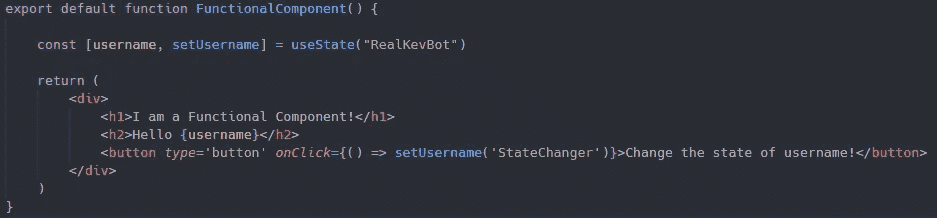
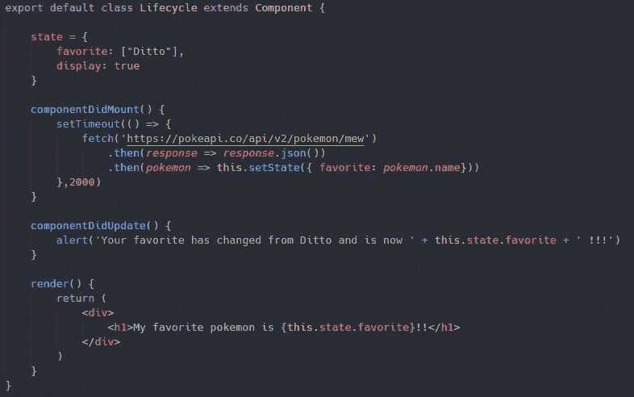
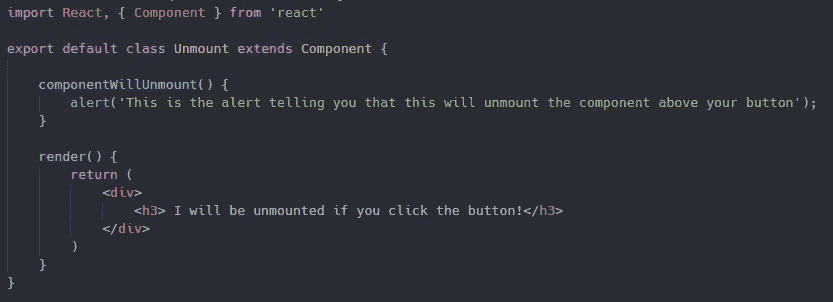
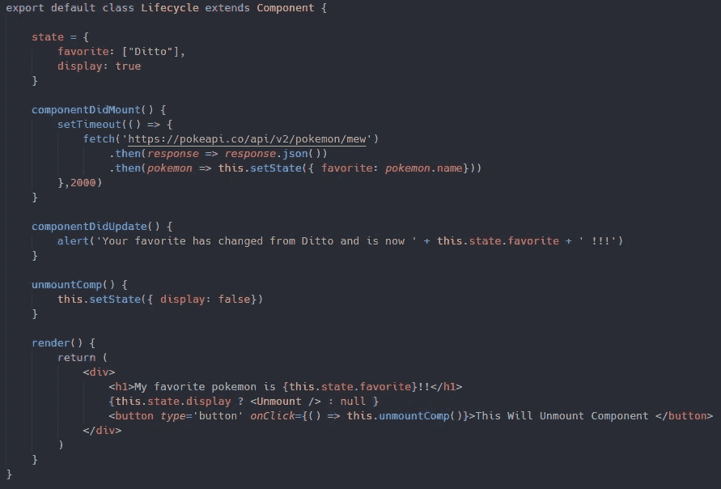

# 类别组件与功能组件

> 原文：<https://medium.com/geekculture/class-components-vs-functional-components-4d6bb1edc1fe?source=collection_archive---------19----------------------->

## 深入了解 React 的核心组件

在 React 中使用组件呈现页面或视图时，您可以使用类组件或函数组件。问题是，你应该使用哪一个，为什么？这可能看起来有点像一个棘手的问题，因为*你*很可能会在未来与*和*都打交道。

让我们先来看看一个类组件和一个功能组件，它们都返回它们是哪种组件。

## 类别组件:

## 功能组件:

正如你所看到的，它们有相似之处，但也有区别于彼此的特征。识别它们之间的区别的直接方法就是阅读组件的第一行。React 足够好，让你知道你直接处理的是什么。

现在你可能想知道为什么我们有两种类型的组件，如果它们都可以呈现相同的项目？嗯，这与生命周期方法和状态有关，尽管由于 React 钩子，我们现在可以在功能组件中使用状态。这让我们想到..

## 状态

在我们开始讨论生命周期方法之前，让我们先来讨论状态，因为我们将在讨论生命周期方法时使用它，所以现在是最佳时机。什么是真正的国家？简而言之，状态是可以存储任何类型的动态数据的地方。这可以在范围和大小上有所不同，从单个用户的信息到颜色。您可以在组件状态中存储任何想要的数据。

## 类别组件

现在我们有了状态的概念，让我们开始设置和使用它。我们将首先在类组件中设置状态，因为这是多年来的惯例，但是我们不要急于求成，因为钩子将在下一节讨论。如果我们愿意，我们可以默认设置状态。例如:

如您所见，我已经将用户名的默认状态设置为我自己的，他们可以调用该状态进行显示。这似乎不是很动态，因为状态目前是硬编码的。如果我们有不同的用户登录使用我们的应用程序会怎么样？这是我们可以调用 React 提供的 setState()方法的地方。这允许我们改变我们的状态，我们将把它放入函数或方法中。在这个例子中，我创建了一个匿名函数来改变按钮被按下时用户名的状态。

setState()方法允许我们在执行某些函数时更动态地设置我们的状态，在本例中，或者方法将被执行，这将在生命周期方法部分中看到。

## 功能成分

正如我以前说过几次的，在过去，状态只能在类组件中设置和使用。截至 2019 年 2 月，React 引入了钩子，允许我们现在在功能组件中设置和使用状态。虽然我们仍然在处理状态，设置和使用它，但它看起来与类组件不同。看一下这个例子:

您可以看到，我们已经将用户名的当前状态声明为我自己的，而且还有一个让我们专门更新用户名状态的函数。我们还可以通过调用 username 以更简单的方式调用我们的状态。大多数人认为这是一种更好的方法，因为在处理大规模应用程序的类组件时，在处理状态时很难区分所有的 this。

## 生命周期方法

既然我们对状态以及如何使用它有了更好的了解，让我们深入讨论一下生命周期方法。什么是 React 生命周期方法？首先，试着把你的每一个组件想象成一株植物或一棵树。你的组件有一个相似的生命周期，它必须首先诞生，然后成长，最后死亡。在 React 中，您的组件将被挂载，可能被更新，并最终被卸载。这是组件的生命周期:出生、成长和死亡。

*对于所有这些例子我们将从 PokeApi 中抽取，具体为***:*[*【https://pokeapi.co/api/v2/pokemon/mew.】*](https://pokeapi.co/api/v2/pokemon/mew.)*

***安装:***

*可以说，这是组件的诞生，您将遇到的最常见的安装生命周期方法之一是 componentDidMount()。一旦组件被安装到页面上，就会调用这个生命周期方法。这种生命周期方法最常见的用途是，如果您需要进行外部 API 调用来填充您的状态。下面是一个我们如何使用 componentDidMount()来更新我们最喜欢的神奇宝贝的状态的例子。*

**

***更新:***

*这是您的组件有可能增长或更新的地方。您将遇到的最常见的更新生命周期方法是 componentDidUpdate()。一旦组件更新，就会调用这个生命周期方法。您将看到，这种生命周期方法最常见的用途是对反映到 DOM 中的属性或状态进行更改。例如，在创建配置文件时，默认情况下会设置学生最喜欢的颜色。如果学生改变了他们喜欢默认颜色，这个生命周期方法将运行以反映 DOM 上的差异。在下面的示例中，状态更新后，我们将在 2 秒钟后收到一条警报，告知我们状态已经更新。*

**

***卸载:***

*这是组件生命周期的最后一步，即组件的死亡或卸载。您将遇到的最常见的卸载生命周期方法是 componentWillUnmount()。如果您一直在认真阅读，这种生命周期方法与前两种方法一样，将如其名称所示类似地执行。这个生命周期方法在组件从 DOM 中卸载之前被调用。在这个例子中，我们需要创建一个新的类组件，我们将从页面中卸载它。*

**

*我们还将在 componentWillUnmount()中创建一个警报，以便我们可以看到它的运行。我们将导入 Unmount 组件，并创建一个函数来改变消息的显示或不显示状态。有几种方法可以做到这一点，但我选择这样做:*

**

## *！！加分！！*

*如果你决定研究代码，并且一直在密切关注，我向你提出这个问题，并鼓励你在评论中留下你的答案。*

*在卸载了组件和每一个按钮之后，为什么你仍然会收到一个警告，让你知道你最喜欢的口袋妖怪已经改变了？*

*提示:答案在生命周期方法部分。*

*如果你想看一份拷贝给自己玩或者只是作为参考，你可以在这里找到 GitHub [的链接。](https://github.com/TheRealKevBot/ClassVsFunctional)*

*我要感谢你的阅读，并希望你学到了新的东西！*