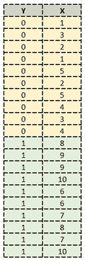
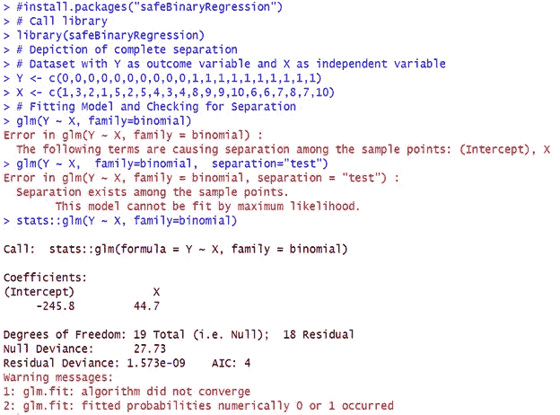
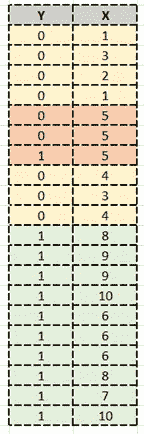
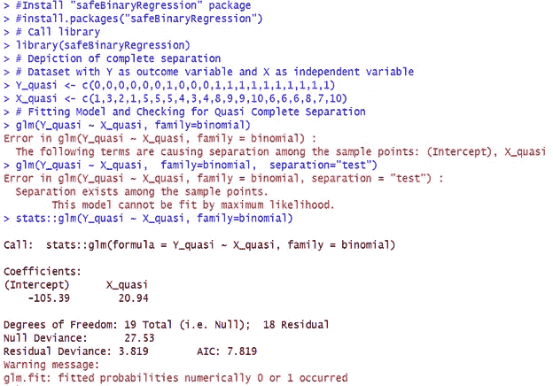

# 逻辑回归中不能忽略阶级分离

> 原文：<https://medium.com/geekculture/class-separation-cannot-be-overlooked-in-logistic-regression-f20e58b203eb?source=collection_archive---------4----------------------->


Picture by [Holly Chisholm](https://unsplash.com/@hollyachisholm) on Unsplash

你们中的大多数人可能都熟悉逻辑回归，这是用于分类问题的最常见的监督机器学习算法之一。

但是你知道吗，当我们运行手头的逻辑回归问题时，有时我们会遇到所谓的**完全类分离**或**准完全类分离**的问题。在这篇文章中，我将讨论完全或准完全类分离以及无限估计的含义，以及当问题出现时我们需要如何处理它。

# **什么是完全分离？**

> 当结果变量 Y 完全分离预测变量时，逻辑回归中的完全分离(也称为完美预测)发生，即，利用结果变量 Y 的假定值，可以清楚地分离/区分预测变量 x 的值的范围

换句话说，我们可以说预测变量可以 100%确定地预测结果变量的值，而不需要运行算法来创建模型，也不需要进行任何估计。

通过下面的数据集示例，这一点就很清楚了。

让我考虑一个小的虚构数据集。

**描述完全分离的数据**

数据集将 Y 作为结果变量，X 作为预测变量。



注意:我只考虑了 1 个预测变量 X，以使表示背后的逻辑更容易理解，但在现实生活中，可以考虑任何数量的预测变量，并且不是所有的预测变量都必须表示分离。

如果我们仔细观察数据集，我们会发现 Y = 0 时，所有 X 的值都在 X <= 5 and with Y = 1 all X have values within range of X > 5 的范围内。即 Y 完美的完全的分开了 X。

另一种理解方式是 X 完美地预测了 Y，因为 X <=5 corresponds to Y = 0 and X > 5 对应于 Y = 1。

也就是说，我们已经为结果变量 y 找到了一个完美的预测因子 X。

概率方面，我们有 P(Y = 1 | X <= 5) = 0 and P(Y = 1 | X > 5) = 1，不需要估计模型。

现在，在这种情况下，当我们尝试使用上面显示的小数据集拟合 Y 对 X 的逻辑回归模型时，会发生什么呢？

X 的参数的最大似然估计不存在。

X 的系数越大，可能性越大。换句话说，X 的系数可以有多大就有多大，它可以延伸到无穷大，这是一个问题，因为我们无法估计参数的正确值。

让我们看看“R”软件是如何处理上述数据集的。下面是拟合模型的代码。

```
#Install "safeBinaryRegression" package
#install.packages("safeBinaryRegression")
# Call library
library(safeBinaryRegression)
# Depiction of complete separation
# Data set with Y as outcome variable and X as independent variable
Y <- c(0,0,0,0,0,0,0,0,0,0,1,1,1,1,1,1,1,1,1,1)
X <- c(1,3,2,1,5,2,5,4,3,4,8,9,9,10,6,6,7,8,7,10)
# Fitting Model and Checking for Separation
glm(Y ~ X, family=binomial)
glm(Y ~ X,  family=binomial,  separation="test")
stats::glm(Y ~ X, family=binomial)
```

它检测到 X 的完美预测，并停止进一步的计算。

输出



“R”软件立即给出的错误信息是:

```
**“Error in glm(Y ~ X, family = binomial) :The following terms are causing separation among the sample points: (Intercept), X".**
```

和

```
**“Error in glm(Y ~ X, family = binomial, separation = "test") :****Separation exists among the sample points.****This model cannot be fit by maximum likelihood.”**
```

此外，它还显示如下警告消息:

```
**“ glm.fit: algorithm did not converge”** and**" glm.fit: fitted probabilities numerically 0 or 1 occurred".**
```

这可以解释为完美的预测或者完全的分离。参数估计的标准误差太大，这证实了描述导致无限 MLE(最大似然估计)的收敛问题的分离。

# 什么是准完全分离？

> 当结果变量几乎完全分离预测变量而不是 100% 时，逻辑回归中的准完全分离发生，即，利用结果变量的假定值，除了少数观察值，人们几乎可以分离/区分预测变量的值范围。

换句话说，我们可以说，预测变量可以 100%确定地预测结果变量的值。

通过下面的数据集示例，这一点就很清楚了。

让我再次考虑一个小的虚构数据集。

描述准完全分离的数据

数据集将 Y 作为结果变量，X 作为预测变量。



注意:同样，我只考虑了 1 个预测变量，以使表示背后的逻辑更容易理解，但在现实生活中，可以考虑任何数量的预测变量，并且不是所有变量都必须表示分离。

请注意，结果变量 Y 很好地分离了预测变量 X，除了 X = 5 的少数观察结果。换句话说，当 X < 5 (Y = 0) or X > 5 (Y=1)时，X 完美地预测了 Y，只留下 X = 5 作为不确定的情况。

就预期概率而言，我们会有 P(Y=1 | X <5) = 0 and P(Y=1 | X> 5) = 1，除了 P(Y = 1 | X = 5)之外，没有什么需要估计的。

当我们试图使用上面的数据拟合 Y 对 X 的逻辑回归模型时会发生什么？原来 X 的最大似然估计不存在。在这个例子中，X 的参数越大，似然性越大，因此 X 的参数估计的最大似然估计至少在数学意义上是不存在的。实际上，11 或更大的值不会产生太大的差异，它们基本上都对应于估计概率 1。

让我们看看“R”软件是如何做到这一点的。下面是拟合模型的代码。

```
#Install "safeBinaryRegression" package
#install.packages("safeBinaryRegression")
# Call library
library(safeBinaryRegression)
# Depiction of complete separation
# Data set with Y as outcome variable and X as independent variable
Y_quasi <- c(0,0,0,0,0,0,1,0,0,0,1,1,1,1,1,1,1,1,1,1)
X_quasi <- c(1,3,2,1,5,5,5,4,3,4,8,9,9,10,6,6,6,8,7,10)
# Fitting Model and Checking for Quasi Complete Separation
glm(Y_quasi ~ X_quasi, family=binomial)
glm(Y_quasi ~ X_quasi,  family=binomial,  separation="test")
stats::glm(Y_quasi ~ X_quasi, family=binomial)
```

它检测到 X 的准完美预测并停止进一步的计算。



“R”软件立即给出的错误信息是:

```
**“Error in glm(Y_quasi ~ X_quasi, family = binomial) :****The following terms are causing separation among the sample points: (Intercept), X_quasi**
```

和

```
**Error in glm(Y_quasi ~ X_quasi, family = binomial, separation = "test") :****Separation exists among the sample points.****This model cannot be fit by maximum likelihood.**
```

此外，它还显示如下警告消息:

```
**"glm.fit: fitted probabilities numerically 0 or 1 occurred".**
```

从参数估计中，我们可以看到 X 的系数足够大，其标准误差甚至更大，这表明模型可能与 X 有一些问题。此时，我们应该仔细研究结果变量 Y 和 X 之间的双变量关系。

这可以解释为半完美的预测或准完全的分离。参数估计的标准误差足够大，这证实了描述收敛问题的准完全分离。

现在，处理这种完全和准完全分离的技术是什么？

处理类分离的技术很少。

由于预测变量 X 被结果变量完全或准完全分开，因此我们下面的讨论集中在如何处理 X？

1.如果我们有不止一个预测变量，最简单的方法就是“什么都不做”。这是因为模型中其他预测变量的最大似然仍然有效，除了有分离问题的那个。但缺点是，我们没有得到任何合理的预测变量的估计，它能如此完美地预测结果变量。

2.另一个简单技术是不在模型中包括导致分离的预测变量。但是这导致了对模型中其他变量的有偏估计。

3.如果 X 是一个分类变量，并且这样做有意义，我们也可以尝试折叠一些预测变量的分类。

4.当数据集很小且模型不是很大时，在数据集中包含更多不同的观察值可能会减少分离是一个好策略。

5.当 x 的参数估计有附加信息时，可以使用贝叶斯方法。

6.正则化，像脊或套索，结合 bootstrap 也可以使用。

7.也可以尝试减少偏差的估计过程。

根据手头的条件和问题，可以采用的技术很少，上面提到的列表并不详尽。

讨论它们中的每一个都不是这篇文章的范围，我将在单独的文章中讨论它们。

我得出这样的结论。希望你喜欢。

感谢阅读！！！