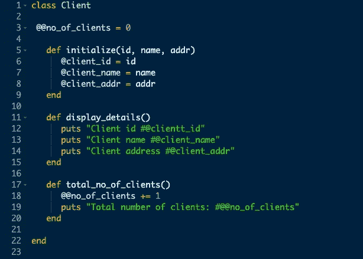
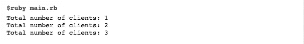

# RUBY 中的类变量、类方法和 SELF

> 原文：<https://medium.com/geekculture/class-variable-class-methods-and-self-in-ruby-388706a4c491?source=collection_archive---------21----------------------->

自从搬进 ActiveRecord，我就一直在纠结这三件事。在一次代码挑战中惊慌失措之后，这一点对我来说非常清楚。我很确定他们会允许我们录制 lol，我从来没有想过他们会，呀！

考虑到我有分离性健忘症和焦虑症，我的记忆力很差，一团糟。所以我们一起来学习吧。

# **什么是类变量？**

**类变量**是存储类信息的变量。全班都可以使用它，它由两个 **(at) @@** 符号组成。使用类变量的一个例子是:

如果我们看最上面，我们会看到类变量**@@no_of_clients** 在使用之前已经初始化。这很重要，因为当一个类变量没有初始化时，我们会得到一个错误。

我们可以通过首先创建一个客户端类的实例来测试我们的类变量。我们可以通过创建新的实例对象并应用 ***new*** 方法来创建 3 个客户端，如下所示。

然后，我们可以在新的客户机对象上调用我们在上面创建的方法。

结果将是:

好的，这个我已经知道了，但是它将帮助我展示类变量和类方法之间的区别，所以让我们继续…

# 什么是类方法？

可以直接在类上调用类方法，而不必实例化任何对象。它不会在类别的执行个体上呼叫。整个类(类范围)都可以访问它。

类方法制定(制造)属于整个类的行为，而不仅仅是类的单个实例。让我们来看看一个有效的类方法:

我们看到创建了类方法 count，然后直接在 Album 类上调用它。这与变量方法不同，在变量方法中，我们必须在类的实例上调用方法，而不是直接在类本身上调用方法。

但是这是如何工作的呢？

为了理解这一点，我们必须看看**自我**是什么…

# 什么是自我？

**Self** 是一个宾语，根据用在哪里可以指代不同的事物。在我们的类方法中，self 指的是整个类。如果我们在一个实例方法上使用它， **self** 将引用那个实例。

当我们定义一个类方法时，你会在这个类方法的开头看到 self 这个词。例如，如果我们查看我们之前的代码，我们会看到 def **self.count** 。这使我们能够依靠实际的类，而不是像我们在博客开始时那样创建实例。

希望这对某人有所帮助。

***个人注:*** *不关注类方法、类变量、自我是非常容易的，尤其是如果你有使用 ActiveRecord 的能力。在过去的几周里，我一直在努力学习 Ruby 的这一部分，即使我回顾了这些方法的定义，我仍然没有理解。*

直到我决定写这篇博客，同时查阅更多的材料和编写一些代码，我才想起这件事。这只能说明这些教授说的是真的。光看书是学不到的，要做题。这是唯一能坚持下去的方法。