# 分类和回归评估指标

> 原文：<https://medium.com/geekculture/classification-and-regression-evaluation-metrics-c7cc843b3486?source=collection_archive---------3----------------------->

在选择机器学习模型时，谨慎选择性能指标是极其重要的。不这样做将导致模型部署后的结果受到损害。评估指标给出了我们的机器学习模型有多好以及我们的算法执行得有多好的定量测量。

## 分类指标

1.准确性-它等于正确预测的数量/总预测的数量。拆分数据，拟合出需要的模型后，简单使用来自 sklearn 的 score 方法就可以找到精度。范围从 0 到 1。

Model_name.score(测试数据)

准确性度量仅仅告诉我们的模型有多好或多坏，但是没有给出关于它有什么问题或者它在哪里出错的信息。只有当我们有一个平衡的数据集时，它才是可靠或合适的。

这可以使用混淆矩阵来完成。

2.混淆矩阵是一个表格，它让我们了解我们的模型做出了多少正确的预测。它将实际输出值和预测输出值关联起来。也可以对多类问题作图。

> 真正(TP)值是那些被正确预测为正的值。
> 
> 假阳性(FP)值被错误地预测为阳性。
> 
> 假阴性(FN)值应该被预测为阳性，但没有。
> 
> 最后，真阴性(TN)值被正确地预测为阴性。

要使用混淆矩阵，您可以从 sklearn.metric 导入它，并使用以下语法:

混淆矩阵(实际值，预测值)

例如，在下面的示例中，正确的预测=126+60=186

错误预测=24+13=37

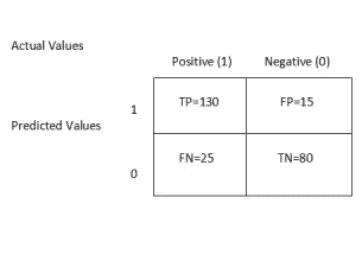

> 注:类型 1 误差=FP 速率= FP/FP+TN
> 
> 类型 2 误差= FN 速率=FN/FN+TP
> 
> 在这些术语中，我们可以说精确度= TN+TP / (TP+TN+FP+FN)

如果我们的数据集是不平衡的，建议使用召回率和精确度，而不是仅仅依靠精确度。

3.精度-它也被称为正预测值。它是真阳性与总阳性的比率。例如，如果我们的模型将患有癌症(1)或未患癌症(0)的患者进行分类。这里的精确度是已经被正确识别为患有癌症的患者与已经被检测出患有癌症的患者总数的比率。

精度= TP/TP+FP

当我们想要减少误报时，通常会考虑到这一点。

4.召回率——它是真阳性与真阳性和假阴性之和的比率。简单来说，就是正确预测值与实际正值总数的比值。在癌症的例子中，它会给我们正确识别出患有该疾病的患者与实际患有该疾病的患者进行比较。它也被称为 TPR(真阳性率)或灵敏度。

召回= TP/TP+FN

当我们想要减少假阴性时，通常会将它考虑在内。

> 注意-在我们的癌症例子的情况下，如果一个人患有癌症，但被预测为没有癌症(假阴性)。这将是我们最坏的情况，并可能带来灾难性的后果。在这种情况下，我们应该专注于回忆。

5.这是精确度和召回率的调和平均值。

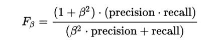

如果β值= 1，则称为 F1 分。如果是 2，就叫 F2 分，以此类推。当 FP 和 FN 同等重要时，β值选择为 1。如果 FP 更本质，β值就减少到 0 到 1 之间。如果 FN 更重要，则将β值增加到大于 1(1 到 10 之间)。

6.F1 得分- F1 得分= 2 *(精确度*召回率/精确度+召回率)

=2*TP/2* TP+FP+FN

它考虑了真阳性、假阳性和假阴性，但不考虑真阴性。一个好的 F1 分数表明一个好的精确度和召回率，这样，我们不需要单独关注其中任何一个。

> 注意-在多类问题的情况下，我们也可以计算精度和回忆，但是找到四个关键元素 TP，FP，TN，FN 的过程会有一点不同。

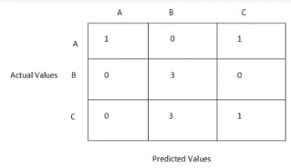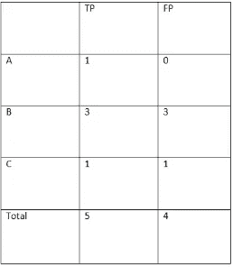

微精度= 5/(5+4)=5/9

宏精度-计算每个类的精度:Precision(A)= 1；精度(B)= 3/6 = 0.5；精度(C)= 1/2=0.5

现在取这些的平均值，宏精度= (1+0.5+0.5)/3=0.667

加权平均值——乘以各精度下的各类样本数，除以总样本数=(2 * 1+3 * 0.5+4 * 0.5)/(2+4+3)= 0.61

7.马修斯相关系数-这使用了混淆矩阵的所有四个类别。

MCC = TP * TN-FP * FN/sqrt((TP+FP)(TP+FN)(TN+FP)(TN+FN))

请记住，如果某些为零，MCC 可能会作为未定义返回。如果我们翻转正值和负值，F1 分数将会改变，但您可能会观察到 MCC 保持不变。这是因为 F1 分数对哪个类是正的和负的很敏感。

8.ROC(受试者工作特性)曲线——这是一种更简单的方法来总结我们从混淆矩阵中得到的信息。它们在 y 轴上有真阳性率，在 x 轴上有假阳性率。

真实阳性率(回忆或敏感度)=TP/ TP+FN

假阳性率= 1-特异性(或真阴性率)= FP/FP+TN

9.曲线下面积。这样更容易比较多个 ROC 曲线和 ML 模型。曲线下的面积越大，模型越好。

10.精度/召回曲线

x 轴表示精确度，y 轴表示召回率。

11.原木损失

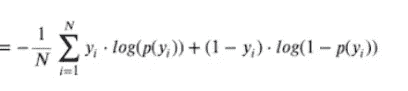

它将模型预测的不确定性考虑在内，并评估给定类别的概率预测。随着预测概率偏离实际标签，测井曲线损失增加。因此，对数损失越小，模型越好。如果我们将实际标签设为 1，预测值设为 0.9，我们将会有非常小的对数损失。另一方面，0.2 的对数损失将呈现高得多的对数损失值。

我们还可以计算多类日志损失。

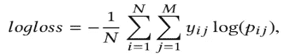

> 分类报告提供准确度、精确度、召回率、f1 分数和支持。

## 回归评估度量

1.r 平方(决定系数)-它给出了数据与拟合回归线接近程度的度量(拟合优度)。它决定了因变量中可以用自变量解释的方差的比例。它利用了实际值和预测值之间的差异，以及实际值和实际值的平均值之间的差异。

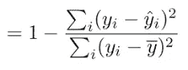

= (1-RSS(残差平方和))/TSS(总平方和)

[这里的](https://neptune.ai/blog/performance-metrics-in-machine-learning-complete-guide)是一篇关于评估指标和使用调整后的 R 平方来克服 R 平方缺陷的深刻文章。

sklearn 中回归变量的评分方法给出了 R 的平方值。然而，R 的平方不能给我们任何关于误差的信息。

为此，我们可以使用平均绝对误差(MAE)。

2.MAE-它是真实值和预测值之间总差值的平均值。

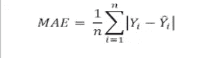

3.均方误差(MSE)-它测量误差平方的平均值(观察值和预测值之间的差异)。

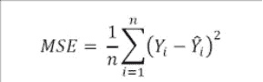

= RSS(残差平方和)/数据点数

4.RMSE(均方根误差)-它是 MSE 的根

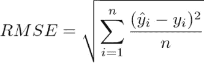

5.均方根对数误差

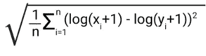