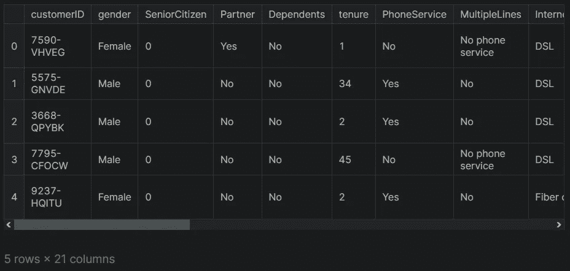
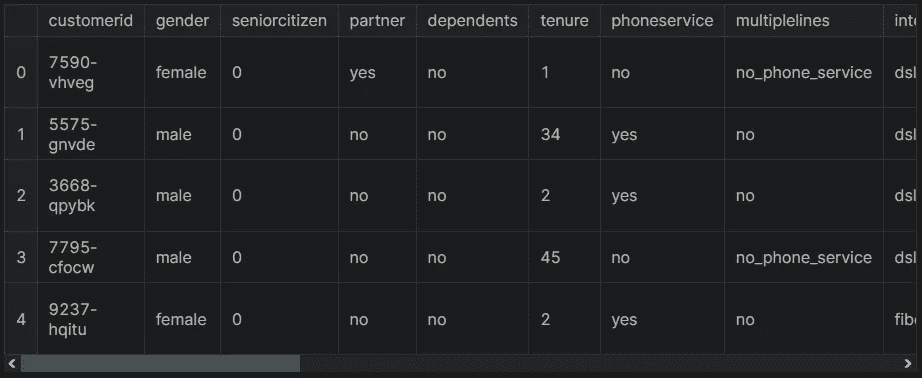
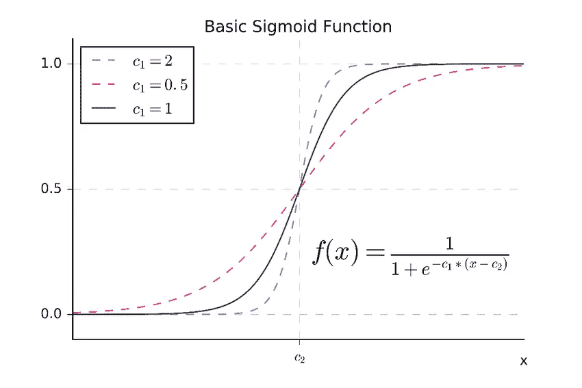

# 机器学习中的分类:初学者指南

> 原文：<https://medium.com/geekculture/classification-in-machine-learning-a-guide-for-beginners-fe586e299721?source=collection_archive---------5----------------------->

## 如何使用真实数据集通过逻辑回归解决分类问题的分步指南。


Photo by [Austin Distel](https://unsplash.com/@austindistel?utm_source=medium&utm_medium=referral) on [Unsplash](https://unsplash.com?utm_source=medium&utm_medium=referral)

数据是当今的新石油。许多公司和政府现在正试图使用机器学习技术从大数据中提取信息。机器学习发展非常快，几乎每天都在这个领域开发新的工具和库。这些工具可以帮助您轻松实现机器学习项目。

在这篇文章中，我将谈论分类问题。以下是我将涉及的主题:

*   什么是机器学习？
*   什么是逻辑回归算法？
*   如何用 logistic 回归解决一个分类问题？
*   如何预测新数据？

让我们开始吧！

# 什么是机器学习？

机器学习是人工智能的一个子领域，它为机器提供了自动学习和根据经验改进的能力，而无需显式编程。

机器学习主要有三种类型:监督学习、非监督学习和强化学习。如果数据集有标注，可以使用监督学习算法。一旦数据集中没有标签，就可以使用无监督学习算法。在强化学习中，系统通过与环境交互来学习。

让我们仔细看看监督学习。监督学习模型是机器学习中最常用的算法。监督学习分为回归和分类。很容易理解一个问题是回归还是分类。如果数据的标签是数值，那就是回归问题，否则就是分类问题。

在这篇文章中，我将用逻辑回归来解释分类问题。请注意，逻辑回归，尽管它的名字，是**一个**分类模型，而不是回归模型。为了展示如何解决分类问题，我将使用[电信客户流失](https://www.kaggle.com/datasets/blastchar/telco-customer-churn)数据集。

# 加载数据集

首先，让我们用`read_csv`方法加载数据集，然后用`head`方法查看数据集的前五行。

```
import pandas as pd
df = pd.read_csv('WA_Fn-UseC_-Telco-Customer-Churn.csv')
df.head()
```



该数据集包括一家虚构的电信公司的信息，该公司在第三季度向加利福尼亚州的 7043 名客户提供了家庭电话和互联网服务。它显示哪些客户已经离开、留下或注册了他们的服务。

如果一个公司能够预测客户是否会离开这项服务，它就会努力留住客户。最后一列“客户流失”表示客户是否取消了合同。如果客户取消了合同，则显示“是”，如果没有，则显示“否”。该变量是我们的目标变量。其他变量也称为特征。

# 了解数据集

让我们来看看数据集的形状。

```
df.shape

#Output 
(7043, 21)
```

如您所见，数据集由 7043 行和 21 列组成。让我向您展示数据集中的列类型。

```
df.dtypes

#Output:
customerID           object
gender               object
SeniorCitizen         int64
Partner              object
Dependents           object
tenure                int64
PhoneService         object
MultipleLines        object
InternetService      object
OnlineSecurity       object
OnlineBackup         object
DeviceProtection     object
TechSupport          object
StreamingTV          object
StreamingMovies      object
Contract             object
PaperlessBilling     object
PaymentMethod        object
MonthlyCharges      float64
TotalCharges         object
Churn                object
dtype: object
```

# 数据预处理

数据预处理是机器学习中最重要的步骤之一。这一步是数据科学家花费最多时间的。项目的 80%通常花在数据预处理上。

请注意，Pandas 会自动确定每个列的类型。但是，列的数据类型有时会被错误地确定。在建立模型之前，检查柱的类型是一项重要的任务。

例如，`SeniorCitizen`列由 0 和 1 组成，该列的类型被指定为数字。您可以将此列转换为对象类型。但是，由于该列的值数量有限，因此不需要转换该列的类型。

`TotalCharges`指付款总额。付款必须是一个数值。让我们用`to_numeric`方法将这个列转换成数字类型。

```
df.TotalCharges = pd.to_numeric(df.TotalCharges, errors='coerce')
```

这里，我使用了`error="coerce"`参数将一个非数值转换为 NaN。

## 处理缺失数据

让我们用`isnull().sum()`方法来看看数据集中缺失的数据。

```
df.isnull().sum()

#Output
customerID           0
gender               0
SeniorCitizen        0
Partner              0
Dependents           0
tenure               0
PhoneService         0
MultipleLines        0
InternetService      0
OnlineSecurity       0
OnlineBackup         0
DeviceProtection     0
TechSupport          0
StreamingTV          0
StreamingMovies      0
Contract             0
PaperlessBilling     0
PaymentMethod        0
MonthlyCharges       0
TotalCharges        11
Churn                0
dtype: int64
```

如您所见，`TotalCharges`列有缺失的数据。让我们用`fillna`方法将 0 赋给缺失值。

```
df.TotalCharges = df.TotalCharges.fillna(0)
```

在数据集中，一些列名以小写字母开头。让我们将列名转换为小写，并在列名之间的空格处添加下划线。

```
df.columns = df.columns.str.lower().str.replace(' ', '_')
```

请注意，Object 类型的一些列值包含空格，并且大小写不匹配。让我们规范这些价值观。

```
string_columns = list(df.dtypes[df.dtypes == 'object'].index)
for col in string_columns:
    df[col] = df[col].str.lower().str.replace(' ', '_')
```

现在，让我们处理目标变量并将该列的值转换成数字。

```
df.churn = (df.churn == ‘yes’).astype(int)
```

让我们看看数据集的最终版本。

```
df.head()
```



Dataset after data preprocessing

## 分割数据集

在机器学习中，数据集分为训练和测试。用训练数据建立模型，用测试数据评估模型。让我们用`train_test_split`方法分割数据集。

```
from sklearn.model_selection import train_test_split
df_train_full, df_test = train_test_split(df, test_size=0.2, random_state=42)
```

在机器学习中，验证数据用于衡量模型的性能。有了这些数据，您可以微调超参数以找到最佳模型。让我们用`train_test_split`方法创建验证数据。

```
df_train, df_val = train_test_split(df_train_full, test_size=0.25, random_state=11)
```

现在，让我们创建目标变量，并从定型集和验证集中删除目标列。

```
y_train = df_train.churn.values
y_val = df_val.churn.values
del df_train['churn']
del df_val['churn']
```

# 特征工程

机器学习算法喜欢处理数值。这个过程被称为一键编码。您可以使用 Pandas 中的`get_dummies`方法或 Scikit-learn 中的`OneHotEncoder`方法执行一键编码。

在本教程中，我将使用`dictVectorizer`类进行一次性编码。要使用这种方法，让我们首先将数据转换成字典结构。首先，让我们为分类和数字列创建变量。

```
categorical = ['gender', 'seniorcitizen', 'partner', 'dependents', 'phoneservice', 'multiplelines', 'internetservice', 'onlinesecurity', 'onlinebackup', 'deviceprotection', 'techsupport', 'streamingtv ', 'streamingmovies', 'contract', 'paperlessbilling', 'paymentmethod']
numerical = ['tenure', 'monthlycharges', 'totalcharges']
```

现在让我们将训练集转换为字典。

```
train_dict = df_train[categorical + numerical].to_dict(orient='records')
```

让我们看看这个变量的第一行。

```
train_dict[:1]

#Output:
[{'gender': 'male',
  'seniorcitizen': 0,
  'partner': 'no',
  'dependents': 'no',
  'phoneservice': 'yes',
  'multiplelines': 'no',
  'internetservice': 'no',
  'onlinesecurity': 'no_internet_service',
  'onlinebackup': 'no_internet_service',
  'deviceprotection': 'no_internet_service',
  'techsupport': 'no_internet_service',
  'streamingtv': 'no_internet_service',
  'streamingmovies': 'no_internet_service',
  'contract': 'month-to-month',
  'paperlessbilling': 'no',
  'paymentmethod': 'mailed_check',
  'tenure': 3,
  'monthlycharges': 19.85,
  'totalcharges': 64.55}]
```

现在让我们将分类值转换为一键编码。

```
from sklearn.feature_extraction import DictVectorizer
dv = DictVectorizer(sparse=False)
dv.fit(train_dict)
X_train = dv.transform(train_dict)
X_train[0]

#Output:
array([ 1\.  ,  0\.  ,  0\.  ,  1\.  ,  0\.  ,  0\.  ,  1\.  ,  0\.  ,  0\.  ,
        1\.  ,  0\.  ,  0\.  ,  1\.  , 19.85,  1\.  ,  0\.  ,  0\.  ,  0\.  ,
        1\.  ,  0\.  ,  0\.  ,  1\.  ,  0\.  ,  1\.  ,  0\.  ,  1\.  ,  0\.  ,
        0\.  ,  0\.  ,  0\.  ,  1\.  ,  0\.  ,  1\.  ,  0\.  ,  0\.  ,  1\.  ,
        0\.  ,  0\.  ,  1\.  ,  0\.  ,  0\.  ,  1\.  ,  0\.  ,  3\.  , 64.55])
```

您还可以使用`get_feature_names_out()`方法查看列的值。

```
dv.get_feature_names_out()

#Output:
array(['contract=month-to-month', 'contract=one_year',
       'contract=two_year', 'dependents=no', 'dependents=yes',
       'deviceprotection=no', 'deviceprotection=no_internet_service',
       'deviceprotection=yes', 'gender=female', 'gender=male',
       'internetservice=dsl', 'internetservice=fiber_optic',
       'internetservice=no', 'monthlycharges', 'multiplelines=no',
       'multiplelines=no_phone_service', 'multiplelines=yes',
       'onlinebackup=no', 'onlinebackup=no_internet_service',
       'onlinebackup=yes', 'onlinesecurity=no',
       'onlinesecurity=no_internet_service', 'onlinesecurity=yes',
       'paperlessbilling=no', 'paperlessbilling=yes', 'partner=no',
       'partner=yes', 'paymentmethod=bank_transfer_(automatic)',
       'paymentmethod=credit_card_(automatic)',
       'paymentmethod=electronic_check', 'paymentmethod=mailed_check',
       'phoneservice=no', 'phoneservice=yes', 'seniorcitizen',
       'streamingmovies=no', 'streamingmovies=no_internet_service',
       'streamingmovies=yes', 'streamingtv=no',
       'streamingtv=no_internet_service', 'streamingtv=yes',
       'techsupport=no', 'techsupport=no_internet_service',
       'techsupport=yes', 'tenure', 'totalcharges'], dtype=object)
```

# 逻辑回归

要解决分类问题，可以使用许多算法，如朴素贝叶斯、随机森林和人工神经网络。一般来说，首先从最简单的模型开始。如果你建立的模型性能不好，就尝试更复杂的模型。

如您所知，当目标变量是数字时，会使用回归模型。逻辑回归是一个线性模型，但用于解决分类问题。这是因为 sigmoid 函数用于逻辑回归。



Basic Sigmoid Function

sigmoid 函数映射 0 和 1 之间的任何值。所以逻辑回归的结果变成了概率。现在让我们用 Scikit-learn 构建一个逻辑回归模型。

```
from sklearn.linear_model import LogisticRegression
model = LogisticRegression(solver="liblinear", random_state=42)
model.fit(X_train, y_train)
```

这里我使用了`solver="liblinear"`参数。它建议对小样本使用此参数。

# 模型评估

我们将使用验证数据来了解模型的性能。让我们像之前处理训练数据一样预处理验证数据。

```
val_dict = df_val[categorical+numerical].to_dict(orient="records")
X_val = dv.transform(val_dict)
y_pred = model.predict_proba(X_val)
y_pred[:5]

#Output:
array([[0.83279817, 0.16720183],
       [0.74686651, 0.25313349],
       [0.5643406 , 0.4356594 ],
       [0.43763388, 0.56236612],
       [0.95025844, 0.04974156]])
```

如你所见，预测值在 0 和 1 之间。这些值是客户流失目标变量的概率。如果概率大于 0.5，模型预测将为 1，如果概率小于 0.5，模型预测将为 0。现在让我们来看看在验证和训练数据集上使用`score`方法的模型的性能。

```
print("The performance of the model on the validation dataset: ",
          model.score(X_val, y_val))
print("The performance of the model on the training dataset: ",
          model.score(X_train, y_train))

#Output:
The performance of the model on the validation dataset:  0.8034066713981547
The performance of the model on the training dataset:  0.8049704142011834
```

如您所见，该模型在验证和训练数据集上的得分约为 80%。为了避免模型中的过拟合和欠拟合问题，我们希望模型的精度分数接近 1，并且彼此接近。我们建立的模型还不错。

# 模型解释

因此，我们为每个变量训练了一个偏差和一个系数。建立一个好的模型意味着找到最佳的系数组合。训练模型后，我们可以使用 Scikit-learn 中的方法查看这些系数，如下所示:

```
print("Bias: ",model.intercept_[0])
print(dict(zip(dv.get_feature_names_out(), model.coef_[0].round(3))))

#Output:

Bias:  -0.14501424313805428
{'contract=month-to-month': 0.63, 'contract=one_year': -0.16, 
'contract=two_year': -0.615, 'dependents=no': -0.054, 
'dependents=yes': -0.091, 'deviceprotection=no': 0.027, 
'deviceprotection=no_internet_service': -0.132, 
'deviceprotection=yes': -0.04, 'gender=female': 0.015, 
'gender=male': -0.16, 'internetservice=dsl': -0.327, 
'internetservice=fiber_optic': 0.314, 'internetservice=no': -0.132, 
'monthlycharges': 0.003, 'multiplelines=no': -0.225, 
'multiplelines=no_phone_service': 0.124, 'multiplelines=yes': -0.044, 
'onlinebackup=no': 0.076, 'onlinebackup=no_internet_service': -0.132, 
'onlinebackup=yes': -0.089, 'onlinesecurity=no': 0.205, 
'onlinesecurity=no_internet_service': -0.132, 'onlinesecurity=yes': -0.217, 
'paperlessbilling=no': -0.241, 'paperlessbilling=yes': 0.096, 
'partner=no': -0.076, 'partner=yes': -0.069, 
'paymentmethod=bank_transfer_(automatic)': -0.107, 
'paymentmethod=credit_card_(automatic)': -0.186, 
'paymentmethod=electronic_check': 0.211, 
'paymentmethod=mailed_check': -0.064, 'phoneservice=no': 0.124, 
'phoneservice=yes': -0.269, 'seniorcitizen': 0.163, 
'streamingmovies=no': -0.139, 'streamingmovies=no_internet_service': -0.132, 
'streamingmovies=yes': 0.126, 'streamingtv=no': -0.059, 
'streamingtv=no_internet_service': -0.132, 'streamingtv=yes': 0.046, 
'techsupport=no': 0.16, 'techsupport=no_internet_service': -0.132, 
'techsupport=yes': -0.173, 'tenure': -0.055, 'totalcharges': 0.0}
```

这里，系数是对数概率。一旦你把它们指数化，它们就变成了赔率，这样你就能更清楚地解释它们。负系数的几率为< 1, meaning the odds of the event occurring are lower than the baseline; on the other hand, a positive coefficient has odds > 1，意味着观察到事件相对于基线的几率增加。

# 预测新数据

建立模型后，您可以预测模型以前没有见过的新数据。为了做到这一点，我将采用客户的价值观如下:

```
customer = {
 'customerid': '8879-zkjof',
 'gender': 'male',
 'seniorcitizen': 1,
 'partner': 'no',
 'dependents': 'no',
 'tenure': 41,
 'phoneservice': 'yes',
 'multiplelines': 'no',
 'internetservice': 'dsl',
 'onlinesecurity': 'yes',
 'onlinebackup': 'no',
 'deviceprotection': 'yes',
 'techsupport': 'yes',
 'streamingtv': 'yes',
 'streamingmovies': 'yes',
 'contract': 'one_year',
 'paperlessbilling': 'yes',
 'paymentmethod': 'bank_transfer_(automatic)',
 'monthlycharges': 79.85,
 'totalcharges': 2990.75,
}
```

首先，让我们用`transform`方法预处理数据，然后用我们的模型预测这个数据的标签。

```
x_new = dv.transform([customer])
model.predict_proba(x_new)

#Output:
array([[0.93840227, 0.06159773]])
```

如您所见，模型发现该客户离开服务的概率为 7%，而不离开服务的概率为 93%。作为一个数据科学家，你可以告诉你工作的公司，这个客户不太可能退订，所以没有必要为这个客户申请促销。现在让我们再取一个客户数据，预测标签。

```
customer2 = {
 'gender': 'female',
 'seniorcitizen': 1,
 'partner': 'no',
 'dependents': 'no',
 'phoneservice': 'yes',
 'multiplelines': 'yes',
 'internetservice': 'fiber_optic',
 'onlinesecurity': 'no',
 'onlinebackup': 'no',
 'deviceprotection': 'no',
 'techsupport': 'no',
 'streamingtv': 'yes',
 'streamingmovies': 'no',
 'contract': 'month-to-month',
 'paperlessbilling': 'yes',
 'paymentmethod': 'electronic_check',
 'tenure': 1,
 'monthlycharges': 85.7,
 'totalcharges': 85.7
}
```

现在，让我们根据我们的模型来预测数据的标签。

```
X_new2= dv.transform([customer2])
model.predict_proba(X_new2)

#Output:
array([[0.19738604, 0.80261396]])
```

正如你所看到的，这个客户离开服务的概率是 80 %,所以你可以建议公司对这个客户进行促销。

# 结论

机器学习中最常用的模型是监督学习模型。监督学习分为回归和分类。如果数据标签是分类的，您可以使用分类算法。

在这篇文章中，我谈到了如何用逻辑回归解决一个分类问题。我们建立的模型预测客户是否会流失。这个模型可以帮助你预测客户是否会流失。

本文使用的笔记本可以在[这里](https://www.kaggle.com/code/tirendazacademy/telco-customer-churn-eda-logistic-regression)找到。

感谢阅读。我希望你喜欢这篇文章。别忘了在 YouTube|[insta gram](https://instagram.com/tirendazacademy)|[Twitter](https://twitter.com/TirendazAcademy)|[LinkedIn](https://www.linkedin.com/in/tirendaz-academy)上关注我们

[](/geekculture/6-steps-to-become-a-machine-learning-expert-5a1f155f7207) [## 成为机器学习专家的 6 个步骤

### 成为机器学习专家需要知道的一切。

medium.com](/geekculture/6-steps-to-become-a-machine-learning-expert-5a1f155f7207) [](https://heartbeat.comet.ml/three-tree-based-machine-learning-models-b69504af12d6) [## 三种基于树的机器学习模型

### 关于如何使用 Scikit 实现决策树、随机森林和 XGBoost 的指南-学习和优化超参数…

heartbeat.comet.ml](https://heartbeat.comet.ml/three-tree-based-machine-learning-models-b69504af12d6) 

# 资源

*   [机器学习图书营](https://www.manning.com/books/machine-learning-bookcamp)
*   [使用 PyTorch 和 Scikit-Learn 进行机器学习](https://www.packtpub.com/product/machine-learning-with-pytorch-and-scikit-learn/9781801819312)

如果这篇文章有帮助，请点击拍手👏按钮几下，以示支持👇