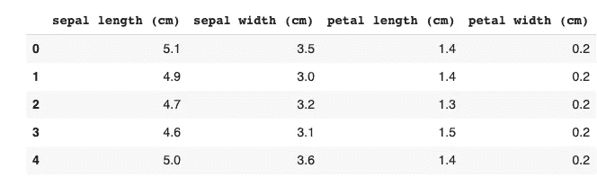
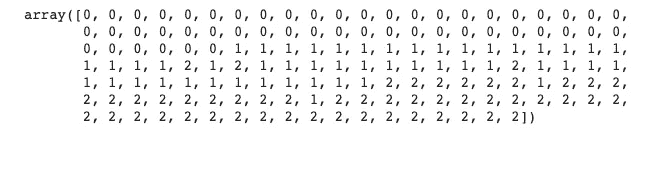

# 分类:K-最近邻

> 原文：<https://medium.com/geekculture/classification-k-nearest-neighbors-28f6622926c9?source=collection_archive---------41----------------------->

使用 scikit-learn 在 Python 中进行 KNN 分类


Photo by [Greyson Joralemon](https://unsplash.com/@greysonjoralemon?utm_source=medium&utm_medium=referral) on [Unsplash](https://unsplash.com?utm_source=medium&utm_medium=referral)

K-最近邻方法是一种简单的分类算法，它通过查看网络中“K”个最近的数据点来预测数据点(比如 x)的标签。

例如，假设我们想要根据 x 的 K 个最近邻的颜色来预测 x 的颜色，其中 K=3。换句话说，我们想通过观察 3 个最近的邻居(或数据点)的颜色来预测 x 的颜色。我们不知道 X 是什么颜色，但它的邻居 a、b 和 c 分别是绿色、蓝色和蓝色。基于这个观察，我们的 K 最近邻法或 KNN 法，会预测 x 的颜色是蓝色。如果我们要展开并查看 5 个最近的邻居(即 K=5)，a、b、c、d 和 e，其中 d 和 e 都是绿色，那么我们的 KNN 分类器会将绿色分配给我们的数据点 x

现在，我将使用 scikit-learn 演示如何在 Python 中安装一个简单的 KNN 分类器。

# **数据**

我们将使用 sci-kit 学习库中可用的[虹膜](https://scikit-learn.org/stable/auto_examples/datasets/plot_iris_dataset.html)数据集。数据集由 3 种不同类型的鸢尾(Setosa、Versicolour 和 Virginica)花瓣和萼片长度和宽度组成。目标是在给定长度和宽度特征的情况下预测虹膜的类型。

# KNN

**1。导入必要的模块:**

```
from sklearn.datasets import load_iris
from sklearn.neighbors import KNeighborsClassifier
import pandas as pd
```

**2。将数据作为 Iris 加载，然后将其转换成两个数据帧**

虹膜数据集作为数组加载。我们将把它转换成两个独立的数据帧—一个用于目标，一个用于特征。分割目标和特征对于步骤 5 中的拟合更有意义。

```
Iris= load_iris()
df=pd.DataFrame(iris['data'],columns=[iris['feature_names']])
df2=pd.DataFrame(iris['target'])
```

**3。探索虹膜数据**

```
df.shape
```

(150,4)

我们的数据有 150 个观察值和 4 个特征。需要注意的是，要使 KNN 分类有效，数据集不能有任何缺失值。此外，这些特征必须是数值连续的变量。它们不能是绝对的。

```
df.head()
```



上面是我们数据集的前五行。

**4。实例化 KNN 分类器**

我们将使用 5 个邻居作为我们的分类器。

```
knn=KNeighborsClassifier(n_neighbors=5)
```

**5。安装分类器**

knn.fit()参数基于两个输入运行模型-特征(X)和响应或目标(Y)。

```
X=df.values #features
y=df2.values #response
knn.fit(X,y)
```

**6。运行预测**

```
y_pred=knn.predict(X)
y_pred
```



我们可以在上面的数据集中看到每个观测值的预测。请注意，0=setosa，1=versicolor，2= virginica。

# 结论

我们使用一个基本的 KNN 分类器来预测我们观察的每个数据点的虹膜类型，给出它的特征和 5 个最近的邻居。接下来的步骤是通过将数据分成训练/测试集并获得每个集的准确度分数来测量模型准确度。

**参考文献**

 [## 熊猫。数据框架- pandas 1.2.4 文档

### 二维、大小可变、潜在异构的表格数据。数据结构还包含带标签的轴(行…

pandas.pydata.org](https://pandas.pydata.org/pandas-docs/stable/reference/api/pandas.DataFrame.html)