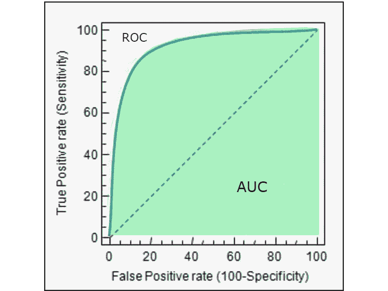
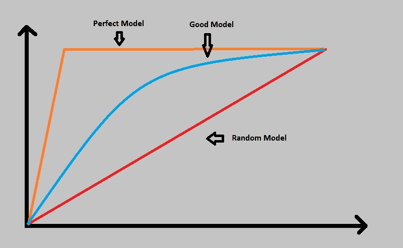
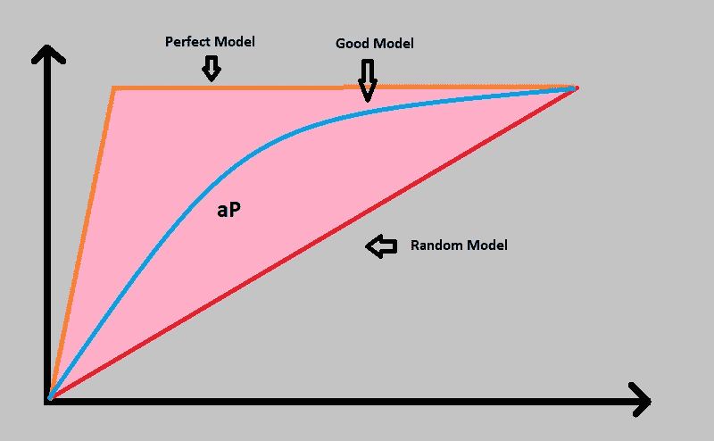
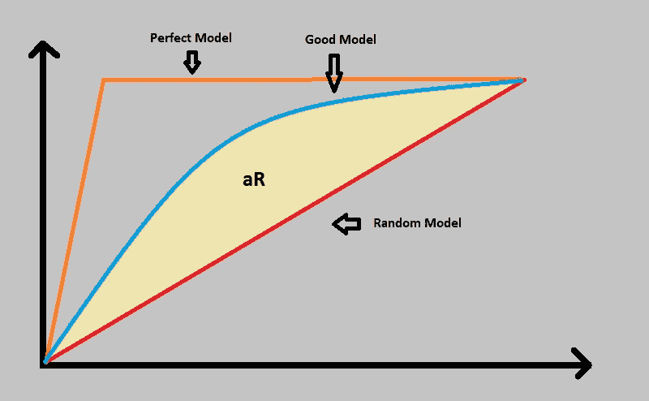
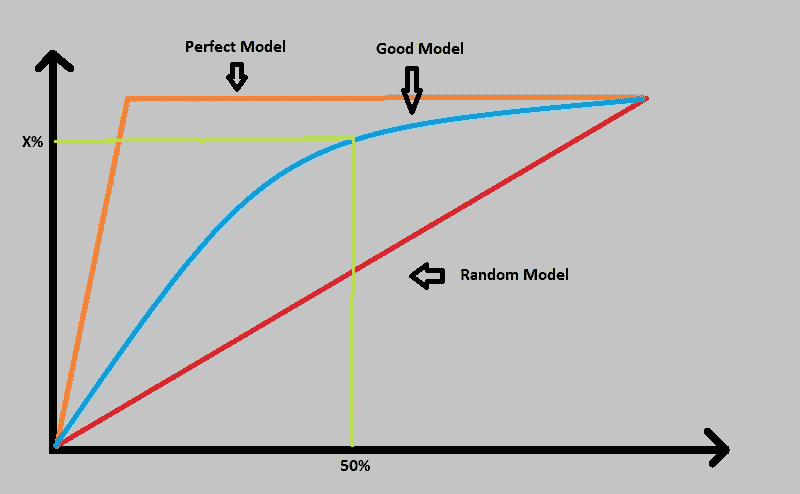
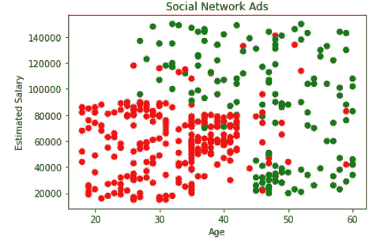
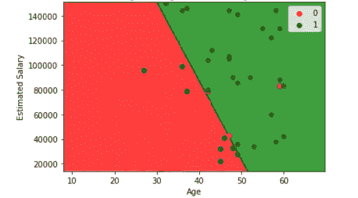
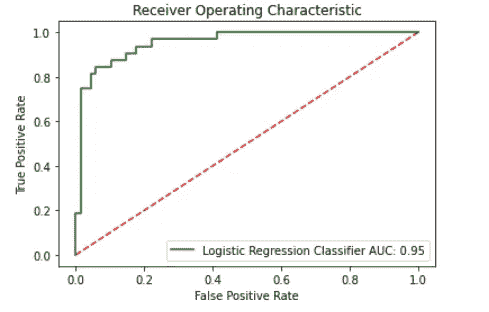
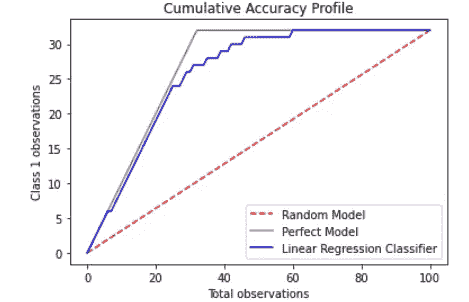
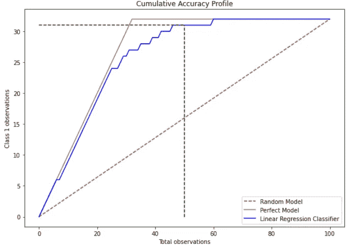

# 使用 AUC-ROC 和 CAP 曲线的分类模型性能评估

> 原文：<https://medium.com/geekculture/classification-model-performance-evaluation-using-auc-roc-and-cap-curves-66a1b3fc0480?source=collection_archive---------7----------------------->

Classification Model Performance Evaluation (Image courtesy: [https://bit.ly/36b7Lf2](https://bit.ly/36b7Lf2))

性能测量是任何机器学习项目的一项基本任务，检查我们的模型好坏非常重要。在回归模型中，我们使用 R 平方(R)和均方根误差(RMSE)。在分类模型的情况下，当我们需要评估或说明多类分类问题的表现时，我们可以依赖 AUC-ROC 曲线或 CAP 曲线。

**什么是 AUC-ROC 曲线？** AUC *(曲线下面积)* ROC *(受试者操作特征)*曲线，也称为 AUROC *(受试者操作特征下面积)*是对各种阈值水平下分类问题的性能度量。它是评估二分类问题性能的最重要的评估方法之一。
ROC 是绘制 TPR ( *真阳性率*)对 FPR ( *假阳性率*)的概率曲线。AUC 是可分性的度量，它显示了我们的模型在多大程度上能够区分类别。
AUC 表示模型区分阳性和阴性类别的程度。AUC 越大越好。

AUC-ROC Curve

**什么是 CAP 曲线？** CAP(*累积精度剖面*)曲线是对分类问题的一种性能度量。它用于通过将当前曲线与'*完美*或' *理想*曲线和'*随机*曲线进行比较来评估模型。
一个体面或优秀的模特会有一顶在完美和随机曲线中间的帽子。模型越接近完美的帽子越好。

CAP Curve

使用 CAP 曲线分析性能有两种方法:

*   曲线下面积:我们通过计算完美模型和随机模型下的面积(aP)，计算预测模型和随机模型下的面积(aR)来计算准确率(AR)。
    准确率(AR)= AR/aP
    AR 越高，即越接近 1，模型越好。

Area under the perfect model and random model (aP)

Area under the good model and random model (aR)

*   绘图:我们从 x 轴的 50%处画一条垂直线，直到它与'*好模型*'线相交，从该交点画一条水平线，直到 y 轴。现在这个与 y 轴相交的点是，如果你选择 50%的人口，你会发现多少积极的结果。

Plot method to assess the performance

只需查看该图，您就可以根据 X%值评估模型的性能。

1.  X < 60% →垃圾
2.  60% < X < 70% →差/一般
3.  70% < X <80% →好
4.  80% < X < 90% →非常好
5.  90% < X < 100% →太好(在这种情况下，您应该非常小心过度拟合的可能性)

现在我将向您展示如何使用 AUCROC 曲线和 CAP 曲线来评估使用 python 的分类模型。

**数据集** 我使用的是[社交 _ 网络 _ 广告](https://www.kaggle.com/rakeshrau/social-network-ads?select=Social_Network_Ads.csv)数据集，其中我只使用了三个特征，*年龄*、*估计销售额*和*购买*。输出标签是“0”和“1 ”,它们表示一个人 a 是否购买了该产品。
0 →未购买
1 →已购买
我们的目标是预测是否有人会购买该产品。

Complete Dataset

“*红色*点代表没有购买该产品的人，“*绿色*点代表已经购买该产品的人。

**分类** 我已经将数据集分成两组，75%的训练数据和 25%的测试数据。我使用了 ***逻辑回归*** 来训练和测试模型。该模型的准确率达到了 89%

**

*Classification on test set*

***绩效评估:***

*   *AUROC :
    从 *sklearn.metrics* 导入 *roc_curve* 和 *auc* 以创建 ROC 曲线并计算曲线下面积。
    首先，使用 *predict_proba 计算预测的概率。*它将返回一个包含两列的 numpy 数组，第一列包含类 0 的概率，第二列包含类 1 的概率。因为我们必须衡量我们的模型区分正类和负类的能力，所以我使用了类 1 的概率来绘制 ROC 曲线。*

**roc_curve* 将生成 roc 曲线并返回 *fpr* 、 *tpr* 和*阈值*。我们需要 *fpr* 和 *tpr* 来计算这个模型的曲线下面积，现在我们已经有了 *roc_curve* 返回的面积。因此，我们可以使用 *fpr* 和 *tpr* 的值作为 *auc* 函数的输入来计算曲线下的面积。现在我们绘制 ROC 曲线并分析我们模型的性能。*

**

*AUC → 95%*

*曲线下的面积是 0.95 → 95%，很不可思议，说明我们的模型做得不错。*

*   *CAP:
    首先计算测试数据中的总数据点(100)。然后计算测试数据中类别 1 的数据点的数量(32)，并且还计算测试数据中类别 0 的数据点的数量(68)。*

*现在我们开始绘制我们的 CAP 曲线。首先，我们基于类 1 的正确检测将线性增加的假设来创建随机模型。接下来我们绘制完美的模型。完美的模型是在与类中数据点数量相同的试验数量中检测所有类 1 数据点的模型。完美的模型需要正好 32 次试验来检测 32 个 1 级数据点。
现在，我们最终绘制出*逻辑回归的结果。*如在 AUROC 曲线中，我们必须获得第 1 类的概率，并使用 *zip* 函数将这些值与 *y_test* 合并。
为了计算 y 值，我们使用 *np.cumsum()* 。 *np.cumsum()* 通过将数组中所有以前的值与当前值相加，生成一个值数组。例如，考虑数组*【1，1，1，1，1】*。*【1，2，3，4，5】*将是 *np.cumsum()* 函数的结果。此外，我们必须将 *0* 追加到数组的起点 *(0，0)* 。 *x 值*将在 *0* 到*总计+ 1* 的范围内。*

**

*CAP curve*

*现在，我们有两种使用 CAP 方法分析性能的方法:*

*   *曲线下面积:首先我们必须使用 *auc* 函数计算所有面积，然后使用这些值计算准确率。该比率为 0.90，非常接近于 1，表明我们的模型确实有效。*

*   *剧情:首先我们要找到总测试数据的 50%的指标。然后，我们必须画一条垂直线，直到它与我们训练好的模型线相交，然后从那个交点画一条水平线，直到它与 y 轴相交。然后通过将观察到的 1 类值除以 1 类数据点的总数并乘以 100 来计算 X%值。我们得到 96.875%*

**

*CAP curve using plot method*

*CAP 曲线给了我们 96.875%，这意味着我们的模型太好了。它告诉我们，我们的模型太好了，无法区分积极和消极的类别。*

***结论** 本文分享了关于性能度量和方法的简要理解，您可以使用这些度量和方法来分析您的分类模型的性能。您可以使用上述任何一种方法来衡量您的模型的性能。*

*您可以在我的 github 存储库中找到从实现逻辑回归到性能评估的完整代码:*

* [## RushiKanjaria/逻辑回归

### 本笔记本向您介绍了如何使用逻辑回归对数据集进行分类。

github.com](https://github.com/RushiKanjaria/Logistic-Regression.git) 

**参考文献**

*   [https://towards data science . com/machine-learning-classifier-evaluation-using-roc-and-cap-curves-7 db 60 Fe 6b 716](https://towardsdatascience.com/machine-learning-classifier-evaluation-using-roc-and-cap-curves-7db60fe6b716)
*   [https://towards data science . com/understanding-AUC-roc-curve-68b 2303 cc9 C5](https://towardsdatascience.com/understanding-auc-roc-curve-68b2303cc9c5)
*   https://en.wikipedia.org/wiki/Cumulative_accuracy_profile

感谢您阅读本文！，希望你们今天都学到了新东西。*