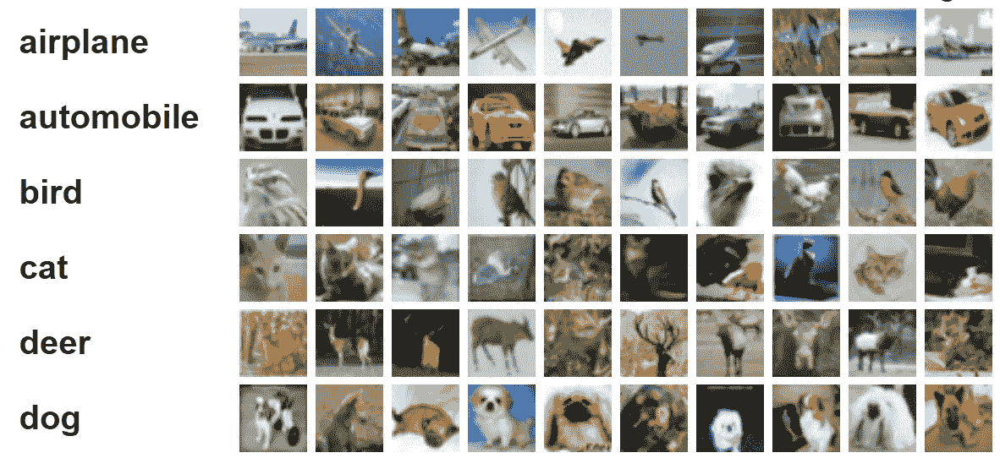

# 无标签图像的分类

> 原文：<https://medium.com/geekculture/classification-of-unlabeled-images-a2eb0e52f7c2?source=collection_archive---------3----------------------->

Source: Google Images

图像分类是计算机视觉中最常见的问题之一。执行图像分类的算法并不新，已经存在了几年。然而，由于没有足够的计算资源和数据，他们无法产生任何影响，直到几年前的 2012 年，亚历克斯·克里兹夫斯基在他的论文中介绍了 T2·亚历克斯网。AlexNet 是一个多层卷积神经网络，它是…