# 使用决策树的分类:

> 原文：<https://medium.com/geekculture/classification-using-decision-trees-a434a052d82a?source=collection_archive---------14----------------------->

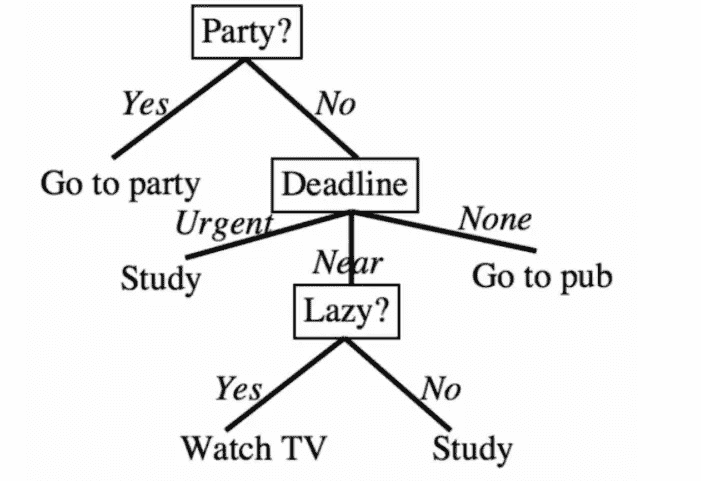

Decision Tree for deciding what to do based on the deadline.

# **那么什么是决策树呢？**

决策树是一种树状决策结构，其中在每个节点评估一个特征值，并根据评估做出进一步的决策。输出值由*叶节点*表示。

## **决策树是如何构建的？**

通过说决策树是如何构造的，我们的意思是我们如何决定特征值将被评估的顺序。

我们遵循一种贪婪的方法，同时选择评估特征的顺序，其中首先评估最具信息性的特征*。*

## **我们如何决定一个特征的信息量？**

有不同的方法和算法，基于这些方法和算法，我们可以从不同的特征中判断出哪些信息更多，哪些信息更少。

## **使用昆兰的 ID3(迭代去优化器版本 3)进行分类:**

这里我们计算熵，即每个特征的数据的不确定性。它基于熵越多，不确定性越大，预测标签的有用性就越小的想法，因此我们将认为熵越小的特征信息量就越大。

计算熵的公式:

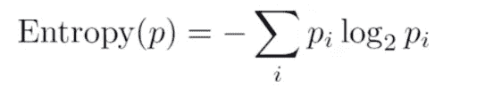

log base 2 as we consider everything is encoded using binary digits. Eqn I

→样本均匀分布时熵最大。

→pi 是数据集拥有不同数据样本的概率。

**让我们看看如何使用 ID3 构建如上所示的决策树:**

以下是决策树的数据集:

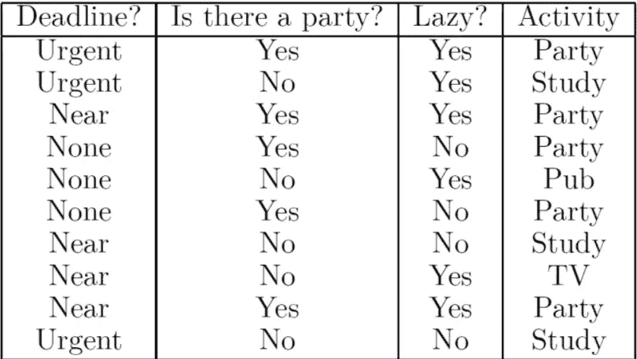

dataset for the above decision tree.

**特点**有期限、党、懒。**标签**:活动

因此，我们将计算所有特征的信息增益，具有最高信息增益的特征将首先被评估。

任意特征 F 的信息增益公式:

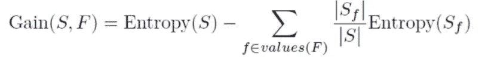

Information gain of feature F from dataset S Eqn II

**步骤 1:熵** →使用等式 I 计算不同类别标签(聚会、酒吧、学习、电视)的概率。

`P(party) = 5/10 = 1/2 , P(pub) = 1/10 , P(study) = 3/10 , P(tv) = 1/10`

`**Entropy(S) = -P(party)log2(P(party))-P(pub)log2(P(pub))-P(study)log2(P(study))-P(tv)log2(P(tv)).**`

**第二步:选择任意一个特征，对该特征 F 的每个值 F 计算熵(Sf)** ，然后代入以下公式:

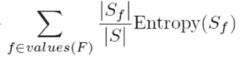

Eqn III

例如:让我们考虑这个特征的特征截止时间值是(紧急、接近、无)

`→ |S| = 10 , |S urgent| = 3 , |S none| = 3 , |S near| = 4`

熵(S urgent) →因为 urgent 具有标签值(研究，团队)，所以计算研究和团队的概率，并按照步骤 1 进行操作。

类似地，计算特征截止时间的其他值的熵，并放入等式 III

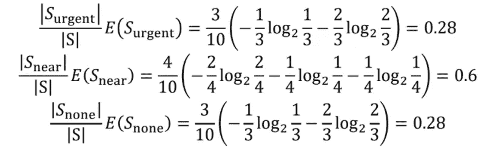

现在将它们相加并代入方程 II:

`InformationGain(Deadline,S) = Entropy(S) -(0.28+0.6+0.28)`

**步骤 3)对所有其他特征重复步骤 2** ，计算它们的信息增益，然后选择具有最高信息增益的特征，因为它将成为树的根，并将首先被评估。

在计算时发现**特征方**具有最高的信息增益，那么它将成为树的根。

**步骤 4)为该特性的每个可能值从节点添加一个分支**。聚会特征有两个值**是和否**

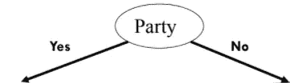

**步骤 5)现在对每个值进行检查**:

如果所有的例子都有相同的标签→返回带有该标签的叶子。(纯节点)

否则，如果没有要测试的特性→返回带有最常见标签的叶子。(这种情况会导致不纯的节点)

否则再次转到**步骤 2** 并计算移除已评估样本后剩余特征的信息增益。

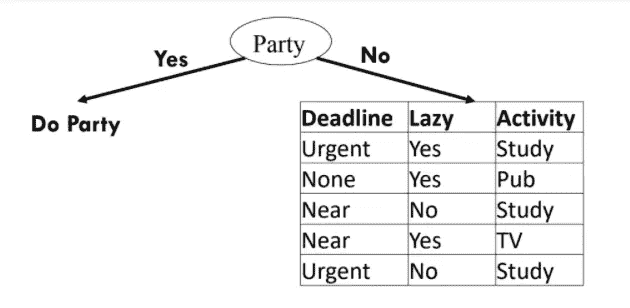

Again cal information gain for deadline, lazy

最后，它将生成如上所示的树。

优点:可以处理数据集中的噪声。

问题:

1.  它不能对有缺失值的样本进行分类。
2.  它不能处理具有连续值的特征。

## 使用 CART 分类(分类和回归树) :

在这里，我们计算基尼系数，因为它相当于计算预期误差率，如果分类是根据类别分布选择的话。

计算基尼系数的公式:公式 1

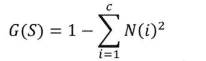

formula for calculating gini impurity

N(i) →表示属于
I 类的数据点分数。

**让我们看看如何使用 CART 构建如上所示的决策树:**

使用的数据集与我们上面使用的相同

因此，与上面相同，我们将计算所有特征的信息增益，具有最高信息增益的特征将首先被评估。

任意特征 F 的信息增益公式:公式 II

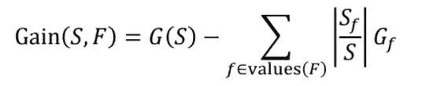

Information gain using gini impurity

**步骤 1: G(S)** →使用等式 I 计算不同类别标签(派对、酒吧、书房、电视)的 N。

`N(party) = 5/10 = 1/2 , N(pub) = 1/10 , N(study) = 3/10 , N(tv) = 1/10`

`G(S) = 1 -(N(party)²+N(pub)²+N(study)²+N(tv)²) = 1-(0.25+0.01+0.09+0.01) = 1–0.36 = 0.64`

**第二步:选择任意一个特征，对该特征 F 的每个值 F 计算 G(Sf)** ，然后代入以下公式:

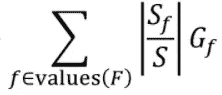

Eqn III

例如:让我们考虑这个特征的特征截止时间值是(紧急、接近、无)

`→ |S| = 10 , |S urgent| = 3 , |S none| = 3 , |S near| = 4`

G(S urgent) →由于 urgent 具有标签值(病历报告、当事人),因此计算病历报告和当事人的 N，并按照步骤 1 进行操作。

类似地，计算特征截止时间的其他值的基尼系数杂质，并放入公式 III。

然后使用等式 II 计算该特征的信息增益。

**步骤 3)对所有其他特征重复步骤 2** 并计算它们的信息增益，然后选择具有最高信息增益的特征，因为它将成为树的根并将首先被评估。

所有其他步骤与 ID3 算法相同。

文章结尾。

感谢阅读。

希望有帮助:)