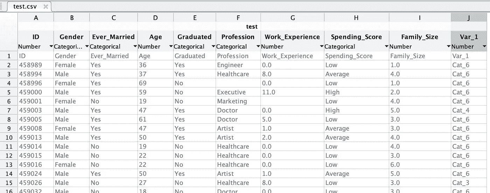
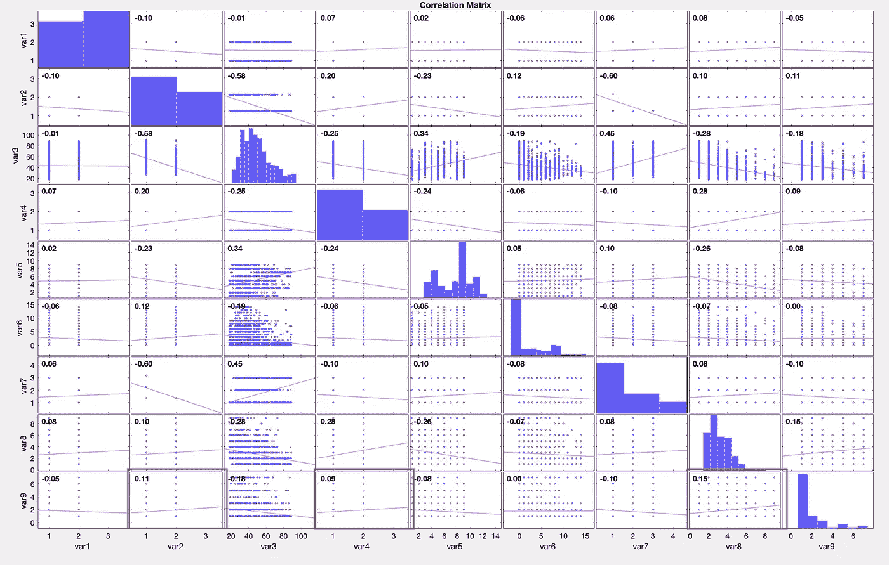

# 物流回归对客户进行分类——一个对所有(4/4)

> 原文：<https://medium.com/geekculture/classifying-customers-with-logistics-regression-one-vs-all-f34ed2e5f042?source=collection_archive---------30----------------------->


对客户数据进行分类可能是一件棘手的事情。你需要把问题弄对，然后派你的销售人员出去为你收集数据。如果你需要一个好的软件包来做到这一点，请随意尝试 [Rapidtrade](http://www.rapidtrade.com) 。

ps。你可以在这里下载源代码[，如果你需要物流回归的介绍，那么你可以](https://github.com/shaunenslin/machinelearning/tree/master/matlab/logisticsregression/classification)[从第 1 篇](/nerd-for-tech/logistics-regression-in-5-minutes-1-3-64a890ed79e1)开始。

所以，让我们看看从 [Kaggle](https://www.kaggle.com) 下载的数据集。

数据上需要牢记的几点:
1。我们需要将所有基于文本的列转换为索引或数字。
2。最后一栏是我们的客户分类
3。第一列并不重要
4。我们需要删除有 NaN 的行



现在，我们已经可视化了我们的数据，让我们开始吧。

让我们从打开表并加载 CSV 开始。

```
clear;
% open csv file
tbl = readtable(‘test.csv’);
```

下一步是将我们的列装载到一个矩阵中，但是将文本列转换成整数。*因为我们不能在等式中使用文本；-)*

```
% replace strings with labels
ds(:,1) = grp2idx(tbl{:,2});
ds(:,2) = grp2idx(tbl{:,3});
ds(:,3) = tbl{:,4};
ds(:,4) = grp2idx(tbl{:,5});
ds(:,5) = grp2idx(tbl{:,6});
ds(:,6) = tbl{:,7};
ds(:,7) = grp2idx(tbl{:,8});
ds(:,8) = tbl{:,9};
[ds(:,9),labels] = grp2idx(tbl{:,10});
```

下一步是删除任何包含 NaN 字段的行

```
% remove NaN
ds = rmmissing(ds);
[m,n] = size(ds);
```

此时，在我们的命令提示符下，让我们运行一个 corrplot 来查看我们最好使用的列。

```
corrplot(ds)
```

这显示了所有列以及它们与分类列**第 9 行**的相关性。在我们的例子中，我们只需要查看**底排**。

因此，数据看起来不太好，但是我还是选择了与**相关性最高的列**。用这么低的数字，我们的预测将很难获得高精度。

啊，好吧，让我们看看怎么走；——)



下一步，让我们分开我们的 X 和 y 矩阵，但只选择列 2，4 和 8。

```
X = [ones(m,1) ds(:,[2 4 8])]; 
y = ds(:,n);
```

现在，设置一些参数。请注意，我们的 **thetas 现在适合所有类别标签**。如果这个 lambda 的东西看起来有点奇怪，那就看看我关于正规化的文章。

```
% setups
[m,n] = size(X);
lambda = 0.01;
thetas = zeros(length(labels),n);
```

因此，现在让我们执行我们的**一对一对全部**成本计算，并从 fminunc 获得我们的最佳 theta，它将为我们执行成本优化。请注意，我们写了 comuteCost，稍后您会看到这一点。你可能会问是什么让这一个 vs 所有？

**好吧，记下(y == i)** 。
这将返回一个矩阵，其中当前类别(I)的行都是“1”，而所有其他类别都是“0”。
为了**完全理解**这一点，继续调试，但这是你可以用来执行**一对一**的聪明小技巧。

```
% loop through labels and run cost optimisations
for i = 1:length(labels)
  itheta = zeros(n,1);
  options = optimset(‘GradObj’, ‘On’, ‘MaxIter’, 400);
  theta = fminunc(@(t)computeCost(t, X, (y == i), lambda), itheta,   options);
  thetas(i,:) = theta’;
end
```

另外，请注意，我们收集了 thetas 矩阵中每个标签的**最佳 theta 的**。

**最后**，我们可以执行我们的预测，我们应该看到我们最终的准确率为 **66.48%** 。

不，不是很好，但是通过 corrplots 查看我们的数据也不错。

这里有一些实用函数，你也需要它们来完成上面的工作。

```
function [J,grad] = computeCost(theta, X, y, lambda)
  % get our hypothesis, apply sigmoid
  h = sigmoid(X*theta);
  m = size(X,1);

  % new theta for lambda, excluding col 1
  theta1 = [0; theta(2:size(theta),:)];

  % penalise thetas to reduce cost
  p = lambda*(theta1'*theta)/(2*m);
  J = ((-y)’*log(h) — (1-y)’*log(1-h))/m + p;
  grad = (X’*(h — y) + lambda * theta1)/m;
endfunction g = sigmoid(z)
  g = 1 ./ (1 + exp(-z));
endfunction p = predict(thetas, X)
  predict = sigmoid(X*thetas');
  [predictmax,p] = max(predict,[],2);
end
```

如果你需要更多关于上述方程的信息，你可以看看这篇关于[正则化](/geekculture/logistics-regression-regularisation-2-3-4a0d8b85564c)的文章。