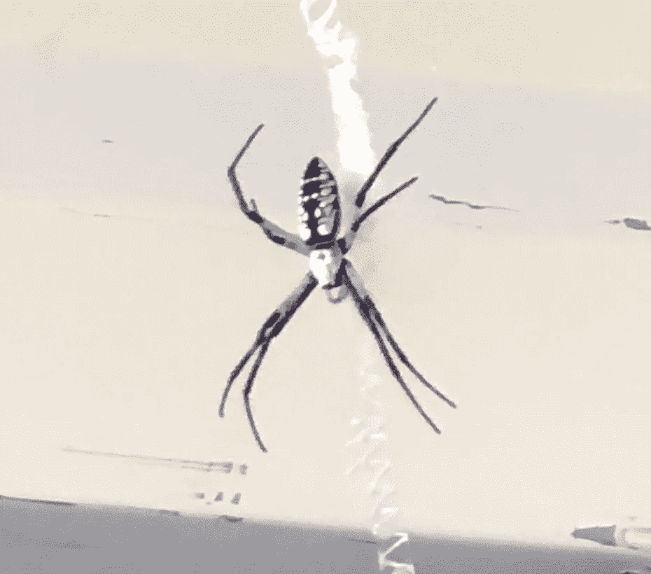
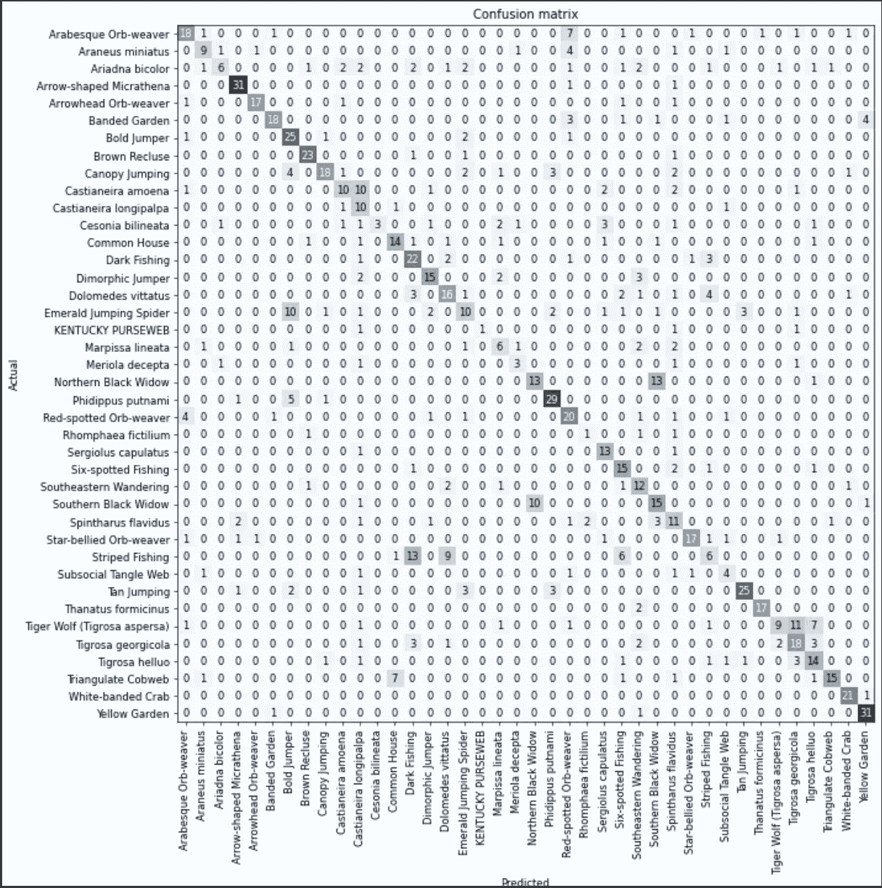
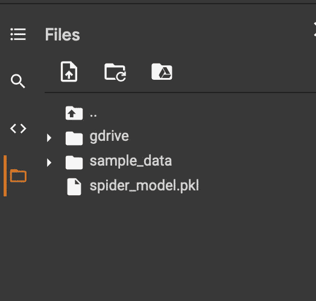
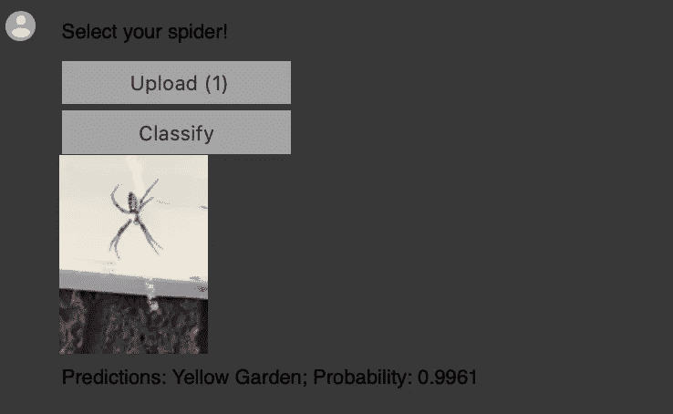
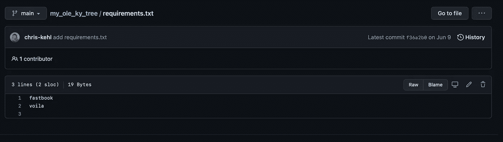
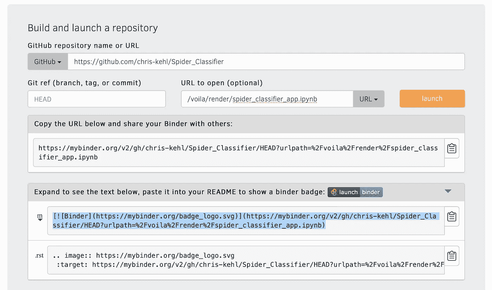
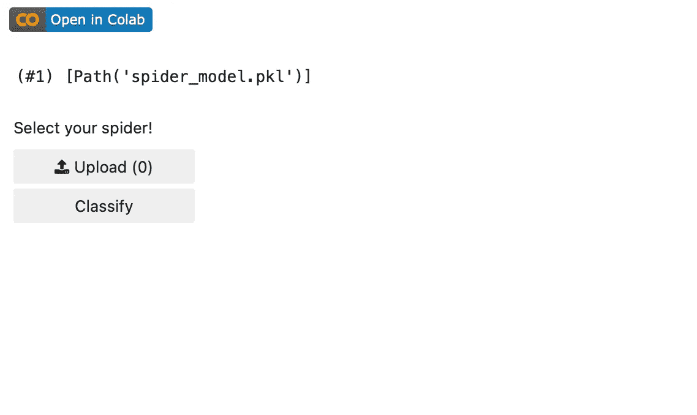
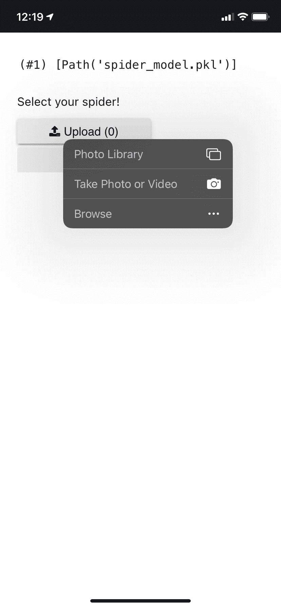
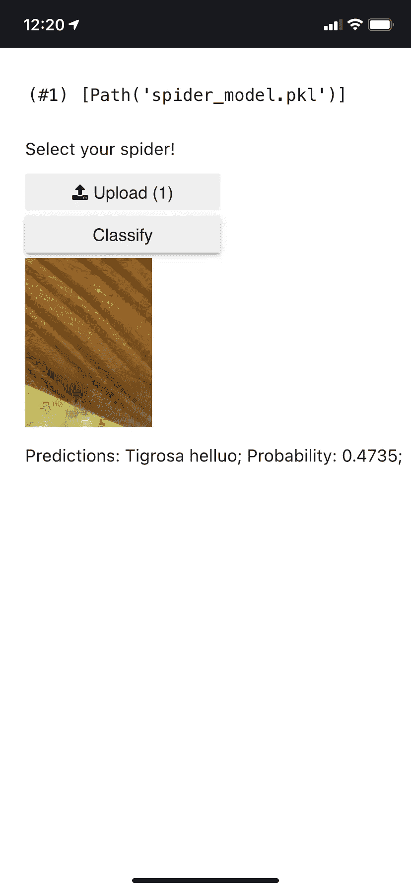

# 用 fastAi 分类肯塔基蜘蛛。第五部分

> 原文：<https://medium.com/geekculture/classifying-spiders-of-kentucky-with-fastai-part-v-e797af27e65?source=collection_archive---------50----------------------->

## 第五部分



太好了！你从第三部分回来了，在那里我们微调了我们的超参数，并学习了如何找到正确的学习率。第三部分向我们展示了使用 Resnet152 为我提供了最低的错误率。最后我得到了 0.38%的错误率。在我看来，这对于这款车型来说相当不错。下面是一个混淆矩阵，通过这个矩阵，你可以看到深度学习算法只是犯了简单的错误，只有专业的主题专家才能区分，例如，模型错误地分类了一只蜘蛛是北方黑寡妇还是南方黑寡妇。这可能很常见，因为它试图分类的图像可能没有显示沙漏，一个沙漏是满的，而另一个沙漏是空的。如果图像没有显示出好的图像，那么它必须做出最好的预测。另一个错误的分类是捕鱼蜘蛛。当我看这些照片时，我觉得它们看起来都一样。就像跳蛛一样，区分它们也是一个问题。我们可以结合我们的蜘蛛类型，这将大大降低我们的学习速度，达到一个非常体面的数字。例如，我们可以使用诸如跳蛛、黑寡妇、钓鱼蛛、花园蛛等标签。然而，这不是我们的目标，我们实际上想了解这个物种。现在你可以改变标签和导入图片，如果你想的话，事实上我建议如果你想降低你的错误率，去试试吧。使用较小的传输模型(如 Resnet34)可能不会有问题。



要构建 Resnet34 应用程序，请在构建我们的应用程序之前遵循下面的 github 要点。要构建更大的 moder，如 Resnet152，请将传输模型更改为 Resnet152 vs Resnet34。差别不大，除了我的花园蜘蛛实际上被标记为 99%的概率对 78%的概率。

为了开始构建我们的应用程序，我们导入以下库。

```
!pip install -Uqq fastbook
!pip install voila
!jupyter serverextension enable --sys-prefix voilaimport fastbook
import warnings
import osfastbook.setup_book()
from fastai.vision.all import *
from fastbook import *
from fastai.vision.widgets import *
```

这就设置了我们所有必需的 fastai 工具。我们看到 fastai 导入小部件，这些小部件用于构建我们的原型。所以，我应该先解释一下我们要做的事情。第五部分使用 pkl 文件，发音为“pickle ”,在这个应用程序中进行我们的预测。因此，在第三部分中，我们将模型保存为 spider_model.pkl。我们将在此应用程序中使用该文件来生成我们的 spider_classification_app。

如果使用 Google Colab，不要把它放在 gdrive 目录中。我只是下载了文件，并上传到 sample downloads 下的本地目录中。



我们的下一步是设置我们的路径并指向我们上面提到的 pkl 文件。

```
# setting the path to Pathpath = Path()
learn_inf = load_learner('spider_model.pkl', cpu=True)# get the imagefrom the upload, display size 128, 128btn_upload = widgets.FileUpload()
out_pl = widgets.Output()
btn_run = widgets.Button(description='Classify')
lbl_pred = widgets.Label()
```

我们刚刚开始用上面的代码制作我们的应用程序。我们刚刚建立了几个按钮，将出现在我们的应用程序。我们有一个上传文件的按钮，和一个分类按钮。接下来，我们将使用“上传”按钮上传一张图像，一旦图像被加载，我们将点击“分类”按钮并获得预测。我们用下面的函数来实现这一切。

```
# define the function to put all the buttons together and make our appdef on_click_classify(change):
    img = PILImage.create(btn_upload.data[-1])
    out_pl.clear_output()
    with out_pl: display(img.to_thumb(128, 128))
    pred,pred_idx,probs = learn_inf.predict(img)
    lbl_pred.value = f'Predictions: {pred}; Probability
    {probs[pred_idx]:.04f}'btn_run.on_click(on_click_classify)
```

我们的函数创建了一个按钮(我们使用 python pil 库),单击该按钮将清除输出，并显示所选图像，大小为 128 X 128。我们使用我们的 learn_inf.predict 来显示 fastai 预测并显示概率。

```
# you use upload to upload the image of your spider, then click classify to get the resultsVBox([widgets.Label('Select your spider!'),
btn_upload, btn_run, out_pl, lbl_pred])
```

我们使用 VBox 来显示我们的标签并获得我们的预测，VBox 是小部件的一部分。如果一切顺利，你会有一个相似的结果。



对于下一步，我必须下到 resnet34，因为我的。pkl 文件超过 200MB。我们将需要我们的 pkl 文件上传或推入我们的 github repo。使用 Renset34 将允许我们上传 84mb 到 github。文件很大，所以我会使用这里列出的步骤[使用大文件系统(lsf)将您的 pkl 文件推送到 github。在接下来的步骤中，我们将依靠 github 知识库和一个名为](https://git-lfs.github.com) [binder](https://mybinder.org) 的程序来发布我们的原型。

在我们开始之前，您需要创建一个名为 requirements.txt 的 txt 文件，并将这两项添加到文本文件中。快本和瞧。将这两个文件推送到我们的 github 库。一个简单的方法是在 github 中创建文件，选择 add file，创建新文件，将其命名为 requirements.txt，然后添加这两个项目。



首先，我们导航到 https://mybinder.org。



在第一个文本框中，我们放置了我们的存储库的位置，然后在笔记本文件的路径中，我们添加了/voila/render/spider _ classifier _ app . ipynb

一旦我们添加了我们的存储库信息，选择启动。坐下来放松，这需要一两分钟。

这是我的活页夹应用[(点击这里)](https://hub.gke2.mybinder.org/user/chris-kehl-spider_classifier-3e0jgzp7/voila/render/spider_classifier_app.ipynb?token=m4dhDn6KRKGfWDnGtz6JBw)的链接



所以这款应用可以在任何设备上运行。最酷的是，如果你用手机加载它，你可以给你的蜘蛛拍照。



这是最终产品。现在我有一个文件路径显示，你可以玩它，让你的屏幕干净一点。



end of phone

请继续关注我，我将研究如何用 swift 和 flutter 构建这个应用程序，以将它添加为一个实际的移动应用程序。